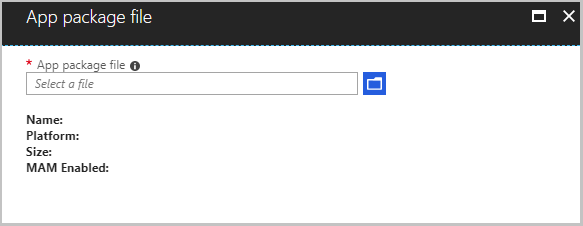
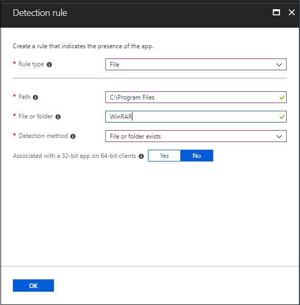
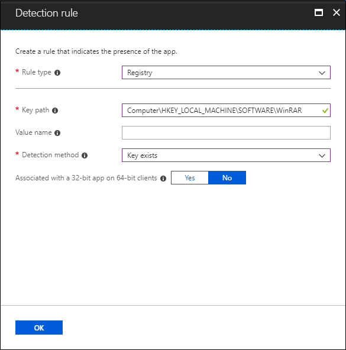
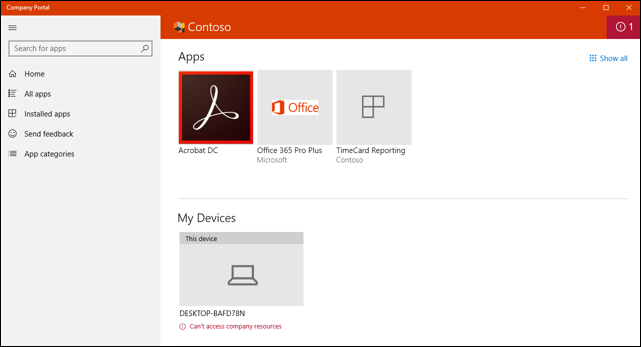

# Intune Standalone - Win32 app management (Public Preview)

Intune standalone will allow greater Win32 app management capabilities. While it is possible to continue to use Configuration Manager for Win32 app management, Intune-only customers will have greater management capabilities for their Win32 line-of-business (LOB) apps. This document provides an overview of the Intune Win32 app management feature, troubleshooting information, known issues and future backlog items.

## Prerequisites for public preview

- Support for Windows 10 RS1 (1607) and above
    - Enterprise 
    - Pro (in preview)
    - Edu (in preview) 
- Windows 10 client needs to be domain-joined to an Azure Active Directory configured with Intune Auto enroll
- Deploy Win32 apps to small number of users and devices for public preview. Content size is capped at 8GB.

## Prepare the Win32 app content for upload

Use the [Microsoft Intune Win32 App Packaging Tool](https://github.com/Microsoft/Intune-Win32-App-Packaging-Tool) to pre-process Win32 apps. The packaging tool converts application installation files into the *.intunewin* format. The packaging tool also detects some of the attributes required by Intune to determine the application installation state. After you use this tool on the app installer folder, you will be able to create a Win32 app in Intune console.

You can download the [Microsoft Intune Win32 App Packaging Tool](https://github.com/Microsoft/Intune-Win32-App-Packaging-Tool) from GitHub.

### Available command-line parameters 

|    **Command-line   parameter**    |    **Description**    |
|:------------------------------:|:----------------------------------------------------------:|
|    `-h`     |    Help    |
|    `-c <setup_folder>`     |    Setup folder for all setup files.    |
|   ` -s <setup_file>`     |    Setup file (such as *setup.exe* or *setup.msi*).    |
|    `-o <output_file>`     |    Output folder for the generated *.intunewin* file.    |
|    `-q`       |    Quiet   mode    |

### Example commands

|    **Example command**    |    **Description**    |
|:-----------------------------------------------------------------------------------------:|:--------------------------------------------------------------------------------------------------------------------------------------------------------------------------------------------------------------------------------------------------------------------------------------------------------------------------------------------------------------------------------------------------:|
|    `IntuneWinAppUtil -h`    |    This command will show usage information for the tool.    |
|    `IntuneWinAppUtil -c <setup_folder> -s <source_setup_file> -o <output_folder> <-q>`    |    This command will generate the `.intunewin` file from the specified source folder and setup file. For the MSI setup file, this tool will retrieve required information for Intune. If `-q` is specified, the command will run in quiet mode, and if the output file already exists, it will be overwritten. Also, if the output folder does not exist, it will be created automatically.    |

## Create, assign, and monitor a Win32 app

Much like a line-of-business (LOB) app, you can add a Win32 app to Microsoft Intune. This type of app is typically written in-house or by a 3rd party. The following steps provide guidance to help you add a Windows app to Intune.

### Step 1: Specify the software setup file

1.	Sign in to the [Azure portal](https://portal.azure.com/).
2.	Select **All services** > **Intune**. Intune is in the **Monitoring + Management** section.
3.	In the **Intune** pane, select **Client apps** > **Apps** > **Add**.
4.	In the **Add** app pane, select **Windows app (Win32) - preview** from the provided drop-down list.

    

### Step 2: Upload the app package file

1.	In the **Add app** pane, select **App package file** to select a file. The App package file pane will be displayed.

    

2.	In the **App package file** pane, select the browse button. Then, select a Windows installation file with the extension *.intunewin*.
3.	When you're finished, select **OK**.

### Step 3: Configure app information

1.	In the **Add app** pane, select **App information** to configure the app.
2.	In the **App information** pane, configure the following information. Some of the values in this pane might be automatically filled in.
    - **Name**: Enter the name of the app as it appears in the company portal. If the same app name exists twice, each app will appear in the company portal.
    - **Description**: Enter a description for the app. The description appears in the company portal.
    - **Publishe**r: Enter the name of the publisher of the app.
    - **Category**: Select one or more of the built-in app categories or select a category that you created. Categories make it easier for users to find the app when they browse through the company portal.
    - **Display this as a featured app in the Company Portal**: Display the app prominently on the main page of the company portal when users browse for apps.
    - **Information URL**: Optionally, enter the URL of a website that contains information about the app. The URL appears in the company portal.
    - **Privacy URL**: Optionally, enter the URL of a website that contains privacy information for the app. The URL appears in the company portal.
    - **Developer**: Optionally, enter the name of the app developer.
    - **Owner**: Optionally, enter a name for the owner of this app. An example is **HR department**.
    - **Notes**: Enter any notes that you want to associate with this app.
    - **Logo**: Upload an icon that is associated with the app. The icon is displayed with the app when users browse through the company portal.
3.	When you're finished, select **OK**.

### Step 4: Configure app installation details
1.	In the **Properties** pane of the app, select **Program** to configure the app installation and removal commands for the app.
2.	Add the complete installation command line to install the app. 

    For example, if your app filename is **MyApp123**, add the following:
    `msiexec /i “MyApp123.msi”`

3.	Add the complete uninstall command line to uninstall the app based on the app’s GUID. 

    For example:
    `msiexec /x “{12345A67-89B0-1234-5678-000001000000}”`

4.	When you're finished, select **OK**.

### Step 5: Configure app requirements

1.	In the **Properties** pane of the app, select **Requirements** to configure the requirements that devices must meet before the app is installed.
2.	In the **Requirements** pane, configure the following information. Some of the values in this pane might be automatically filled in.
    - **Operating system architecture**: Choose the architectures need to install the app.
    - **Minimum operating system**: Select the minimum operating system needed to install the app.
    - **Disk space required (MB)**: Optionally, add the free disk space needed on the system drive to install the app.
    - **Physical memory required (MB)**: Optionally, add the physical memory (RAM) required to install the app.
    - **Minimum number of logical processors required**: Optionally, add the minimum number of logical processors required to install the app.
    - **Minimum CPU speed required (MHz)**: Optionally, add the minimum CPU speed required to install the app.
3.	When you're finished, select **OK**.

### Step 6: Configure app detection rules

1.	In the **Properties** pane of the app, select **Detection rules** to configure the rules to detect the presence of the app.
2.	In **Rules format** field, select how the presence of the app will be detected. You can choose to either manually configure the detection rules or use a custom script to detect the presence of the app. You must choose at least one detection rule. 

    > [!NOTE]
    > In the **Detection rules** pane, you can choose to add multiple rules. The conditions for **all** rules must be met to detect the app.

    - **Manually configure detection rules** - You can select one of the following rule types:
        1.	**MSI** – Verify based on MSI version check. This option can only be added once. When you choose this rule type, you have two settings:
            - **MSI product code** – Add a valid MSI product code for the app.
            - **MSI product version check** – Select **Yes** to verify the MSI product version in addition to the MSI product code.
        2.	**File** – Verify based on file or folder detection, date, version, or size.
            - **Path** – The full path of the folder containing the file or folder to detect.
            - **File or folder** - The file or folder to detect.
            - **Detection method** – Select the type of detection method used to validate the presence of the app.
            - **Associated with a 32-bit app on 64-bit clients** - Select **Yes** to expand any path environment variables in the 32-bit context on 64-bit clients. Select **No** (default) to expand any path variables in the 64-bit context on 64-bit clients. 32-bit clients will always use the 32-bit context.
            
            **Examples of file-based detection**
            1.	Check for file existence.
         
                
        
            2.	Check for folder existence.
         
                
        
            3. **Registry** – Verify based on value, string, integer, or version.
            - **Key path** – The full path of the registry entry containing the value to detect.
            - **Value name** - The name of the registry value to detect. If this value is empty, the detection will happen on the key. The (default) value of a key will be used as detection value if the detection method is other than file or folder existence.
            - **Detection method** – Select the type of detection method used to validate the presence of the app.
            - **Associated with a 32-bit app on 64-bit clients** - Select **Yes** to search the 32-bit registry on 64-bit clients. Select **No** (default) search the 64-bit registry on 64-bit clients. 32-bit clients will always search the 32-bit registry.
            
            **Examples for registry-based detection**
            1.	Check for registry key exists.
         
                    
            
            2.	Check for registry value exists (**Not available in preview**).
        
                    
        
            3.	Check for registry value string equals.
        
                    
     
    - **Use a custom detection script** – Specify the PowerShell script that will be used to detect this app. 
    
        1.	**Script file** – Select a PowerShell script that will detect the presence of the app on the client. The app will be detected when the script both returns a 0 value exit code and writes a string value to STDOUT.
        2.	**Run script as 32-bit process on 64-bit clients** - Select **Yes** to run the script using the logged-on end-user's credentials. Select **No** (default) to run the script in the system context.
        3.	**Enforce script signature check** - Select **Yes** to verify that the script is signed by a trusted publisher, which will allow the script to run with no warnings or prompts displayed. The script will run unblocked. Select **No** (default) to run the script with end-user confirmation without signature verification.
    
        Intune sidecar checks the results from the script. It reads the values written by the script to the standard output (STDOUT) stream, the standard error (STDERR) stream, and the exit code. If the script exits with a nonzero value, the script fails and the application detection status is not installed. If the exit code is zero and STDOUT has data, the application detection status is Installed. 
    
        > [!NOTE]
        > When the script exits with the value of 0, the script execution was success. Second output channel indicates app was detected - STDOUT data indicates that the app was found on the client. We do not look for a particular string from STDOUT.
    
3.	Once you have added your rule(s), select **Add** > **OK**.

### Step 7: Configure app return codes

1.	In the **Properties** pane of the app, select **Return codes** to add the return codes used to specify either app installation retry behavior or post-installation behavior. Return code entries are added by default during app creation. However, you can add additional return codes or change existing return codes. 
2.	In the **Return codes** pane, add additional return codes, or modify existing return codes.
    - **Failed** – The return value that indicate an app installation failure.
    - **Hard reboot** – The hard reboot return code does not allow next  Win32 apps to be installed on the client without reboot. 
    - **Soft reboot** – The soft reboot return code allows the next Win32 app to be installed without requiring a client reboot. Reboot is necessary to complete installation of the current application.
    - **Retry** – The retry return code agent will attempt to install the app three times. It will wait for 5 minutes between each attempt. 
    - **Success** – The return value that indicates the app was successfully installed.
3.	Select **OK** once you have added or modify your list of return codes.

### Step 8: Add the app

1.	In the **Add app** pane, verify that you configured the app information correctly.
2.	Select **Add** to upload the app to Intune.

### Step 9: Assign the app

1.	In the app pane, select **Assignments**.
2.	Select **Add Group** to open the **Add group** pane that is related to the app.
3.	For the specific app, select an **assignment type**:
    - **Available for enrolled devices**: Users install the app from the Company Portal app or Company Portal website.
    - **Required**: The app is installed on devices in the selected groups.
    - **Uninstall**: The app is uninstalled from devices in the selected groups.
4.	Select **Included Groups** and assign the groups that will use this app.
5.	In the **Assign** pane, select **OK** to complete the included groups selection.
6.	If you want to exclude any groups of users from being affected by this app assignment, select **Exclude Groups**.
7.	In the **Add group** pane, select **OK**.
8.	In the app **Assignments** pane, select **Save**.

At this point you have completed steps to add a Win32 app to Intune. For information about app assignment and monitoring, see [Assign apps to groups with Microsoft Intune](https://docs.microsoft.com/intune/apps-deploy) and [Monitor app information and assignments with Microsoft Intune](https://docs.microsoft.com/intune/apps-monitor).

## Install required and available apps on devices

The end-user will see Windows Toast Notifications for the required and available app installations. The following image shows an example toast notification where the app installation is not complete until the device is restarted. 

    

The following image notifies the end-user that app changes are being made to the device.

    

## Troubleshoot Win32 app issues
Agent logs on the client machine are commonly in `C:\ProgramData\Microsoft\IntuneManagementExtension\Logs`. You can leverage `CMTrace.exe` to view these log files. *CMTrace.exe* can be downloaded from [SCCM Client Tools](https://docs.microsoft.com/sccm/core/support/tools). 

    

### Troubleshooting areas to consider
- Check targeting to make sure agent is installed on the device - Win32 app targeted to a group or PowerShell Script targeted to a group will create agent install policy for security group.
- Check OS Version – Windows 10 1607 and above.  
- Is AAD user logged on to the client machine?
- Check Windows 10 SKU - Windows 10 S, or Windows versions running with S-mode enabled, do not support MSI installation.

## Next steps

- For more information about adding apps to Intune, see [Add apps to Microsoft Intune](apps-add.md).