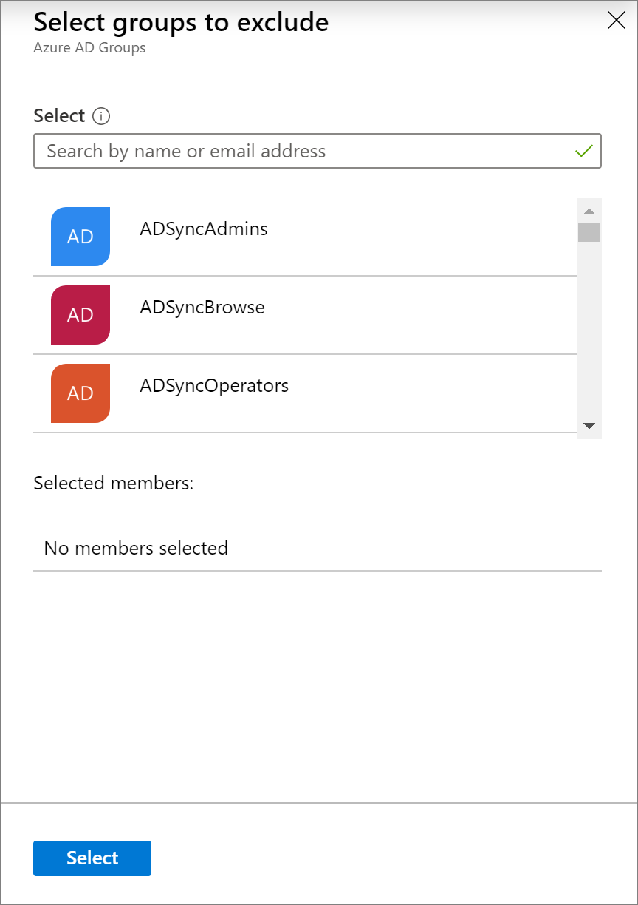

---
# required metadata

title: Configuration policies for managed apps without device enrollment
titleSuffix: Microsoft Intune
description: Learn how to configure policies for managed apps without device enrollment.
keywords:
author: Erikre
ms.author: erikre
manager: dougeby
ms.date: 01/23/2020
ms.topic: conceptual
ms.service: microsoft-intune
ms.subservice: apps
ms.localizationpriority: high
ms.technology:
ms.assetid: E61C1618-79D0-41A1-B61F-4123FB6672FC

# optional metadata 

#ROBOTS:
#audience:
#ms.devlang:
ms.reviewer: mghadial
ms.suite: ems
search.appverid: MET150
#ms.tgt_pltfrm:
ms.custom: intune-azure
ms.collection: M365-identity-device-management
---

# Add app configuration policies for managed apps without device enrollment

[!INCLUDE [azure_portal](../includes/azure_portal.md)]

You can use app configuration policies with managed apps that support the Intune App SDK, even on devices that are not enrolled. 

1. Sign in to the [Microsoft Endpoint Manager Admin Center](https://go.microsoft.com/fwlink/?linkid=2109431).
2. Choose the **Apps** > **App configuration policies** > **Add** > **Managed apps**.
3. On the **Basics** page, set the following details:
    - **Name**: The name of the profile that will appear in the Azure portal.
    - **Description**: The  description of the profile that will appear in the Azure portal.
    - **Device enrollment type**: Managed apps is selected.
4. Choose either **Select public apps** or **Select custom apps** to choose the app that you are going to configure. Select the app from the list of apps that you have approved and synchronized with Intune.
5. Click **Next** to display the **Settings** page.
6. For each configuration setting that the app supports, type the **Name** and **Value**. 

   Intune App SDK-enabled apps support configurations in key/value pairs. To learn more about which key-value configurations are supported, consult the documentation for each app. Note that you can use tokens that will be dynamically populated with data generated by the application. For more information, see [Configuration values for using tokens](~/apps/app-configuration-policies-managed-app.md#configuration-values-for-using-tokens). For information about Outlook for iOS app configuration policy settings, see [Manage Outlook for iOS app configuration with Microsoft Intune](https://technet.microsoft.com/library/mt813789(v=exchg.150).aspx).

    To delete a configuration, choose the ellipsis (**…**) and select **Delete**.  

7. Click **Next** to display the **Assignments** page.
8. In the dropdown box next to **Assign to**, select either **Selected groups**, **All users**, **All devices**, or **All users and all devies** to assign the app configuration policy to.

    

9. Select **All Users** in the dropdown box.

    

10. Click **Select groups to exclude** to display the related pane.

    

11. Choose the groups you want to exclude and then click **Select**.

    >[!NOTE]
    >When adding a group, if any other group has already been included for a given assignment type, it is pre-selected and unchangeable for other include assignment types. Therefore, that group that has been used, cannot be used as an excluded group.

12. Click **Next** to display the **Review + create** page.
13. Click **Create** to add the app configuration policy to Intune.

## Configuration values for using tokens

Intune can generate certain tokens and send them to the managed application. For example, if your app configuration can use an email setting, you can add a dynamic email by using a token. Type the name expected by the app in the **Name** field, and then type `\{\{mail\}\}` in the **Value** field.

Intune supports the following token types in the configuration settings. Other custom key/value pairs are not supported.

- \{\{userprincipalname\}\}—for example, John@contoso.com
- \{\{mail\}\}—for example, John@contoso.com
- \{\{partialupn\}\}—for example, John
- \{\{accountid\}\}—for example, fc0dc142-71d8-4b12-bbea-bae2a8514c81
- \{\{userid\}\}—for example, 3ec2c00f-b125-4519-acf0-302ac3761822
- \{\{username\}\}—for example, John Doe
- \{\{PrimarySMTPAddress\}\}—for example, testuser@ad.domain.com

> [!Note]  
> The \{\{ and \}\} characters are used by token types only and must not be used for other purposes.

## Next steps

Continue to [assign](apps-deploy.md) and [monitor](apps-monitor.md) the app as usual.
