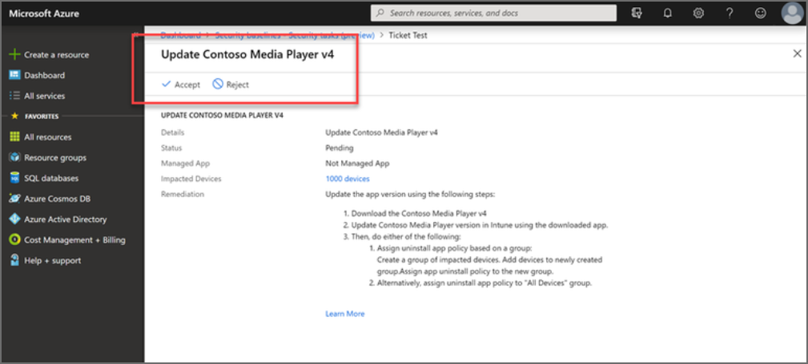

---
# required metadata

title: Use Intune to remediate vulnerabilities found by Microsoft Defender ATP - Azure | Microsoft Docs
description: See how to manage security tasks from  and Threat & vulnerability Management, part of Microsoft Defender Advanced Threat Protection (ATP) from within the Intune console.
keywords:
author: brenduns 
ms.author: brenduns
manager: dougeby
ms.date: 07/12/2019
ms.topic: conceptual
ms.service: microsoft-intune
ms.localizationpriority: high
ms.technology:
ms.reviewer: joglocke

# optional metadata

#ROBOTS:
#audience:
#ms.devlang:
ms.suite: ems
search.appverid: MET150
#ms.tgt_pltfrm:
ms.custom: intune-azure
ms.collection: M365-identity-device-management
---

# Use Intune to remediate vulnerabilities identified by Microsoft Defender ATP  

When you integrate Intune with Microsoft Defender Advanced Threat Protection (ATP), you can take advantage of ATPs Threat & Vulnerability Management (TVM) and use Intune to remediate endpoint weakness identified by TVM. This integration brings a risk-based approach to the discovery and prioritization of vulnerabilities that can improve remediation response time across your environment.  

[Threat & Vulnerability Management](https://docs.microsoft.com/windows/security/threat-protection/windows-defender-atp/next-gen-threat-and-vuln-mgt) is part of [Microsoft Defender Advanced Threat Protection](https://docs.microsoft.com/windows/security/threat-protection/windows-defender-atp/windows-defender-advanced-threat-protection).  

## How integration works  

After you connect Intune to Microsoft Defender Advanced Threat Protection, ATP receives threat and vulnerability details from managed devices.  

In the Microsoft Defender Security Center console, ATP security admins review data about endpoint vulnerabilities. The admins then use a single-click to create security tasks that flag the vulnerable devices for remediation. The security tasks are immediately passed to the Intune console where Intune admins can view them. The security task identifies the type of vulnerability, priority, status, and the steps to take to remediate the vulnerability. The Intune admin chooses to accept or reject the task.  

When a task is accepted, the Intune admin then acts to remediate the vulnerability though Intune, using the guidance provided as part of the security task.  

Common actions for remediation include:  

- **Block** an application from being run  
- **Deploy** an operating system update to mitigate the vulnerability.  
- **Modify** a registry value.  
- **Disable** or **Enable** a configuration to affect the vulnerability.  
- **Require Attention** alerts the admin to the threat when there's no suitable recommendation to provide.  

An example workflow:

- Within Microsoft Defender ATP, a vulnerability for an app named Contoso Media Player v4 is discovered and an admin creates a security task to update that app. The Contoso Media player is an unmanaged app that was deployed with Intune.  

  This security task appears in the Intune console with a status of Pending:  
  
 
- The Intune admin selects the security task to view details about the task.  The admin then selects **Accept**, which updates the status in Intune, and in ATP to be *Accepted*.  
   
 
- The admin then remediates the task based on the guidance provided.  The guidance varies depending on the type of remediation that’s needed. When available, remediation guidance includes links that open relevant panes for configurations in Intune. 

  Because the media player in this example isn't a managed app, Intune can only provide text instructions. If the app was managed, Intune could provide instructions to download an updated version, and provide a link to open the deployment for the app so that the updated files can be added to the deployment. 

- After the completing the remediation, the Intune admin opens the security task and selects **Complete Task**.  The remediation status is updated for Intune and in ATP, where security admins confirm the revised status for the vulnerability.  

## Prerequisites  

**Subscriptions**:  

- Microsoft Intune  
- Microsoft Defender Advanced Threat Protection ([Sign up for a free trial](https://www.microsoft.com/WindowsForBusiness/windows-atp?ocid=docs-wdatp-main-abovefoldlink).)  

**Intune configurations for ATP**:  

- Configure a service to service connection with Microsoft Defender ATP.  
- Deploy a device compliance policy with a profile type of **Microsoft Defender ATP (Windows 10 Desktop)** to devices that will have risk assessed by ATP.
  For information about how to set up Intune to work with ATP, see [Enforce compliance for Microsoft Defender ATP with Conditional Access in Intune](advanced-threat-protection.md#enable-microsoft-defender-atp-in-intune.md).  

## Work with security tasks  

1. Sign in to [Intune](https://go.microsoft.com/fwlink/?linkid=2090973) and go to **Device security** > **Security tasks**.  
2. Select a task from the list to open a resource window that displays additional details for that security task.  
3. While viewing the security task resource window, you can select additional links:  
   - MANAGED APPS - View the app that is vulnerable. When the vulnerability applies to multiple apps, you’ll see a filtered list of apps.  
   - DEVICES - View a list of the *Vulnerable devices*, from which you can link through to an entry with more details for the vulnerability on that device.  
   - REQUESTOR - Use the link to send mail to the admin who submitted this security task.  
   - NOTES - Read custom messages submitted by the requestor when opening the security task.  
4. Select **Accept** or **Reject** to send notification to ATP for your planned action. When you accept or reject a task, you can submit notes, which are sent to ATP.  

5. After accepting a task, reopen the security task (if it closed), and follow the REMEDIATION details to remediate the vulnerability.  The instructions provided by ATP in the security task details vary depending on the vulnerability involved.  

   When it’s possible to do so, the remediation instructions include links that open the relevant configuration objects in the Intune console.  

6. After completing the remediation steps, open the security task and select **Complete Task**.  This action updates the security task status in both Intune and ATP.  

After remediation is successful, the risk exposure score in ATP can drop, based on new information from the remediated devices. 

## Next Steps
Learn more about Intune and [Microsoft Defender ATP](advanced-threat-protection.md)  
Review Intune [Mobile Threat Defense](mobile-threat-defense.md)  
Review the [Threat & Vulnerability Management dashboard](https://docs.microsoft.com/windows/security/threat-protection/windows-defender-atp/tvm-dashboard-insights) in Microsoft Defender ATP
