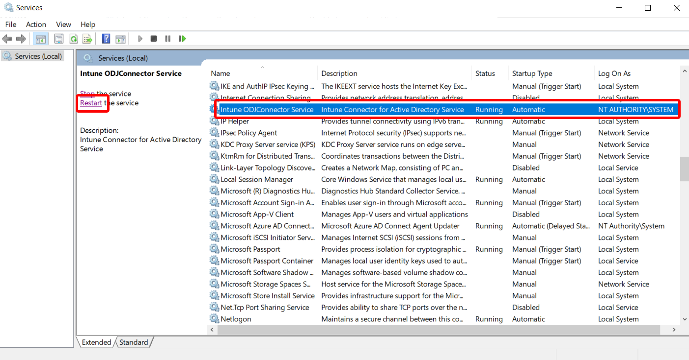

---
# required metadata

title: Configure proxy settings for the Intune Connector for Active Directory
description: Covers how to configure the Intune Connector for Active Directory to work with existing on-premises proxy servers.
keywords:
author: ErikjeMS    
ms.author: erikje
manager: smantri
ms.date: 4/12/2019
ms.topic: conceptual
ms.prod:
ms.service: microsoft-intune
ms.localizationpriority: high
ms.technology:
ms.assetid: 

# optional metadata
 
#ROBOTS:
#audience:
#ms.devlang:
ms.reviewer: tanvira
ms.suite: ems
search.appverid: 
#ms.tgt_pltfrm:
ms.custom: 
ms.collection: M365-identity-device-management
---

# Work with existing on-premises proxy servers

This article explains how to configure the Intune Connector for Active Directory to work with outbound proxy servers. It is intended for customers with network environments that have existing proxies.

For more information about how connectors work, see [Understand Azure AD Application Proxy connectors](https://docs.microsoft.com/en-us/azure/active-directory/manage-apps/application-proxy-connectors).

## Bypass outbound proxies

Connectors have underlying OS components that make outbound requests. These components automatically attempt to locate a proxy server on the network using Web Proxy Auto-Discovery (WPAD).

The OS components attempt to locate a proxy server by carrying out a DNS lookup for wpad.domainsuffix. If the lookup resolves in DNS, an HTTP request is then made to the IP address for wpad.dat. This request becomes the proxy configuration script in your environment. The connector uses this script to select an outbound proxy server. However, connector traffic might still not go through, because of additional configuration settings needed on the proxy.

You can configure the connector to bypass your on-premises proxy to ensure that it uses direct connectivity to the Azure services. We recommend this approach, as long as your network policy allows for it, because it means that you have one less configuration to maintain.

To disable outbound proxy usage for the connector, edit the :\Program Files\Microsoft Intune\ODJConnector\ODJConnectorUI\ODJConnectorUI.exe.config file and add the proxy address and proxy port in the section shown in this code sample:

```xml
<?xml version="1.0" encoding="utf-8" ?>
<configuration>
    <system.net>  
        <defaultProxy>   
            <proxy proxyaddress="<PROXY ADDRESS HERE>:<PORT HERE>" bypassonlocal="True" usesystemdefault="True"/>   
        </defaultProxy>  
    </system.net>
    <runtime>
        <assemblyBinding xmlns="urn:schemas-microsoft-com:asm.v1">
            <dependentAssembly>
                <assemblyIdentity name="mscorlib" publicKeyToken="b77a5c561934e089" culture="neutral"/>
                <bindingRedirect oldVersion="0.0.0.0-2.0.0.0" newVersion="4.6.0.0" />
            </dependentAssembly>
        </assemblyBinding>
    </runtime>
    <startup> 
        <supportedRuntime version="v4.0" sku=".NETFramework,Version=v4.6" />
    </startup>
    <appSettings>
        <add key="SignInURL" value="https://portal.manage.microsoft.com/Home/ClientLogon"/>
        <add key="LocationServiceEndpoint" value="RestUserAuthLocationService/RestUserAuthLocationService/ServiceAddresses"/>
    </appSettings>
</configuration>
```
To ensure that the Connector Updater service also bypasses the proxy, make a similar change to C:\Program Files\Microsoft Intune\ODJConnector\ODJConnectorSvc\ODJConnectorSvc.exe.config.

```xml
<?xml version="1.0" encoding="utf-8" ?>
<configuration>
    <system.net>  
        <defaultProxy>   
            <proxy proxyaddress="<PROXY ADDRESS HERE>:<PORT HERE>" bypassonlocal="True" usesystemdefault="True"/>   
        </defaultProxy>  
    </system.net>
    <startup>
        <supportedRuntime version="v4.0" sku=".NETFramework,Version=v4.6" />
    </startup>
    <appSettings>
        <add key="BaseServiceAddress" value="https://manage.microsoft.com/" />
    </appSettings>
</configuration>
```

Be sure to make copies of the original files, in case you need to revert to the default .config files.

Once the configuration files have been modified, you will need to restart the Intune Connector service. 

1. Open **services.msc**.
2. Find and select the **Intune ODJConnector Service**.
3. Select **Restart**.




## Next steps

[Manage your devices](device-management.md)