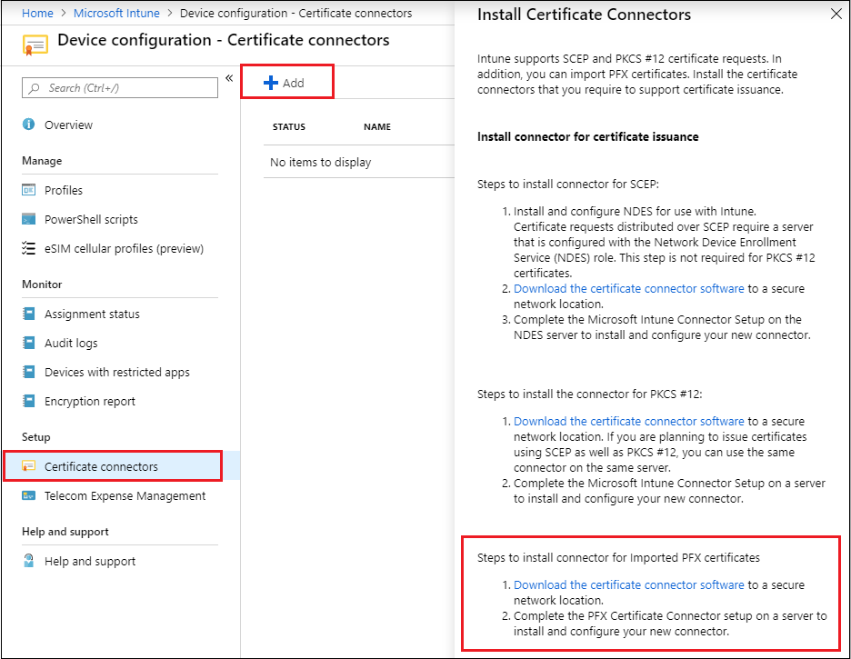
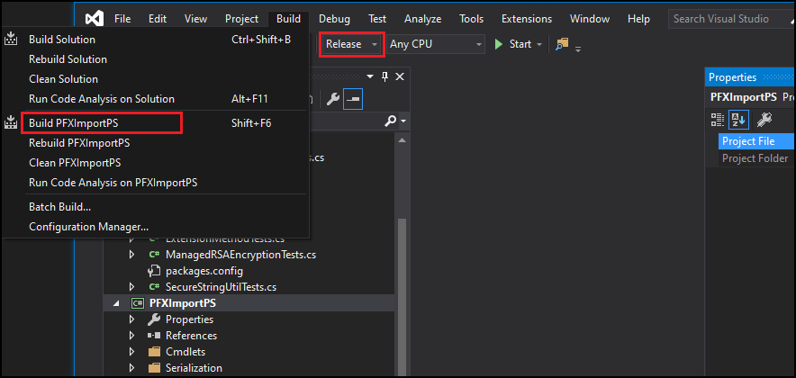

# Configure and use imported PKCS certificates with Intune

Microsoft Intune supports the use of imported public key pair (PKCS) certificates, commonly used for S/MIME with Email profiles. Email profiles in Intune support an option to enable S/MIME where you can define an S/MINE Signing Cert and S/MINE Encryption Cert.

The challenge is with handling the S/MINE Encryption certificates as revoking or deleting such a certificate results in the loss of the email contents that the certificate encrypted. As such, it's not possible to use [SCEP](certificates-scep-configure.md) or [PKCS](certficates-pfx-configure.md) certificate profiles for this purpose. When a device is unenrolled, certificates issued with SCEP or PKCS certificate profiles are revoked.

For more information about using S/MINE with Intune, [Use S/MIME to encrypt email](certificates-s-mime-encryption-sign.md).

## Requirements

To use imported PKCS certificates with Intune, you'll need the following infrastructure:

- **PFX Certificate Connector for Microsoft Intune**:  
  In the Intune portal, go to **Device configuration** > **Certificate Connectors** > **Add**, and follow the *Steps to install connector for Imported PFX certificates*. Use the download link in the portal to start download of the installer **PfxCertificateConnectorBootstrapper.exe**.

  Each Intune tenant supports a single instance of this connector. You can install this connector on the same server as an instance of the Microsoft Intune Certificate connector.

  This connector handles requests for PFX files imported to Intune for S/MIME email encryption for a specific user.  

  This connector can automatically update itself when new versions become available. To use the update capability, you must:
  - Install the Imported PFX Certificate Connector for Microsoft Intune on your server.
  - To automatically receive important updates, ensure firewalls are open that allow the connector to contact **autoupdate.msappproxy.net** on port **443**.  

  For more information about all the network endpoints that the connector must be able to access, see [Microsoft Intune Certificate Connector](intune-endpoints.md#microsoft-intune-certificate-connector).

- **Windows Server**:  
  You use a Windows Server to host:

  - Imported PFX Certificate Connector for Microsoft Intune - for S/MIME email signing or encryption scenarios.

  Intune supports install of the *Microsoft Intune Certificate Connector* on the same server as the *Imported PFX Certificate Connector*.

- **Visual Studio 2015 or above** (optional): 
  You use Visual Studio to build the helper PowerShell module with cmdlets for importing PFX certificates to Microsoft Intune. To get the helper PowerShell cmdlets, see [PFXImport Powershell Project in GitHub](https://github.com/microsoft/Intune-Resource-Access/tree/develop/src/PFXImportPowershell)

## How it works

When you use Intune to deploy an **Imported PFX certificate** to a user, there are two components at play in addition to the device: 

- **Intune Service**: Stores the PFX certificates in an encrypted state and handles the deployment of the certificate to the user device.
- **Connector for Imported PFX certificates**: Decrypts the PFX certificates using a local key.

When you target a user with a **PKCS imported certificate** profile in Intune, Intune looks for a certificate for that user that was imported with Graph. If a certificate is found, Intune requests the Connector for Imported PFX certificates to decrypt that certificate. After being decrypted, the certificate is pushed to the device by Intune.

## Download, install, and configure the Imported PFX Certificate Connector for Microsoft Intune

1. In the [[Intune](https://go.microsoft.com/fwlink/?linkid=2090973) portal, select **Device configuration** > **Certification Connectors** > **Add**

   

2. Download and save the Connector for Imported PFX certificates to a location that's accessible from the server where you're going to install the connector.
3. After the download completes, sign in to the server and do the following actions:

   1. Confirm that .NET 4.6 Framework or higher is installed, as it's required by the Connector for Imported PFX certificates. If .NET 4.6 Framework isn't installed, the installer installs it automatically.
   2. Run the installer (PfxCertificateConnectorBootstrapper.exe), and accept the default location, which installs the connector to `Program Files\Microsoft Intune\PFXCertificateConnector`.
   3. The connector service runs under the local system account. If a proxy is required for internet access, confirm that the local service account can access the proxy settings on the server.

4. The Connector for Imported PFX certificates opens the **Enrollment** tab after installation. To enable the connection to Intune, **Sign In**, and enter an account with Azure global administrator or Intune administrator permissions.

   > [!WARNING]
   > By defualt, in Windows Server **IE Enhanced Security Configuration** is set to **On** which can cause issues with the sign-in to Office 365.

5. Close the window.
6. In the Intune portal, go back to **Device Configuration** > **Certification Connectors**. In a few moments, a green check mark appears and the **Connection status** is **Active**. The connector server can now communicate with Intune.

## Import PFX Certificates to Intune

The import to Intune of your users the PFX certificates is achieved with [Microsoft Graph](https://docs.microsoft.com/graph). The helper [PFXImport Powershell Project at GitHub](https://github.com/microsoft/Intune-Resource-Access/tree/develop/src/PFXImportPowershell) provides you with cmdlets to perform the operations with ease.

If you prefer to use your own custom solution using Graph, use the [userPFXCertificate resource type](https://docs.microsoft.com/graph/api/resources/intune-raimportcerts-userpfxcertificate?view=graph-rest-beta).

### Build 'PFXImport PowerShell Project' cmdlets

To make use of the PowerShell cmdlets, you must build the project yourself using Visual Studio. The process is straight forward and while it can run on the server, we recommended you run it on your workstation.  

1. Go to the root of the [Intune-Resource-Access](https://github.com/microsoft/Intune-Resource-Access) repository and then either download or clone the repository with Git to your machine.

   

2. Go to `.\Intune-Resource-Access-develop\src\PFXImportPowershell\` and open the project with Visual Studio using the file **PFXImportPS.sln**.
3. On the top, change from **Debug** to **Release**.
4. Go to **Build** and select **Build PFXImportPS**. After a few seconds at the bottom left of Visual Studio you'll see the **Build succeeded** confirmation.

   

5. The build process creates a new folder with the Powershell Module at `.\Intune-Resource-Access-develop\src\PFXImportPowershell\PFXImportPS\bin\Release`.

   You'll use this **Release** folder for the next steps.

### Create the encryption Public Key

PFX Certificates are imported to Intune encrypted and require a public key. An administrator manages this key, which remains installed on the server where it was created. The key is also saved in file format for backup purposes.

Although the Powershell module provides methods to create a key, other tools can be used.

#### To create the encryption Publish key

1. Copy the *Release* folder that was created by Visual Studio to the server where the **Connector for Imported PFX certificates** is installed. This folder contains the PowerShell module.  
2. On the server, open *PowerShell* as an Administrator and then navigate to the *Release* folder that contains the PowerShell module.
2. To import the module, run `Import-Module .\IntunePfxImport.psd1` to import the module.
3. Run `Add-IntuneKspKey "Microsoft Software Key Storage Provider" "PFXEncryptionKey"`

   > [!TIP]  
   > The provider you use must be selected again when you import PFX Certificates. We recommend the **Microsoft Software Key Storage Provider**, although it is supported to use a different provider. The key name is also provided as an example, and you can use a different key name of your choice.  

   If you plan to import the certificate at your workstation, you can export this key to a file with the following command:
    `Export-IntunePublicKey -ProviderName "<ProviderName>" -KeyName "<KeyName>" -FilePath "<File path to write to>"`

   You can use the same key for multiple PFX certificates, even if the certificates are from different users.

### Import PFX Certificates 

The following process uses the Powershell cmdlets as an example on how to import the PFX certificates. You can pick different options depending on your requirements.

Options include:  
- Intended Purpose:  

  0. unassigned
  1. smimeEncryption
  2. smimeSigning

- Padding Scheme:  
  1. pkcs1
  2. oaepSha1
  3. oaepSha256
  4. oaepSha384
  5. oaepSha512

Select the Key Storage Provider that matches the provider you used to create the key.

#### To import the PFX certificate

1. On the server, open *PowerShell* as an Administrator and then navigate to the *Release* folder that contains the PowerShell module.
2. To import the module, run `Import-Module .\IntunePfxImport.psd1`   
3. To authenticate to Intune Graph, run `$authResult = Get-IntuneAuthenticationToken -AdminUserName "<Admin-UPN>"`

   > [!NOTE]
   > As the authentication is runs against Graph, you must provide permissions to the AppID. If it's the first time you've used this utility, a *Global administrator* is required. The PowerShell cmdlets use the same AppID as the one used with [PowerShell Intune Samples](https://github.com/microsoftgraph/powershell-intune-samples).  

4. To export the certificate to a variable, run `$SecureFilePassword = ConvertTo-SecureString -String "<PFXPassword>" -AsPlainText -Force`. Save the PFX password you use for this operation.
5. To create a **UserPFXCertificate** object, run
`$userPFXObject = New-IntuneUserPfxCertificate -PathToPfxFile "<FullPathPFXToCert>" $SecureFilePassword "<UserUPN>" "<ProviderName>" "<KeyName>" "<IntendedPurpose>" "<PaddingScheme>"`

   For example: `$userPFXObject = New-IntuneUserPfxCertificate -PathToPfxFile "C:\temp\userA.pfx" $SecureFilePassword "userA@contoso.com" "Microsoft Software Key Storage Provider" "PFXEncryptionKey" "smimeEncryption" "pkcs1"`

   > [!NOTE]  
   > When you import the certificate from a system other than the server where the connector is installed, use must use the following command that includes the key file path: `$userPFXObject = New-IntuneUserPfxCertificate -PathToPfxFile "<FullPathPFXToCert>" $SecureFilePassword "<UserUPN>" "<ProviderName>" "<KeyName>" "<IntendedPurpose>" "<PaddingScheme>" "<File path to public key file>"`

6. Import the **UserPFXCertificate** object to Intune by running `Import-IntuneUserPfxCertificate -AuthenticationResult $authResult -CertificateList $userPFXObject`

7. To validate the certificate was imported, run `Get-IntuneUserPfxCertificate -AuthenticationResult $authResult -UsertList "<UserUPN>"`

For more information about other available commands, see the read me file at [PFXImport Powershell Project at GitHub](https://github.com/microsoft/Intune-Resource-Access/tree/develop/src/PFXImportPowershell).

## Create a PKCS imported certificate profile

You can import to Intune certificates that were previously issued to a specific user from any CA. Imported certificates are installed on each device that a user enrolls. S/MIME email encryption is the most common scenario for importing existing PFX certificates to Intune. A user might have many certificates to encrypt email. The private keys of those certificates must exist on each of a user's devices so that they can decrypt previously encrypted email.

To import certificates into Intune, you can use the [PowerShell cmdlets provided on GitHub](https://github.com/Microsoft/Intune-Resource-Access).

After importing the certificates to Intune, create a **PKCS imported certificate** profile, and assign it to Azure Active Directory groups.

1. In the [Intune](https://go.microsoft.com/fwlink/?linkid=2090973) portal, got to **Device configuration** > **Profiles** > **Create profile**.
2. Enter the following properties:

   - **Name** for the profile
   - Optionally set a description
   - **Platform** to deploy the profile to
   - Set **Profile type** to **PKCS imported certificate**

3. Go to **Settings**, and enter the following properties:

   - **Intended purpose**: Specify the intended purpose of the certificates that are imported for this profile. Administrators can import certificates with different intended purposes (like authentication, S/MIME signing, or S/MIME encryption). The intended purpose selected in the certificate profile matches the certificate profile with the right imported certificates.
   - **Certificate validity period**: Unless the validity period was changed in the certificate template, this option defaults to one year. 
   - **Key storage provider (KSP)**: For Windows, select where to store the keys on the device.

4. Select **OK** > **Create** to save your profile.
5. To assign the new profile to one or more devices, see [assign Microsoft Intune device profiles](device-profile-assign.md).

## Next steps

The profile is created, but it's not doing anything yet. Next, [assign the profile](device-profile-assign.md) to your email configuration policy and [monitor its status](device-profile-monitor.md).

