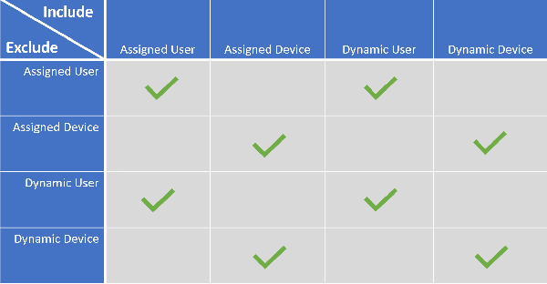

---
# required metadata

title: Assign device profiles in Microsoft Intune - Azure | Microsoft Docs
description: Use the Azure portal to assign device profiles and policies to users and devices. Learn how to exclude groups from a profile assignment in Microsoft Intune.
keywords:
author: MandiOhlinger
ms.author: mandia
manager: dougeby
ms.date: 10/23/2019
ms.topic: conceptual
ms.service: microsoft-intune
ms.subservice: configuration
ms.localizationpriority: high
ms.technology:
ms.assetid: f6f5414d-0e41-42fc-b6cf-e7ad76e1e06d

# optional metadata

#ROBOTS:
#audience:
#ms.devlang:
ms.reviewer: altsou
ms.suite: ems
search.appverid: MET150
#ms.tgt_pltfrm:
ms.custom: intune-azure
ms.collection: M365-identity-device-management
---

# Assign user and device profiles in Microsoft Intune

[!INCLUDE [azure_portal](../includes/azure_portal.md)]

You create a profile, and it includes all the settings you entered. The next step is to deploy or "assign" the profile to your Azure Active Directory (Azure AD) user or device groups. When it's assigned, the users and devices receive your profile, and the settings you entered are applied.

This article shows you how to assign a profile, and includes some information on using scope tags on your profiles.

> [!NOTE]  
> When a policy is removed or no longer assigned to a device, the setting might keep the existing value. The setting doesn't revert to a default value. To change the setting to a different value, create a new policy and assign it.

## Before you begin

Be sure you have the appropriate role to assign policies. For more information, see [Role-based access control (RBAC) with Microsoft Intune](../fundamentals/role-based-access-control.md).

## Assign a device profile

1. Sign in to [Intune](https://go.microsoft.com/fwlink/?linkid=2090973).
2. Select **Device configuration** > **Profiles**. All the profiles are listed.
3. Select the profile you want to assign > **Assignments**.
4. Choose to **Include** groups or **Exclude** groups, and then select your groups. When you select your groups, you're choosing an Azure AD group. To select multiple groups, hold down the **Ctrl** key, and select your groups.

    

5. **Save** your changes.

### Evaluate how many users are targeted

When you assign the profile, you can also **Evaluate** how many users are affected. This feature calculates users; it doesn't calculate devices.

1. In Intune, select **Device configuration** > **Profiles**.
2. Select a profile > **Assignments** > **Evaluate**. A message shows you how many users are targeted by this profile.

If the **Evaluate** button is grayed out, make sure the profile is assigned to one or more groups.

## Use scope tags or applicability rules

When you create or update a profile, you can also add scope tags and applicability rules to the profile.

**Scope tags** are a great way to assign and filter policies to specific groups, such as Human Resources or All US-NC employees. [Use RBAC and scope tags for distributed IT](../fundamentals/scope-tags.md) has more information.

On Windows 10 devices, you can add **applicability rules** so the profile only applies to a specific OS version or a specific Windows edition. [Applicability rules](device-profile-create.md#applicability-rules) has more information.

## Exclude groups from a profile assignment

Intune device configuration profiles let you include and exclude groups from policy assignment.

As a best practice, create and assign policies specifically for your user groups. And, create and assign different policies specifically for your device groups. For more information on groups, see [Add groups to organize users and devices](../fundamentals/groups-add.md).

When you assign your policies, use the following table when including and excluding groups. A checkmark means that assignment is supported:

### What you should know

- Exclusion takes precedence over inclusion in the following same group type scenarios:

  - Including user groups and excluding user groups
  - Including device groups and excluding device group

  For example, you assign a device profile to the **All corporate users** user group, but exclude members in the **Senior Management Staff** user group. Since both groups are user groups, the following behavior happens:

    - All members in the **All corporate users** user group receive the policy.
    - All members in the **Senior Management Staff** don't receive the policy, even though they're members of the **All corporate users** include group.

- Intune doesn't evaluate user-to-device group relationships. If you assign policies to mixed groups, the results may not be what you want or expect.

  For example, you assign a device profile to the **All Users** user group, but exclude an **All personal devices** device group. In this mixed group policy assignment, the following behavior happens:

  - All members in the **All users** user group get the policy.
  - All devices in the **All personal devices** device group also get the policy, which isn't the intent.

  As a result, it's not recommended to assign policies to mixed groups.

## Next steps

See [monitor device profiles](device-profile-monitor.md) for guidance on monitoring your profiles, and the devices running your profiles.
