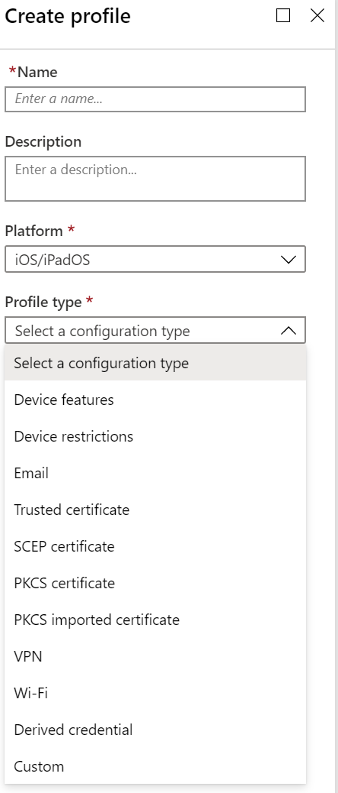
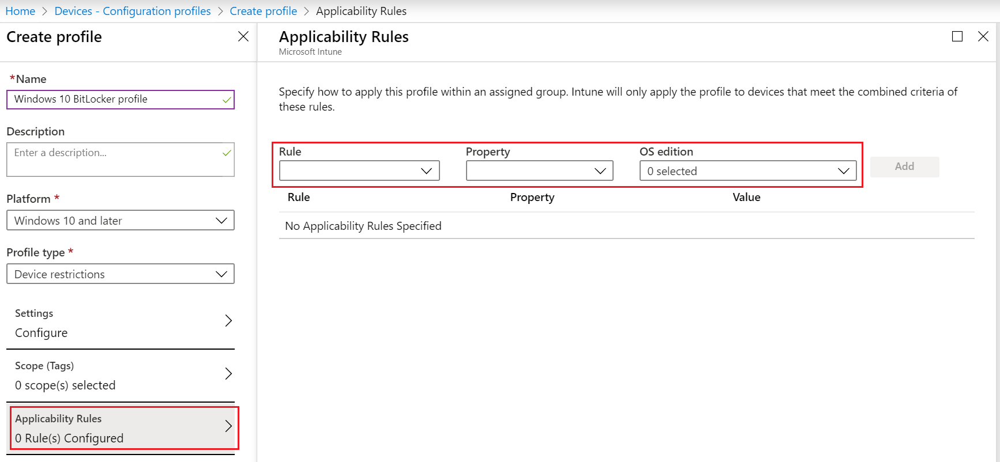

---
# required metadata

title: Create device profiles in Microsoft Intune - Azure | Microsoft Docs
description: Add or configure a device configuration profile in Microsoft Intune. Select the platform type, configure the settings, add a scope tag.
keywords:
author: MandiOhlinger
ms.author: mandia
manager: dougeby
ms.date: 09/04/2019
ms.topic: conceptual
ms.service: microsoft-intune
ms.subservice: configuration
ms.localizationpriority: high
ms.technology:
ms.assetid: d98aceff-eb35-4e3e-8e40-5f300e7335cc

# optional metadata

#ROBOTS:
#audience:
#ms.devlang:
ms.reviewer: heenamac
ms.suite: ems
search.appverid: MET150
#ms.tgt_pltfrm:
ms.custom: intune-azure
ms.collection: M365-identity-device-management
---

# Create a device profile in Microsoft Intune

[!INCLUDE [azure_portal](../includes/azure_portal.md)]

Devices profiles allow you to add and configure settings, and then push these settings to devices in your organization. [Apply features and settings on your devices using device profiles](device-profiles.md) goes into more detail, including what you can do.

This article:

- Lists the steps to create a profile.
- Shows you how to add a scope tag to "filter" the profile.
- Describes applicability rules on Windows 10 devices, and shows you how to create a rule.
- Lists the check-in refresh cycle times when devices receive profiles and any profile updates.

## Create the profile

1. Sign in to [Intune](https://go.microsoft.com/fwlink/?linkid=2090973).

2. Select **Device configuration**. You have the following options:

    - **Overview**: Lists the status of your profiles, and provides additional details on the profiles you assigned to users and devices.
    - **Manage**: Create device profiles, upload custom [PowerShell scripts](../apps/intune-management-extension.md) to run within the profile, and add data plans to devices using [eSIM](esim-device-configuration.md).
    - **Monitor**: Check the status of a profile for success or failure, and also view logs on your profiles.
    - **Setup**: Add a SCEP or PFX certificate authority, or enable [Telecom Expense Management](telecom-expenses-monitor.md) in the profile.

3. Select **Profiles** > **Create Profile**. Enter the following properties:

   - **Name**: Enter a descriptive name for the profile. Name your profiles so you can easily identify them later. For example, a good profile name is **WP email profile for entire company**.
   - **Description**: Enter a description for the profile. This setting is optional, but recommended.
   - **Platform**: Choose the platform of your devices. Your options:  

       - **Android**
       - **Android enterprise**
       - **iOS/iPadOS**
       - **macOS**
       - **Windows Phone 8.1**
       - **Windows 8.1 and later**
       - **Windows 10 and later**

   - **Profile type**: Select the type of settings you want to create. The list shown depends on the **platform** you choose.
   - **Settings**: The following articles describe the settings for each profile type:

       - [Administrative templates](administrative-templates-windows.md)
       - [Custom](../custom-settings-configure.md)
       - [Delivery optimization](../delivery-optimization-windows.md)
       - [Device features](../device-features-configure.md)
       - [Device restrictions](device-restrictions-configure.md)
       - [Edition upgrade and mode switch](edition-upgrade-configure-windows-10.md)
       - [Education](education-settings-configure.md)
       - [Email](email-settings-configure.md)
       - [Endpoint protection](../protect/endpoint-protection-configure.md)
       - [Identity protection](../protect/identity-protection-configure.md)  
       - [Kiosk](kiosk-settings.md)
       - [PKCS certificate](../protect/certficates-pfx-configure.md)
       - [PKCS imported certificate](../protect/certificates-imported-pfx-configure.md)
       - [SCEP certificate](../protect/certificates-scep-configure.md)
       - [Trusted certificate](../protect/certificates-configure.md)
       - [Update policies](../software-updates-ios.md)
       - [VPN](vpn-settings-configure.md)
       - [Wi-Fi](wi-fi-settings-configure.md)
       - [Windows Defender ATP](../protect/advanced-threat-protection.md)
       - [Windows Information Protection](../protect/windows-information-protection-configure.md)

     For example, if you select **iOS/iPadOS** for the platform, your profile type options look similar to the following profile:

     

4. When finished, select **OK** > **Create** to save your changes. The profile is created, and shown in the list.

## Scope tags

After you add the settings, you can also add a scope tag to the profile. Scope tags assign and filter policies to specific groups, such as HR or All US-NC employees.

For more information about scope tags, and what you can do, see [Use RBAC and scope tags for distributed IT](../fundamentals/scope-tags.md).

### Add a scope tag

1. Select **Scope (Tags)**.
2. Select **Add** to create a new scope tag. Or, select an existing scope tag from the list.
3. Select **OK** to save your changes.

## Applicability rules

Applies to:

- Windows 10 and later

Applicability rules allow administrators to target devices in a group that meet specific criteria. For example, you create a device restrictions profile that applies to the **All Windows 10 devices** group. And, you only want the profile assigned to devices running Windows 10 Enterprise.

To do this task, create an **applicability rule**. These rules are great for the following scenarios:

- You use Windows 10 Education (EDU). At Bellows College, you want to target all Windows 10 EDU devices between RS3 and RS4.
- You want to target all users in Human Resources at Contoso, but only want Windows 10 Professional or Enterprise devices.

To approach these scenarios, you:

- Create a devices group that includes all devices at Bellows College. In the profile, add an applicability rule so it applies if the OS minimum version is `16299` and the maximum version is `17134`. Assign this profile to the Bellows College devices group.

  When it's assigned, the profile applies to devices between the minimum and maximum versions you enter. For devices that aren't between the minimum and maximum versions you enter, their status shows as **Not applicable**.

- Create a users group that includes all users in Human Resources (HR) at Contoso. In the profile, add an applicability rule so it applies to devices running Windows 10 Professional or Enterprise. Assign this profile to the HR users group.

  When it's assigned, the profile applies to devices running Windows 10 Professional or Enterprise. For devices that aren't running these editions, their status shows as **Not applicable**.

- If there are two profiles with the exact same settings, then the profile without an applicability rule is applied. 

  For example, ProfileA targets the Windows 10 devices group, enables BitLocker, and doesn’t have an applicability rule. ProfileB targets the same Windows 10 devices group, enables BitLocker, and has an applicability rule to only apply the profile to Windows 10 Enterprise.

  When both profiles are assigned, ProfileA is applied because it doesn’t have an applicability rule. 

When you assign the profile to the groups, the applicability rules act as a filter, and only target the devices that meet your criteria.

### Add a rule

1. Select **Applicability Rules**. You can choose the **Rule**, **Property**, and **OS edition**:

    

2. In **Rule**, choose if you want to include or exclude users or groups. Your options:

    - **Assign profile if**: Includes users or groups that meet the criteria you enter.
    - **Don't assign profile if**: Excludes users or groups that meet the criteria you enter.

3. In **Property**, choose your filter. Your options: 

    - **OS edition**: In the list, check the Windows 10 editions you want to include (or exclude) in your rule.
    - **OS version**: Enter the **min** and **max** Windows 10 version numbers of you want to include (or exclude) in your rule. Both values are required.

      For example, you can enter `10.0.16299.0` (RS3 or 1709) for minimum version and `10.0.17134.0` (RS4 or 1803) for maximum version. Or, you can be more granular and enter `10.0.16299.001` for minimum version and `10.0.17134.319` for maximum version.

4. Select **Add** to save your changes.

## Refresh cycle times

Intune uses different refresh cycles to check for updates to configuration profiles. If the device recently enrolled, the check-in runs more frequently. [Policy and profile refresh cycles](device-profile-troubleshoot.md#how-long-does-it-take-for-devices-to-get-a-policy-profile-or-app-after-they-are-assigned) lists the estimated refresh times.

At any time, users can open the Company Portal app, and sync the device to immediately check for profile updates.

## Next steps

[Assign the profile](../device-profile-assign.md) and [monitor its status](device-profile-monitor.md).
