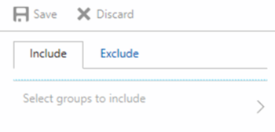
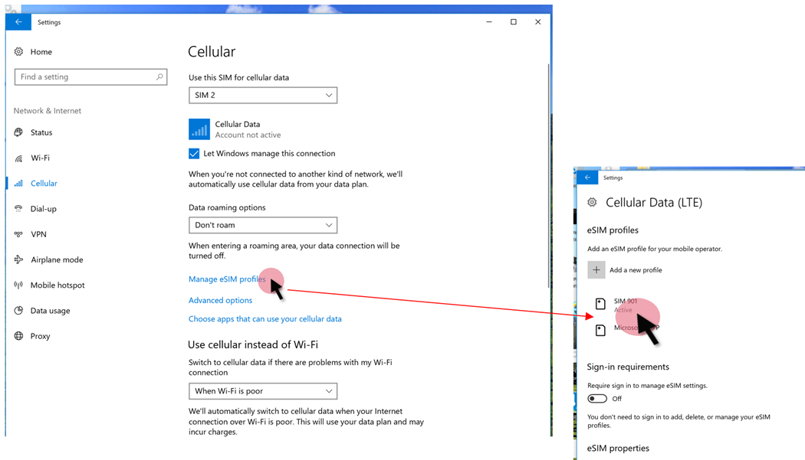

---
# required metadata

title: Enable eSIM data connections in Microsoft Intune - Azure | Microsoft Docs
description: Add or use eSIM to get internet and data access using different data plans. In Intune, add or import activation codes, and then assign these activation codes using a configuration profile. You can also monitor the eSIM profiles and check the status of the eSIM-enabled devices. 
keywords:
author: MandiOhlinger
ms.author: mandia
manager: dougeby
ms.date: 7/31/2018
ms.topic: conceptual
ms.service: microsoft-intune
ms.subservice: configuration
ms.localizationpriority: high
ms.technology:

# optional metadata

#ROBOTS:
#audience:
#ms.devlang:
ms.suite: ems
search.appverid: MET150
#ms.tgt_pltfrm:
ms.custom: intune-azure
ms.collection: M365-identity-device-management
---

# Configure eSIM cellular profiles in Intune - Public preview

eSIM is an embedded SIM chip, and lets you connect to the Internet over a cellular data connection on an eSIM-capable device, such as the [Surface LTE Pro](https://www.microsoft.com/surface/business/surface-pro). With an eSIM, you don't need to get a SIM card from your mobile operator. As a global traveler, you can also switch between mobile operators and data plans to always stay connected.

For example, you have a cellular data plan for work, and another data plan with a different mobile operator for personal use. When traveling, you can get Internet access by finding mobile operators with data plans in that area.

In Intune, you can import one time use activation codes provided by your mobile operator. To configure cellular data plans on the eSIM module, deploy those activation codes to your eSIM-capable devices. When Intune installs the activation code, the eSIM hardware module uses the data in the activation code to contact the mobile operator. Once complete, the eSIM profile is downloaded on the device, and configured for cellular activation.

To deploy eSIM to your devices using Intune, the following are needed:

- **eSIM capable devices**, such as the Surface LTE: See [if your device supports eSIM](https://support.microsoft.com/help/4020763/windows-10-use-esim-for-cellular-data). Or, see a list of [some of the known eSIM capable devices](#esim-capable-devices) (in this article).
- **Windows 10 Fall creators update PC** (1709 or later) that is enrolled and MDM managed by Intune
- **Activation codes** provided by your mobile operator. These one time-use activation codes are added to Intune, and deployed to your eSIM capable devices. Contact your mobile operator to acquire eSIM activation codes.

## Deploy eSIM to devices - overview

To deploy eSIM to devices, an Administrator completes the following tasks:

1. Import activation codes provided by your mobile operator
2. Create an Azure Active Directory (Azure AD) device group that includes your eSIM capable devices
3. Assign the Azure AD group to your imported subscription pool
4. Monitor the deployment

This article guides you through these steps.

## eSIM capable devices

The following devices have been announced as eSIM-capable, or are in-market today. Also, check if [your device supports eSIM](https://support.microsoft.com/help/4020763/windows-10-use-esim-for-cellular-data).

- Acer Swift 7
- Asus NovoGo TP370QL
- Asus TP401
- Asus Transformer Mini T103
- HP Elitebook G5
- HP Envy x2
- HP Probook G5
- Lenovo Miix 630
- Lenovo T480
- Samsung Galaxy Book
- Surface Pro LTE
- HP Spectre Folio 13
- Lenovo Yoga C630

## Step 1: Add cellular activation codes

Cellular activation codes are provided by your mobile operator in a comma-separated file (csv). When you have this file, add it to Intune using the following steps:

1. Sign in to the [Azure portal](https://portal.azure.com/).
2. Select **All services**, filter on **Intune**, and select **Microsoft Intune**.
3. Select **Device configuration** > **eSIM cellular profiles** > **Add**.
4. Select the CSV file that has your activation codes.
5. Select **OK** to save your changes.

### CSV file requirements

When working with the csv file with the activation codes, be sure you or your mobile operator follows the requirements:

- The file must be in csv format (filename.csv).
- The file structure must adhere to a strict format. Otherwise, the import fail. Intune checks the file on import, and fails if errors are found.
- Activation codes are used one time. It's not recommended to import activation codes that you previously imported, as it may cause problems when you deploy to the same or different device.
- Each file should be specific to a single mobile operator, and all activation codes specific to the same billing plan. Intune randomly distributes the activation codes to targeted devices. There isn't any guarantee which device gets a specific activation code.
- A maximum of 1000 activation codes can be imported in one csv file.

### CSV file example

1. The first row and first cell of the csv is the URL of the mobile operator eSIM activation service, which is called SM-DP+ (Subscription Manager Data Preparation server). The URL should be a fully qualified domain name (FQDN) without any commas.
2. The second and all later rows are unique one-time use activation codes that include two values:

    1. First column is the unique ICCID (the identifier of the SIM chip)
    2. Second column is the Matching ID with only a comma separating them (no comma at the end). See the following example:

        

3. The csv file name becomes the cellular subscription pool name in the Azure portal. In the previous image, the file name is `UnlimitedDataSkynet.csv`. So, Intune names the subscription pool `UnlimitedDataSkynet.csv`:

    

## Step 2: Create an Azure AD device group

Create a Device group that includes the eSIM capable devices. [Add groups](../fundamentals/groups-add.md) lists the steps.

> [!NOTE]
> - Only devices are targeted, users aren't targeted.
> - We recommend creating a static Azure AD device group that includes your eSIM devices. Using a group confirms you target only eSIM devices.

## Step 3: Assign eSIM activation codes to devices

Assign the profile to the Azure AD group that includes your eSIM devices.

1. In the [Azure portal](https://portal.azure.com/), select **All Services**, filter on **Intune**, and select **Microsoft Intune**.
2. Select **Device configuration** > **eSIM cellular** > **Profiles**.
3. In the list of profiles, select the eSIM cellular subscription pool you want to assign, and then select **Assignments**.
4. Choose to **Include** groups or **Exclude**  groups, and then select the groups.

    

5. When you select your groups, you're choosing an Azure AD group. To select multiple groups, use the **Ctrl** key, and select the groups.
6. When done, **Save** your changes.

eSIM activation codes are used once. After Intune installs an activation code on a device, the eSIM module contacts the mobile operator to download the cellular profile. This contact finishes registering the device with mobile operator network.

## Step 4: Monitor deployment

### Review the deployment status

After you assign the profile, you can monitor the deployment status of a subscription pool.

1. Sign in to the [Azure portal](https://portal.azure.com/).
2. Select **All services**, filter on **Intune**, and select **Microsoft Intune**.
3. Select **Device configuration** > **eSIM cellular profiles**. All of your existing eSIM cellular subscription pools are listed.
4. Select a subscription, and review the **Deployment Status**.

### Check the profile status
After you create your device profile, Intune provides graphical charts. These charts display the status of a profile, such as it being successfully assigned to devices, or if the profile shows a conflict.

1. Select **Device configuration** > **eSIM cellular profiles** > Select an existing subscription.
2. In the **Overview** tab, the top graphical chart shows the number of devices assigned to the specific eSIM cellular subscription pool deployment.

    It also shows the number of devices for other platforms that are assigned the same device profile.

    Intune shows the delivery and installation status for the activation code targeted to devices.

    - **Device not synced**: The targeted device hasn't contacted Intune since the eSIM deployment policy was created
    - **Activation pending**: A transient state when Intune is actively installing the activation code on the device
    - **Active**: Activation code installation successful
    - **Activation fail**: Activation code installation failed – see troubleshooting guide.

#### View the detailed device status

You can monitor and view a detailed list of devices you can view in Device Status.**

1. Select **Device configuration** > **eSIM cellular profiles** > Select an existing subscription.
2. Select **Device Status**. Intune shows additional details about the device:

    - **Device Name**: Name of the device that is targeted
    - **User**: User of the enrolled device
    - **ICCID**: Unique code provided by the mobile operate within the activation code installed on the device
    - **Activation Status**: Intune delivery and installation status of the activation code on the device
    - **Cellular status**: State provided by the mobile operator. Follow up with mobile operator to troubleshoot.
    - **Last Check-In**: Date the device last communicated with Intune

### Monitor eSIM profile details on the actual device

1. On your device, open **Settings** > go to **Network & Internet**.
2. Select **Cellular** > **Manage eSIM profiles**
3. The eSIM profiles are listed:

    

## Remove the eSIM profile from device

When you remove the device from the Azure AD group, the eSIM profile is also removed. Be sure to:

1. Confirm you're using the eSIM devices Azure AD group.
2. Go to the Azure AD group, and remove the device from the group.
3. When the removed device contacts Intune, the updated policy is evaluated, and the eSIM profile removed.

The eSIM profile is also removed when the device is [retired](../remote-actions/devices-wipe.md#retire) or unenrolled by the user, or when the [reset device remote action](../remote-actions/devices-wipe.md#wipe) runs on the device.

> [!NOTE]
> Removing the profile may not stop billing. Contact your mobile operator to check the billing status for your device.

## Best practices & troubleshooting

- Be sure your csv file is properly formatted. Confirm the file doesn't include duplicate codes, doesn't include multiple mobile operators, or doesn't include different data plans. Remember, each file must be unique to a mobile operator and cellular data plan.
- Create a static device Azure AD group that only includes the eSIM devices that are targeted.
- If there's an issue with the deployment status, check the following:
  - **File format not proper**: See **Step 1: Add cellular activation codes** (in this article) on how to properly format your file.
  - **Cellular activation failure, contact mobile operator**: The activation code may not be activated within their network. Or, the profile download and cellular activation failed.

## Next steps
[Configure device profiles](../device-profiles.md)
