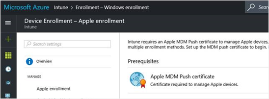
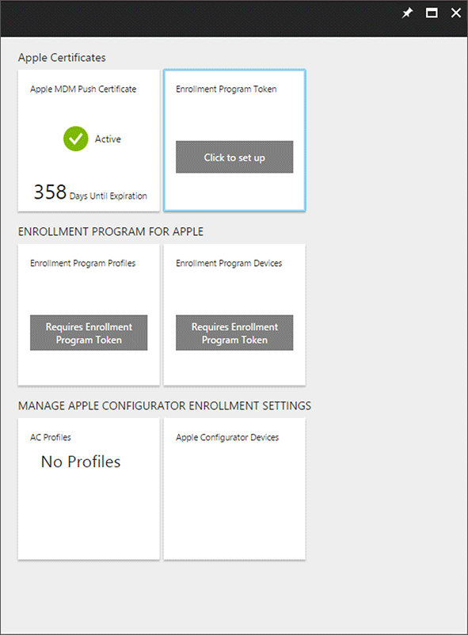
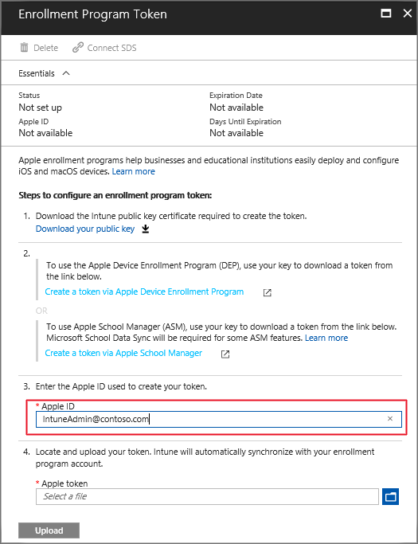
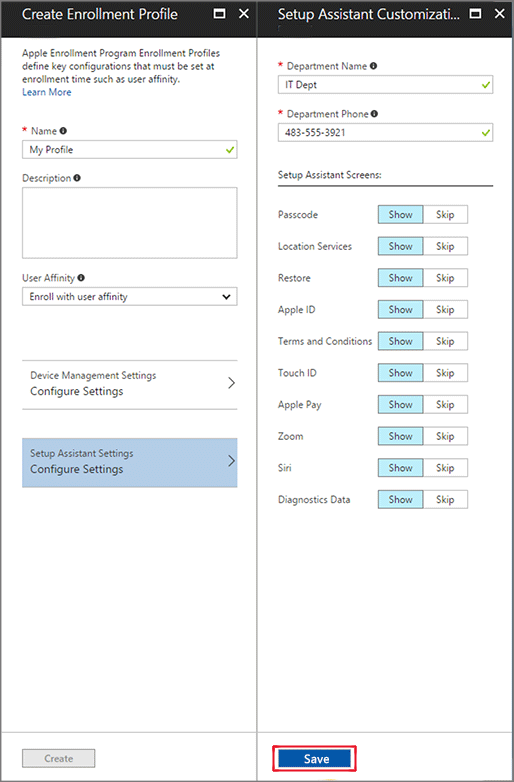

---
# required metadata

title: Enroll iOS devices using the Device Enrollment Program
titlesuffix: "Microsoft Intune"
description: Learn how to enroll corporate-owned iOS devices using the Device Enrollment Program."
keywords:
author: ErikjeMS
ms.author: erikje
manager: dougeby
ms.date: 02/08/2018
ms.topic: article
ms.prod:
ms.service: microsoft-intune
ms.technology:
ms.assetid: 7981a9c0-168e-4c54-9afd-ac51e895042c

# optional metadata

#ROBOTS:
#audience:
#ms.devlang:
ms.reviewer: dagerrit
ms.suite: ems
#ms.tgt_pltfrm:
ms.custom: intune-azure

---

# Automatically enroll iOS devices by using Apple's Device Enrollment Program

[!INCLUDE [azure_portal](./includes/azure_portal.md)]

> [!NOTE]
> ### Temporary user interface differences
>
>The user interfaces for the features described on this page are in the process of being updated. These updates are rolling out across all user accounts through the first week of May.
>
>If your **Device enrollment** page looks like the image below, your account has not yet been updated to the new user interface and you can use this help page.
>
>
>
>If your **Device enrollment** page looks like the image below, you have the updated user interfaces.  Go to [this help page](device-enrollment-program-enroll-ios-newui.md).
>
>

This topic helps you enable iOS device enrollment for devices purchased through Apple's [Device Enrollment Program (DEP)](https://deploy.apple.com). You can enable DEP enrollment for large numbers of devices without ever touching them. You can ship devices like iPhones and iPads directly to users. When the user turns on the device, Setup Assistant runs with preconfigured settings and the device enrolls into management.

To enable DEP enrollment, you use both the Intune and Apple DEP portals. A list of serial numbers or a purchase order number is required so you can assign devices to Intune for management. You create DEP enrollment profiles containing settings that applied to devices during enrollment.

DEP enrollment does not work with the [device enrollment manager](device-enrollment-manager-enroll.md). Also, macOS doesn't currently support DEP.

## What is supervised mode?
Apple introduced supervised mode in iOS 5. An iOS device in supervised mode can be managed with more controls. As such, it is especially useful for corporate-owned devices. Intune supports configuring devices for supervised mode as part the Apple Device Enrollment Program (DEP).

<!--
**Steps to enable enrollment programs from Apple**
1. [Get an Apple DEP token and assign devices](#get-the-apple-dep-token)
2. [Create an enrollment profile](#create-an-apple-enrollment-profile)
3. [Synchronize DEP-managed devices](#sync-managed-device)
4. [Assign DEP profile to devices](#assign-an-enrollment-profile-to-devices)
5. [Distribute devices to users](#end-user-experience-with-managed-devices)
-->
## Prerequisites
- Devices purchased in [Apple's Device Enrollment Program](http://deploy.apple.com)
- [MDM Authority](mdm-authority-set.md)
- [Apple MDM Push certificate](apple-mdm-push-certificate-get.md)

> [!NOTE]
> Multifactor authentication (MFA) doesn't work during DEP enrollment set up for user affinity. After enrollment, MFA works as expected on devices. Devices can't prompt users who need to change their password when they first sign in. Additionally, users with expired passwords aren't prompted to reset their password during enrollment. Users must use a different device to reset the password.

## Get the Apple DEP token

Before you can enroll iOS devices with DEP, you need a DEP token (.p7m) file from Apple. This token lets Intune sync information about DEP devices that your corporation owns. It also permits Intune to upload enrollment profiles to Apple and to assign devices to those profiles.

You use the Apple DEP portal to create a DEP token. You also use the DEP portal to assign devices to Intune for management.

> [!NOTE]
> If you delete the token from the Intune classic portal before migrating to Azure, Intune might restore a deleted Apple DEP token. You can delete the DEP token again from the Azure portal. You can delete the DEP token again from the Azure portal.

**Step 1. Download an Intune public key certificate required to create an Apple DEP token.** 

1. In the [Intune in the Azure portal](https://aka.ms/intuneportal), choose **Device enrollment** > **Apple enrollment** > **Enrollment Program Token**.

   

2. Choose **Download your public key** to download and save the encryption key (.pem) file locally. The .pem file is used to request a trust-relationship certificate from the Apple Device Enrollment Program portal.

   

**Step 2. Create and download an Apple DEP token.** 
1. Choose **Create a token via Apple's Device Enrollment Program** to open Apple's Deployment Program portal, and sign in with your company Apple ID. You can use this Apple ID to renew your DEP token.
2.  In Apple's [Deployment Programs portal](https://deploy.apple.com), choose **Get Started** for **Device Enrollment Program**.

3. On the **Manage Servers** page, choose **Add MDM Server**.
4. Enter the **MDM Server Name**, and then choose **Next**. The server name is for your reference to identify the mobile device management (MDM) server. It is not the name or URL of the Microsoft Intune server.

   

5. The **Add &lt;ServerName&gt;** dialog box opens, stating **Upload Your Public Key**. Choose **Choose File…** to upload the .pem file, and then choose **Next**.  

6. Go to  **Deployment Programs** &gt; **Device Enrollment Program** &gt; **Manage Devices**.
7. Under **Choose Devices By**, specify how devices are identified:
    - **Serial Number**
    - **Order Number**
    - **Upload CSV File**.

   

8. For **Choose Action**, choose **Assign to Server**, choose the &lt;ServerName&gt; specified for Microsoft Intune, and then choose **OK**. The Apple portal assigns the specified devices to the Intune server for management and then displays **Assignment Complete**.

   In the Apple portal, go to **Deployment Programs** &gt; **Device Enrollment Program** &gt; **View Assignment History** to see a list of devices and their MDM server assignment.

**Step 3. Enter the Apple ID used to create your enrollment program token.** In Intune in the Azure portal, provide the Apple ID for future reference.

**Step 4. Browse to your enrollment program token to upload.** 
Go to the certificate (.pem) file, choose **Open**, and then choose **Upload**. With the push certificate, Intune can enroll and manage iOS devices by pushing policy to enrolled mobile devices. Intune automatically synchronizes with Apple to see your enrollment program account.

## Create an Apple enrollment profile

Now that you've installed your token, you can create an enrollment profile for DEP devices. A device enrollment profile defines the settings applied to a group of devices during enrollment.

1. In [Intune in the Azure portal](https://aka.ms/intuneportal), choose **Device enrollment** > **Apple Enrollment**.
2. Under **Enrollment Program for Apple**, choose **Enrollment Program Profiles** > **Create**.
3. On **Create Enrollment Profile**, enter a **Name** and **Description** for the profile for administrative purposes. Users do not see these details. You can use this **Name** field to create a dynamic group in Azure Active Directory. Use the profile name to define the enrollmentProfileName parameter to assign devices with this enrollment profile. Learn more about [Azure Active Directory dynamic groups](https://docs.microsoft.com/azure/active-directory/active-directory-groups-dynamic-membership-azure-portal#using-attributes-to-create-rules-for-device-objects).

   For **User Affinity**, choose whether devices with this profile enroll with or without an assigned user.

   - **Enroll with user affinity** - Choose for devices that belong to users and that need to use the company portal for services like installing apps. User affinity requires [WS-Trust 1.3 Username/Mixed endpoint](https://technet.microsoft.com/library/adfs2-help-endpoints). [Learn more](https://technet.microsoft.com/itpro/powershell/windows/adfs/get-adfsendpoint).

   - **Enroll without user affinity** - Choose for device unaffiliated with a single user. Use for devices that perform tasks without accessing local user data. Apps like the Company Portal app don’t work.

4. Choose **Device Management Settings** to configure the following profile settings:

   
   - **Supervised** - a management mode that enables more management options and disabled Activation Lock by default. If you leave the check box blank, you have limited management capabilities. Microsoft recommends using DEP as the mechanism for enabling supervised mode, especially for organizations that are deploying large numbers of iOS devices.

   > [!NOTE]
   > Configuring a device for supervised mode cannot be done using Intune after a device has been enrolled. After enrollment, the only way to enable supervised mode is to connect an iOS device to a Mac with a USB cable and use Apple Configurator. This will reset the device and configure it in supervised mode. Learn more about this on [Apple Configurator docs](http://help.apple.com/configurator/mac/2.3). A supervised device will say that "This iPhone is managed by Contoso." on the lock screen, and "This iPhone is supervised. Contoso can monitor your Internet traffic and locate this device." in **Settings** > **General** > **About**.

   - **Locked enrollment** - (Requires Management Mode = supervised) Disables iOS settings that could allow removal of the management profile. If you leave the check box blank, it allows the management profile to be removed from the Settings menu. After device enrollment, you cannot change this setting without factory resetting the device.

   - **Enable Shared iPad** - Apple's Device Enrollment Program does not support shared iPad.

   - **Allow Pairing** - Specifies whether iOS devices can sync with computers. If you chose **Allow Apple Configurator by certificate**, you must choose a certificate under **Apple Configurator Certificates**.

   - **Apple Configurator Certificates** - If you chose **Allow Apple Configurator by certificate** under **Allow Pairing**, choose an Apple Configurator Certificate to import.

   Choose **Save**.

5. Choose **Setup Assistant Settings** to configure the following profile settings:

   
   - **Department Name** - Appears when users tap **About Configuration** during activation.

   - **Department Phone** - Appears when the user clicks the **Need Help** button during activation.
     - **Setup Assistant Options** - These optional settings can be set up later in the iOS **Settings** menu.
        - **Passcode**
        - **Location Services**
        - **Restore**
        - **Apple ID**
        - **Terms and Conditions**
        - **Touch ID**
        - **Apple Pay**
        - **Zoom**
        - **Siri**
        - **Diagnostic Data**

     Choose **Save**.

>[!NOTE]
>Starting with iOS 11, if you want to enable restore from iCloud backup you must show both "Restore" and "Apple ID" under Setup Assistant Options.

6. To save the profile settings, choose **Create** on the **Create Enrollment Profile** blade. The enrollment profile appears in the Apple Enrollment Program Enrollment Profiles list.

## Sync managed devices
Now that Intune has permission to manage your devices, you can synchronize Intune with Apple to see your managed devices in Intune in the Azure portal.

1. In [Intune in the Azure portal](https://aka.ms/intuneportal), choose **Device enrollment** > **Apple Enrollment** > **Enrollment Program Devices** > **Sync**. The progress bar shows the amount of time you must wait before requesting Sync again.

   

2. On the **Sync** blade, choose **Request Sync**. The progress bar shows the amount of time you must wait before requesting Sync again.

   

   To comply with Apple’s terms for acceptable enrollment program traffic, Intune imposes the following restrictions:
    - A full sync can run no more than once every seven days. During a full sync, Intune fetches the complete updated list of serial numbers assigned to the Apple MDM server connected to Intune. After an Enrollment Program device is deleted from Intune portal, it can't be re-imported until the full sync is run. 
    - A sync is run automatically every 24 hours. You can also sync by clicking the **Sync** button (no more than once every 15 minutes). All sync requests are given 15 minutes to finish. The **Sync** button is disabled until a sync is completed. This sync will refresh existing device status and import new devices assigned to the Apple MDM server.

3. In the Enrollment Program Devices workspace, choose **Refresh** to see your devices.

## Assign an enrollment profile to devices
You must assign an enrollment program profile to devices before they can enroll.

>[!NOTE]
>You can also assign serial numbers to profiles from the **Apple Serial Numbers** blade.

1. In [Intune in the Azure portal](https://aka.ms/intuneportal), choose **Device enrollment** > **Apple Enrollment**, and then choose **Enrollment Program Profiles**.
2. From the list of **Enrollment Program Profiles**, choose the profile you want to assign to devices and then choose **Assign devices**.

   

3. Choose **Assign** and then choose the devices you want to assign this profile. You can filter to view available devices:
   - **unassigned**
   - **any**
   - **&lt;profile name&gt;**
4. Choose the devices you want to assign. The checkbox above the column selects up to 1000 listed devices, and then click **Assign**. To enroll more than 1000 devices, repeat the assignment steps until all devices are assigned an enrollment profile.

   

## Distribute devices
You have enabled management and syncing between Apple and Intune, and assigned a profile to  let your DEP devices enroll. You can now distribute devices to users. Devices with user affinity require each user be assigned an Intune license. Devices without user affinity require a device license. An activated device cannot apply an enrollment profile until the device is factory reset.

See [Enroll your iOS device in Intune with the Device Enrollment Program](/intune-user-help/enroll-your-device-dep-ios).
