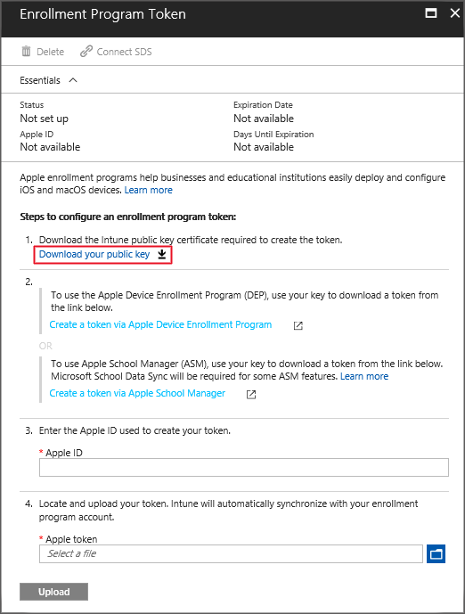
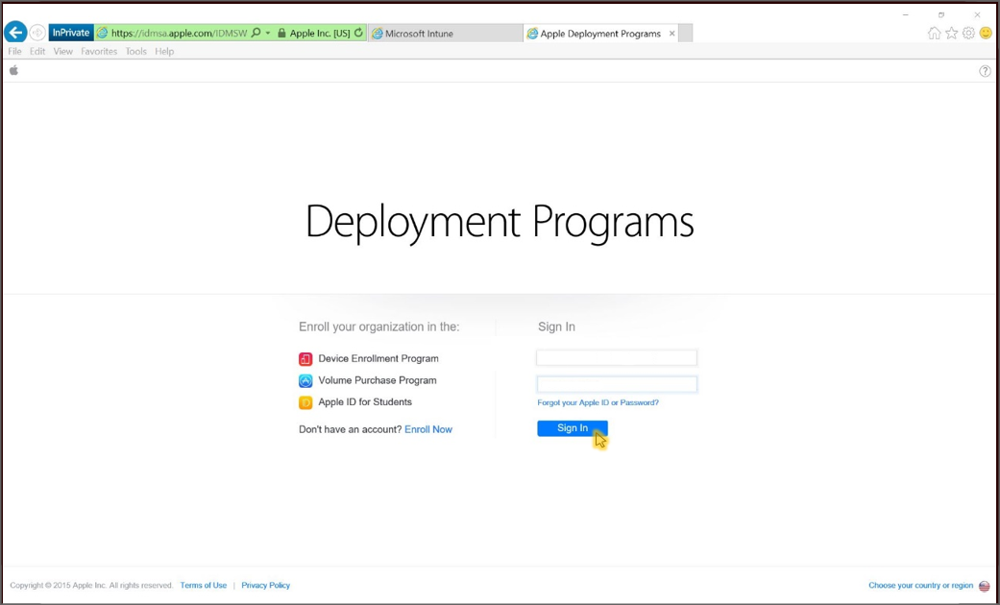
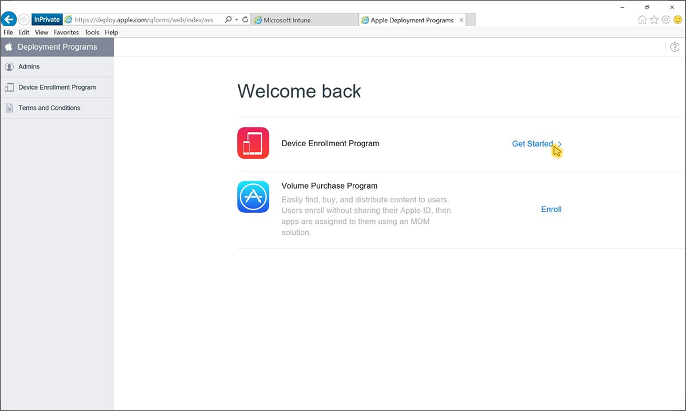
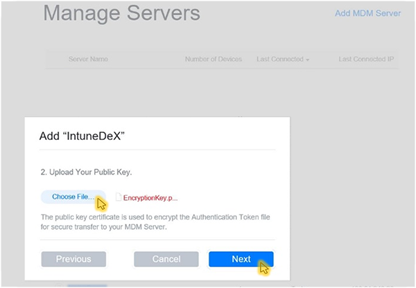
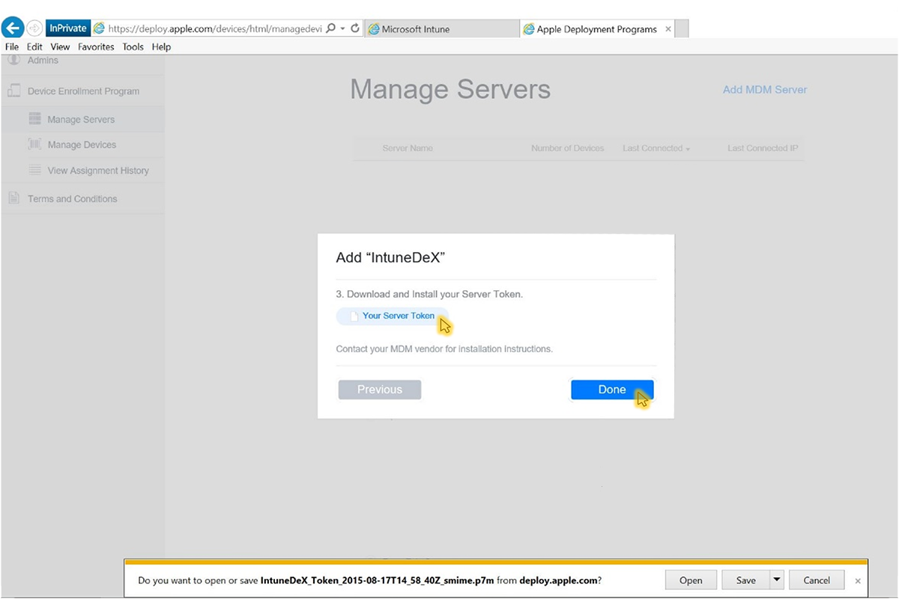
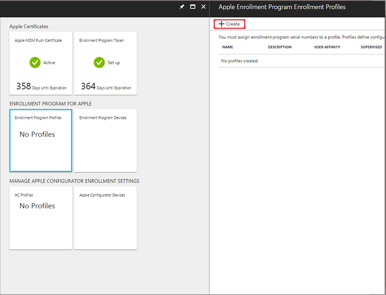
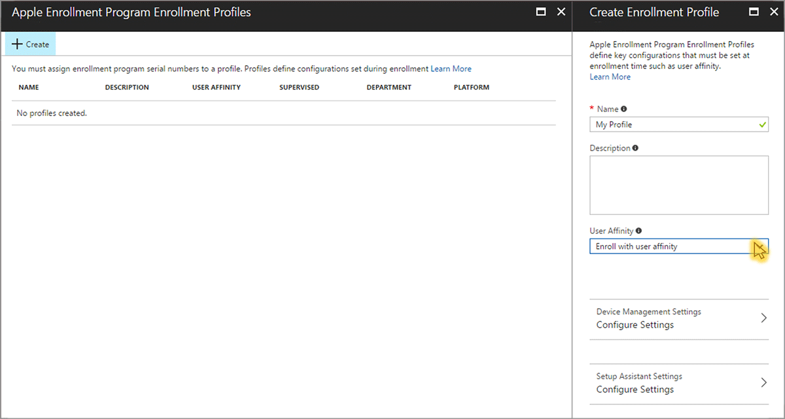
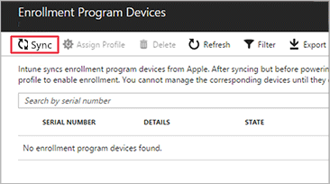
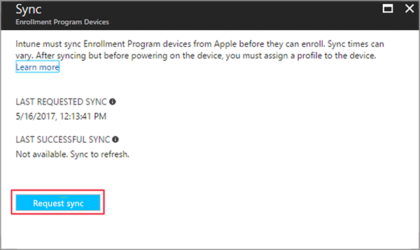
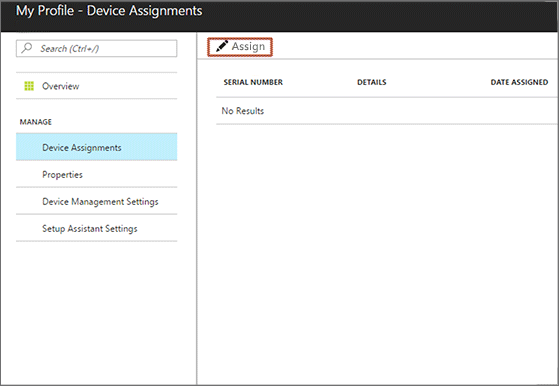

---
# required metadata

title: Enroll iOS devices - Device Enrollment Program
titleSuffix: "Intune on Azure"
description: Learn how to enroll corporate-owned iOS devices using the Device Enrollment Program."
keywords:
author: nathbarn
ms.author: nathbarn
manager: angrobe
ms.date: 07/05/2017
ms.topic: article
ms.prod:
ms.service: microsoft-intune
ms.technology:
ms.assetid: 7981a9c0-168e-4c54-9afd-ac51e895042c

# optional metadata

#ROBOTS:
#audience:
#ms.devlang:
ms.reviewer: dagerrit
ms.suite: ems
#ms.tgt_pltfrm:
ms.custom: intune-azure

---

# Set up iOS device enrollment with Device Enrollment Program

[!INCLUDE[azure_portal](./includes/azure_portal.md)]

This topic helps IT admins enable iOS device enrollment for devices purchased through Apple's [Device Enrollment Program (DEP)](https://deploy.apple.com). Microsoft Intune can deploy an enrollment profile “over the air” to devices purchased through DEP. The administrator never has to touch each managed device. A DEP profile contains management settings that are applied to devices during enrollment including Setup Assistant options.

To enable DEP enrollment, you use both the Intune and Apple DEP portals. A list of IDs or purchase order number is also required so you can assign them to Intune for management in the Apple portal.

>[!NOTE]
>DEP enrollment can't be used with the [device enrollment manager](device-enrollment-manager-enroll.md).

**Steps to enable enrollment programs from Apple**
1. [Get an Apple DEP token and assign devices](#get-the-apple-dep-certificate)
2. [Create an enrollment profile](#create-anapple-enrollment-profile)
3. [Synchronize DEP-managed devices](#sync-dep-managed-devices)
4. [Assign DEP profile to devices](#assign-a-dep-profile-to-devices)
5. [Distribute devices to users](#distribute-devices-to-users)

## Get the Apple DEP token

Before you can enroll corporate-owned iOS devices with Apple's Device Enrollment Program (DEP), you need a DEP token (.p7m) file from Apple. This token lets Intune sync information about DEP-participating devices that your corporation owns. It also permits Intune to perform enrollment profile uploads to Apple and to assign devices to those profiles.

> [!NOTE]
> Intune might restore a deleted Apple DEP token if you delete the token from the Intune classic console before migrating to Azure. You can delete the DEP token again from the Azure portal.

**Prerequisites**
- [Apple MDM Push certificate](apple-mdm-push-certificate-get.md)
- Signed up for [Apple's Device Enrollment Program](http://deploy.apple.com)

**Step 1. Download an Intune public key certificate required to create an Apple DEP token.** 
1. In the Intune portal, choose **Device enrollment**, and then choose **Apple enrollment**, choose **Enrollment Program Token**.

  

2. Select **Download your public key** to download and save the encryption key (.pem) file locally. The .pem file is used to request a trust-relationship certificate from the Apple Device Enrollment Program portal.

  

**Step 2. Create and download an Apple DEP token.** 
1. Select **Create a token via Apple's Device Enrollment Program** to open Apple's Deployment Program portal, and sign in with your company Apple ID. You can use this Apple ID to renew your DEP token.

  

  
2.  In Apple's [Deployment Programs portal](https://deploy.apple.com), select **Get Started** for **Device Enrollment Program**.

   

3. On the **Manage Servers** page, choose **Add MDM Server**.
4. Enter the **MDM Server Name**, and then choose **Next**. The server name is for your reference to identify the mobile device management (MDM) server. It is not the name or URL of the Microsoft Intune server.

   

5. The **Add &lt;ServerName&gt;** dialog box opens, stating **Upload Your Public Key**. Choose **Choose File…** to upload the .pem file, and then choose **Next**.

   
6.  The **Add &lt;ServerName&gt;** dialog box shows a **Your Server Token** link. Download the server token (.p7m) file to your computer, and then choose **Done**.
   
7. Go to  **Deployment Programs** &gt; **Device Enrollment Program** &gt; **Manage Devices**.
8. Under **Choose Devices By**, specify how devices are identified:
    - **Serial Number**
    - **Order Number**
    - **Upload CSV File**.

   

9. For **Choose Action**, select **Assign to Server**, select the &lt;ServerName&gt; specified for Microsoft Intune, and then choose **OK**. The Apple portal assigns the specified devices to the Intune server for management and then displays **Assignment Complete**.

   In the Apple portal, go to **Deployment Programs** &gt; **Device Enrollment Program** &gt; **View Assignment History** to see a list of devices and their MDM server assignment.

**Step 3. Enter the Apple ID used to create your enrollment program token.** In the Intune portal, provide the Apple ID for future reference. Use this ID to renew your enrollment program token to avoid needing to re-enroll all your devices.

**Step 4. Browse to your enrollment program token to upload.** 
Go to the certificate (.pem) file, choose **Open**, and then choose **Upload**. With the push certificate, Intune can enroll and manage iOS devices by pushing policy to enrolled mobile devices. Intune automatically synchronizes with Apple to see your enrollment program account.

## Create an Apple enrollment profile

A device enrollment profile defines the settings applied to a group of devices during enrollment.

1. In the Intune portal, choose **Device enrollment**, and then choose **Apple Enrollment**.
2. Under **Enrollment Program for Apple**, select **Enrollment Program Profiles**, and then select **Create** on the **Enrollment Program Profiles** blade.

  

3. On the **Create Enrollment Profile** blade, enter a **Name** and **Description** for the profile for administrative purposes. Users do not see these details.

  
For **User Affinity**, choose whether devices with this profile enroll with or without user affinity.

 - **Enroll with user affinity** - User are affiliated with devices during setup and can then be permitted to access company data and email. Choose **user affinity** for devices that belong to users and that need to use the company portal for services like installing apps.

 > [!NOTE]
 > Multifactor authentication (MFA) doesn't work during enrollment on enrollment program-managed devices with user affinity. After enrollment, MFA works as expected on these devices. New users who are required to change their password when they first sign in cannot be prompted during enrollment on devices. Additionally, users with expired passwords aren't prompted to reset their password during enrollment and must reset the password from a different device.

 >[!NOTE]
 >Enrollment program management with user affinity requires [WS-Trust 1.3 Username/Mixed endpoint](https://technet.microsoft.com/library/adfs2-help-endpoints) to be enabled to request user token. [Learn more about WS-Trust 1.3](https://technet.microsoft.com/itpro/powershell/windows/adfs/get-adfsendpoint).

 - **Enroll without user affinity** - The device is not affiliated with a user. Use this affiliation for devices that perform tasks without accessing local user data. Apps requiring user affiliation (including the Company Portal app used for installing line-of-business apps) won’t work.

4. Select **Device Management Settings** to configure the following profile settings:

  
	- **Supervised** - a management mode that enables more management options and disabled Activation Lock by default. If you leave the check box blank, you have limited management capabilities.

	- **Locked enrollment** - (Requires Management Mode = Supervised) Disables iOS settings that could allow removal of the management profile. If you leave the check box blank, it allows the management profile to be removed from the Settings menu. After device enrollment, you cannot change this setting without factory resetting the device.

	- **Allow Pairing** - Specifies whether iOS devices can sync with computers. If you choose **Allow Apple Configurator by certificate**, you must choose a certificate under **Apple Configurator Certificates**.

	- **Apple Configurator Certificates** - If you chose **Allow Apple Configurator by certificate** under **Allow Pairing**, select an Apple Configurator Certificate to import.

  Choose **Save**.

5. Select **Setup Assistant Settings** to configure the following profile settings:

  
	- **Department Name** - Appears when users tap **About Configuration** during activation.

	- **Department Phone** - Appears when the user clicks the **Need Help** button during activation.
    - **Setup Assistant Options** - These optional settings can be set up later in the iOS **Settings** menu.
        - **Passcode** - Prompt for passcode during activation. Always require a passcode unless the device is secured or has access controlled in some other manner. For example, kiosk mode restricts the device to one app.
        - **Location Services** - If enabled, Setup Assistant prompts for the service during activation
        - **Restore** - If enabled, Setup Assistant prompts for iCloud backup during activation
        - **Apple ID** - If enabled, iOS prompts users for an Apple ID when Intune attempts to install an app without an ID. An Apple ID is required to download iOS App Store apps, including those apps installed by Intune.
        - **Terms and Conditions** - If enabled, Setup Assistant prompts users to accept Apple's terms and conditions during activation
        - **Touch ID** - If enabled, Setup Assistant prompts for this service during activation
        - **Apple Pay** - If enabled, Setup Assistant prompts for this service during activation
        - **Zoom** - If enabled, Setup Assistant prompts for this service during activation
        - **Siri** - If enabled, Setup Assistant prompts for this service during activation
        - **Diagnostic Data** - If enabled, Setup Assistant prompts for this service during activation

    Choose **Save**.
9. To save the profile settings, select **Create** on the **Create Enrollment Profile** blade. The enrollment profile appears in the Apple Enrollment Program Enrollment Profiles list.

## Sync managed devices
Now that Intune has permission to manage your devices, you can synchronize Intune with Apple to see your managed devices in the Intune portal.

1. In the Intune portal, choose **Device enrollment** &gt;  **Apple Enrollment** &gt; **Enrollment Program Devices**.
2. Under **Enrollment Program Devices**, select **Sync**. The **Sync** blade appears.

  
3. On the **Sync** blade, select **Request Sync**. The progress bar shows the amount of time you must wait before requesting Sync again.

  

  To comply with Apple’s terms for acceptable enrollment program traffic, Intune imposes the following restrictions:
     -	A full sync can run no more than once every seven days. During a full sync, Intune refreshes every Apple serial number assigned to Intune. If a full sync is attempted within seven days of the previous full sync, Intune only refreshes serial numbers that are not already listed in Intune.
     -	Any sync request is given 15 minutes to finish. During this time or until the request succeeds, the **Sync** button is disabled.
4. In the Enrollment Program Devices workspace, choose **Refresh** to see your devices.

## Assign an enrollment profile to devices
You must assign an enrollment program profile to devices before they can enroll.

>[!NOTE]
>You can also assign serial numbers to profiles from the **Apple Serial Numbers** blade.

1. In the Intune portal, choose **Device enrollment** > **Apple Enrollment**, and then select **Enrollment Program Profiles**.
2. From the list of **Enrollment Program Profiles**, select the profile you want to assign to devices and then select **Assign devices**.

 

3. Select **Assign** and then select the devices you want to assign this profile. You can filter to view available devices:
  - **unassigned**
  - **any**
  - **&lt;profile name&gt;**
4. Select the devices you want to assign. The checkbox above the column selects up to 1000 listed devices, and then click **Assign**. To enroll more than 1000 devices, repeat the assignment steps until all devices are assigned an enrollment profile.

  

## End-user experience with managed devices

You can now distribute devices to users. Devices with user affinity require each user be assigned an Intune license. An activated device cannot apply an enrollment profile until the device is factory reset. When the enrollment program-managed iOS device is turned on, the user sees the following options on their device:  

1. **Set Up iOS device** - Users can choose from the following options:
  - **Set Up as New device**
  - **Restore from iCloud Backup**
  - **Restore from iTunes Backup**
2. Users are informed **&lt;Your Organization&gt; will automatically configure your device.** The following additional configuration details are also available:

  **Configuration allows Microsoft to manage this device over the air.**

  **An administrator can help you set up email and network accounts, install and configure apps, and manage settings remotely.**

  **An administrator may disable features, install and remove apps, monitor and restrict your Internet traffic and remotely erase this device.**

  **Configuration is provided by: 
  &lt;Your organization&gt; iOS Team 
  &lt;Address&gt;**

3. Users are prompted for their work or school username and password.
4. Users are prompted for their Apple ID. An Apple ID is required to install the Intune Company Portal app and other apps. After credentials are provided, the device installs a management profile that cannot be removed. The Intune management profile is displayed in **Settings** > **General** > **Device Management** on the device.

Users can now finish setting up their company-owned device using either the Intune Company portal or Apple Setup Assistant.
