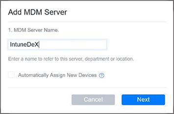
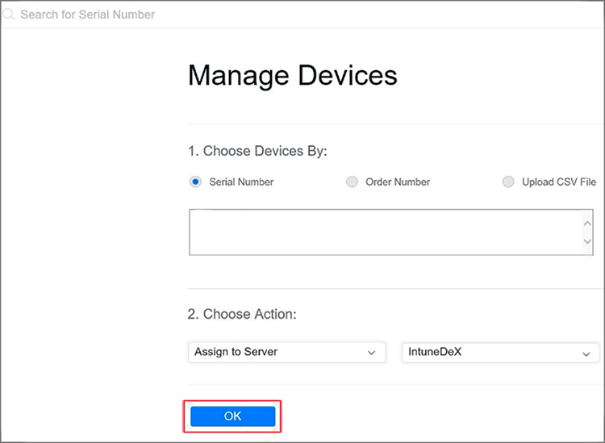
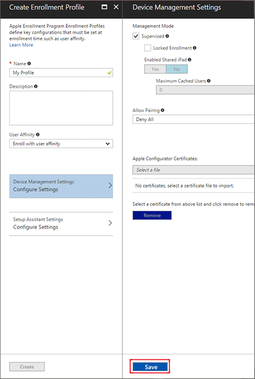

---
# required metadata

title: Enroll iOS devices - Device Enrollment Program
titleSuffix: "Intune on Azure"
description: Learn how to enroll corporate-owned iOS devices using the Device Enrollment Program."
keywords:
author: nathbarn
ms.author: nathbarn
manager: angrobe
ms.date: 07/27/2017
ms.topic: article
ms.prod:
ms.service: microsoft-intune
ms.technology:
ms.assetid: 7981a9c0-168e-4c54-9afd-ac51e895042c

# optional metadata

#ROBOTS:
#audience:
#ms.devlang:
ms.reviewer: dagerrit
ms.suite: ems
#ms.tgt_pltfrm:
ms.custom: intune-azure

---

# Automatically enroll iOS devices with Apple's Device Enrollment Program

[!INCLUDE[azure_portal](./includes/azure_portal.md)]

This topic helps you enable iOS device enrollment for devices purchased through Apple's [Device Enrollment Program (DEP)](https://deploy.apple.com). You can enable DEP enrollment for large numbers of devices without ever touching them. You can ship devices directly to users. When the user turns on the device, Setup Assistant runs with preconfigured settings and the device enrolls into management.

To enable DEP enrollment, you use both the Intune and Apple DEP portals. A list of serial numbers or a purchase order number is required so you can assign devices to Intune for management. You create DEP enrollment profiles containing settings that applied to devices during enrollment.

By the way, DEP enrollment does not work with the [device enrollment  manager](device-enrollment-manager-enroll.md).

**Steps to enable enrollment programs from Apple**
1. [Get an Apple DEP token and assign devices](#get-the-apple-dep-token)
2. [Create an enrollment profile](#create-an-apple-enrollment-profile)
3. [Synchronize DEP-managed devices](#sync-managed-device)
4. [Assign DEP profile to devices](#assign-an-enrollment-profile-to-devices)
5. [Distribute devices to users](#end-user-experience-with-managed-devices)

**Prerequisites**
- Devices purchased in [Apple's Device Enrollment Program](http://deploy.apple.com)
- [MDM Authority](mdm-authority-set.md)
- [Apple MDM Push certificate](apple-mdm-push-certificate-get.md)
- User affinity requires [WS-Trust 1.3 Username/Mixed endpoint](https://technet.microsoft.com/library/adfs2-help-endpoints). [Learn more](https://technet.microsoft.com/itpro/powershell/windows/adfs/get-adfsendpoint).

> [!NOTE]
> Multifactor authentication (MFA) doesn't work during DEP enrollment set up for user affinity. After enrollment, MFA works as expected on devices. Devices can't prompt users who need to change their password when they first sign in. Additionally, users with expired passwords aren't prompted to reset their password during enrollment. Users must use a different device to reset the password.

## Get the Apple DEP token

Before you can enroll corporate-owned iOS devices with Apple's Device Enrollment Program (DEP), you need a DEP token (.p7m) file from Apple. This token lets Intune sync information about DEP devices that your corporation owns. It also permits Intune to upload enrollment profiles to Apple and to assign devices to those profiles.

You use the Apple DEP portal to create a DEP token. You also use the DEP portal to assign devices to Intune for management.

> [!NOTE]
> If you delete the token from the Intune classic console before migrating to Azure, Intune might restore a deleted Apple DEP token. You can delete the DEP token again from the Azure portal. You can delete the DEP token again from the Azure portal.

**Step 1. Download an Intune public key certificate required to create an Apple DEP token.** 

1. In Intune in the Azure portal, choose **Device enrollment** > **Apple enrollment** > **Enrollment Program Token**.

  

2. Choose **Download your public key** to download and save the encryption key (.pem) file locally. The .pem file is used to request a trust-relationship certificate from the Apple Device Enrollment Program portal.

  

**Step 2. Create and download an Apple DEP token.** 
1. Choose **Create a token via Apple's Device Enrollment Program** to open Apple's Deployment Program portal, and sign in with your company Apple ID. You can use this Apple ID to renew your DEP token.
2.  In Apple's [Deployment Programs portal](https://deploy.apple.com), choose **Get Started** for **Device Enrollment Program**.

3. On the **Manage Servers** page, choose **Add MDM Server**.
4. Enter the **MDM Server Name**, and then choose **Next**. The server name is for your reference to identify the mobile device management (MDM) server. It is not the name or URL of the Microsoft Intune server.

   

5. The **Add &lt;ServerName&gt;** dialog box opens, stating **Upload Your Public Key**. Choose **Choose File…** to upload the .pem file, and then choose **Next**.

6.  The **Add &lt;ServerName&gt;** dialog box shows a **Your Server Token** link. Download the server token (.p7m) file to your computer, and then choose **Done**.

7. Go to  **Deployment Programs** &gt; **Device Enrollment Program** &gt; **Manage Devices**.
8. Under **Choose Devices By**, specify how devices are identified:
    - **Serial Number**
    - **Order Number**
    - **Upload CSV File**.

   

9. For **Choose Action**, choose **Assign to Server**, choose the &lt;ServerName&gt; specified for Microsoft Intune, and then choose **OK**. The Apple portal assigns the specified devices to the Intune server for management and then displays **Assignment Complete**.

   In the Apple portal, go to **Deployment Programs** &gt; **Device Enrollment Program** &gt; **View Assignment History** to see a list of devices and their MDM server assignment.

**Step 3. Enter the Apple ID used to create your enrollment program token.** In Intune in the Azure portal, provide the Apple ID for future reference. Use this ID to renew your enrollment program token in the future to avoid needing to re-enroll all your devices.

**Step 4. Browse to your enrollment program token to upload.** 
Go to the certificate (.pem) file, choose **Open**, and then choose **Upload**. With the push certificate, Intune can enroll and manage iOS devices by pushing policy to enrolled mobile devices. Intune automatically synchronizes with Apple to see your enrollment program account.

## Create an Apple enrollment profile

A device enrollment profile defines the settings applied to a group of devices during enrollment.

1. In Intune in the Azure portal, choose **Device enrollment** > **Apple Enrollment**.
2. Under **Enrollment Program for Apple**, choose **Enrollment Program Profiles**, and then choose **Create** on the **Enrollment Program Profiles** blade.
3. On the **Create Enrollment Profile** blade, enter a **Name** and **Description** for the profile for administrative purposes. Users do not see these details. You can use this **Name** field to create a dynamic group in Azure Active Directory. Use the profile name to define the enrollmentProfileName parameter to assign devices with this enrollment profile. Learn more about [Azure Active Directory dynamic groups](https://docs.microsoft.com/azure/active-directory/active-directory-groups-dynamic-membership-azure-portal#using-attributes-to-create-rules-for-device-objects).

  For **User Affinity**, choose whether devices with this profile enroll with or without user affinity.

 - **Enroll with user affinity** - Choose for devices that belong to users and that need to use the company portal for services like installing apps.

 - **Enroll without user affinity** - Choose for device unaffiliated with a single user. Use for devices that perform tasks without accessing local user data. Apps like the Company Portal app don’t work.

4. Chose **Device Management Settings** to configure the following profile settings:

  
	- **Supervised** - a management mode that enables more management options and disabled Activation Lock by default. If you leave the check box blank, you have limited management capabilities.

	- **Locked enrollment** - (Requires Management Mode = Supervised) Disables iOS settings that could allow removal of the management profile. If you leave the check box blank, it allows the management profile to be removed from the Settings menu. After device enrollment, you cannot change this setting without factory resetting the device.

	- **Allow Pairing** - Specifies whether iOS devices can sync with computers. If you choose **Allow Apple Configurator by certificate**, you must choose a certificate under **Apple Configurator Certificates**.

	- **Apple Configurator Certificates** - If you chose **Allow Apple Configurator by certificate** under **Allow Pairing**, choose an Apple Configurator Certificate to import.

  Choose **Save**.

5. Choose **Setup Assistant Settings** to configure the following profile settings:

  
	- **Department Name** - Appears when users tap **About Configuration** during activation.

	- **Department Phone** - Appears when the user clicks the **Need Help** button during activation.
    - **Setup Assistant Options** - These optional settings can be set up later in the iOS **Settings** menu.
        - **Passcode**
        - **Location Services**
        - **Restore**
        - **Apple ID**
        - **Terms and Conditions**
        - **Touch ID**
        - **Apple Pay**
        - **Zoom**
        - **Siri**
        - **Diagnostic Data**

    Choose **Save**.
9. To save the profile settings, choose **Create** on the **Create Enrollment Profile** blade. The enrollment profile appears in the Apple Enrollment Program Enrollment Profiles list.

## Sync managed devices
Now that Intune has permission to manage your devices, you can synchronize Intune with Apple to see your managed devices in Intune in the Azure portal.

1. In Intune in the Azure portal, choose **Device enrollment** >  **Apple Enrollment** > **Enrollment Program Devices**.
2. Under **Enrollment Program Devices**, choose **Sync**.

  
3. On the **Sync** blade, choose **Request Sync**. The progress bar shows the amount of time you must wait before requesting Sync again.

  

  To comply with Apple’s terms for acceptable enrollment program traffic, Intune imposes the following restrictions:
     -	A full sync can run no more than once every seven days. During a full sync, Intune refreshes every Apple serial number assigned to Intune. If a full sync is attempted within seven days of the previous full sync, Intune only refreshes serial numbers that are not already listed in Intune.
     -	Any sync request is given 15 minutes to finish. During this time or until the request succeeds, the **Sync** button is disabled.
     - Intune syncs new and removed devices with Apple every 24 hours.

4. In the Enrollment Program Devices workspace, choose **Refresh** to see your devices.

## Assign an enrollment profile to devices
You must assign an enrollment program profile to devices before they can enroll.

>[!NOTE]
>You can also assign serial numbers to profiles from the **Apple Serial Numbers** blade.

1. In Intune in the Azure portal, choose **Device enrollment** > **Apple Enrollment**, and then choose **Enrollment Program Profiles**.
2. From the list of **Enrollment Program Profiles**, choose the profile you want to assign to devices and then choose **Assign devices**.

 

3. Choose **Assign** and then choose the devices you want to assign this profile. You can filter to view available devices:
  - **unassigned**
  - **any**
  - **&lt;profile name&gt;**
4. Choose the devices you want to assign. The checkbox above the column selects up to 1000 listed devices, and then click **Assign**. To enroll more than 1000 devices, repeat the assignment steps until all devices are assigned an enrollment profile.

  

You can now distribute devices to users. Devices with user affinity require each user be assigned an Intune license. An activated device cannot apply an enrollment profile until the device is factory reset.

See [Enroll your iOS device in Intune with the Device Enrollment Program](../../intune-user-help/enroll-your-device-dep-ios).
