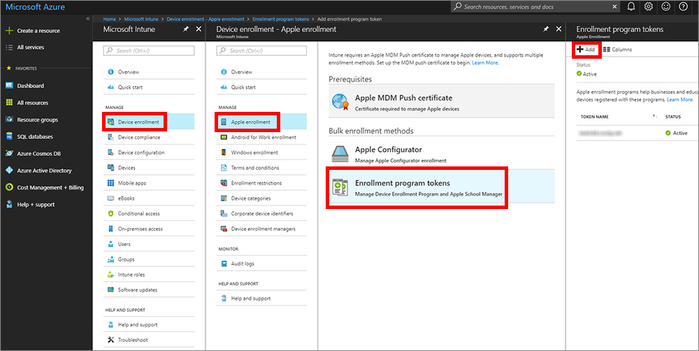
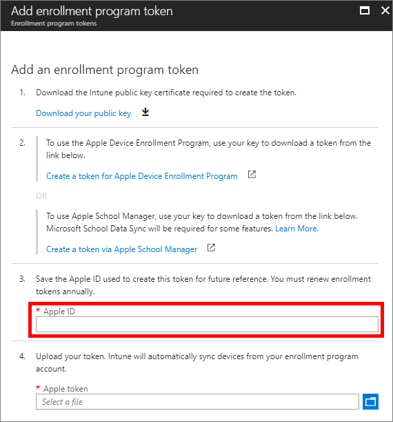
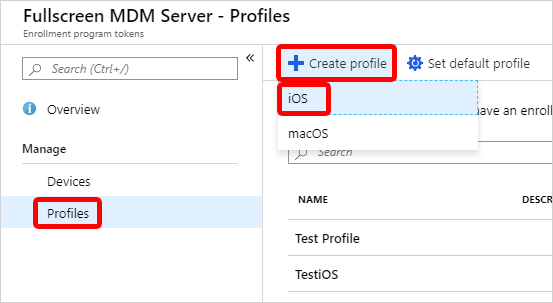
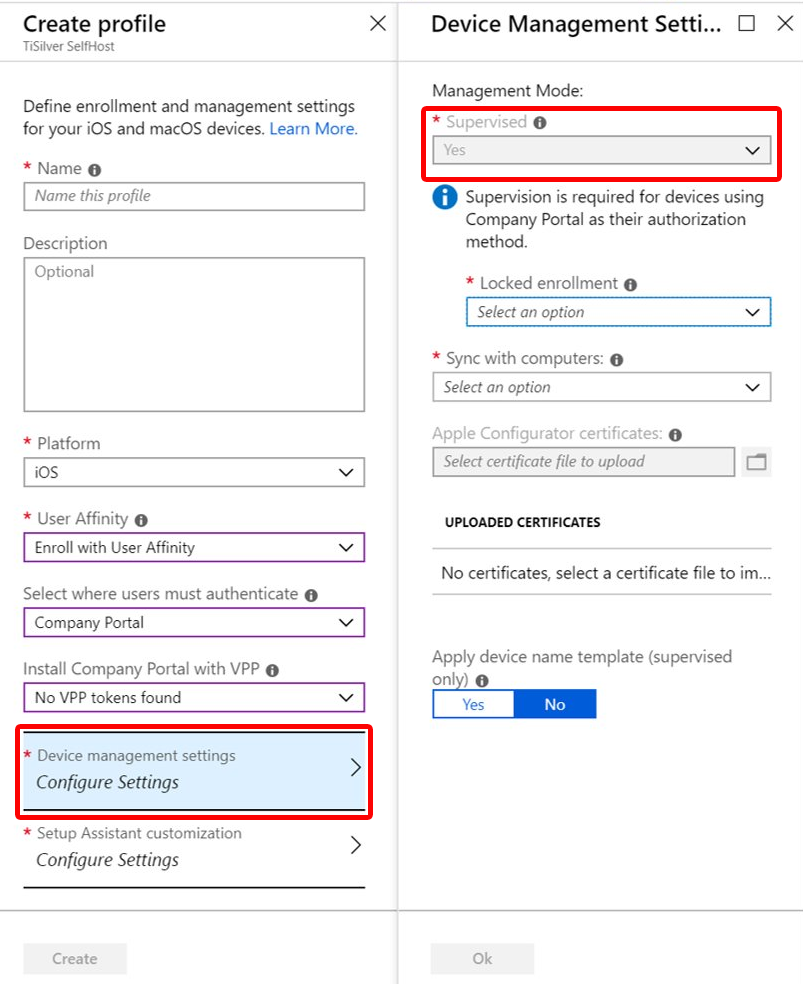
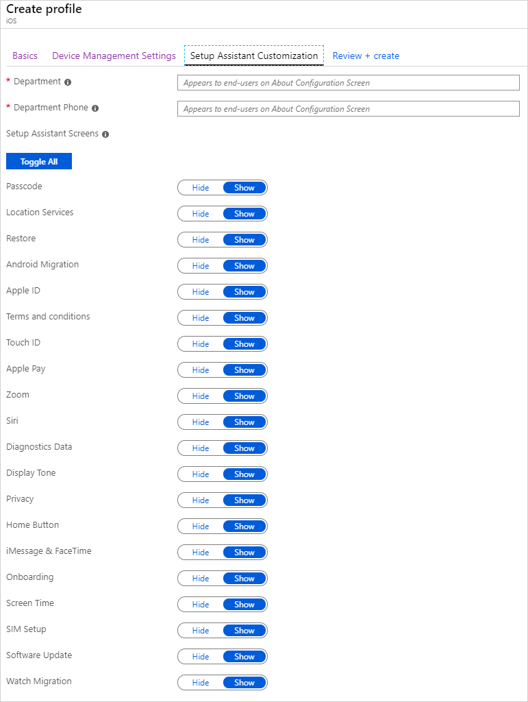
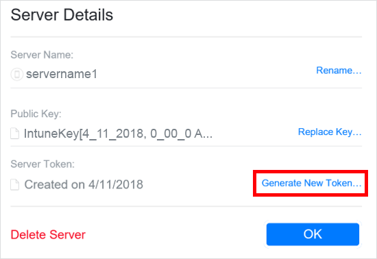
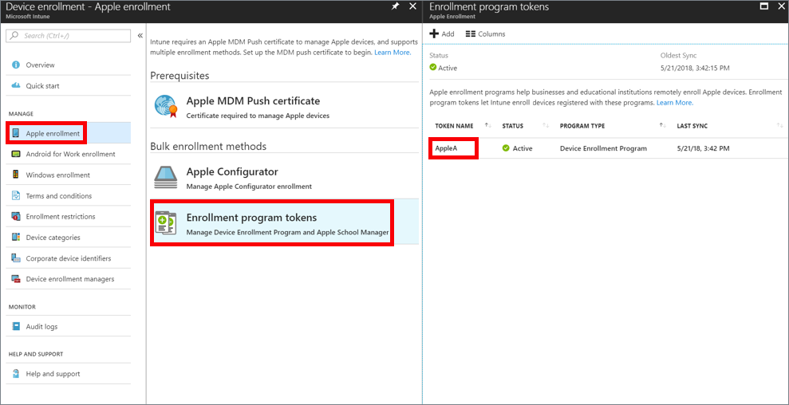
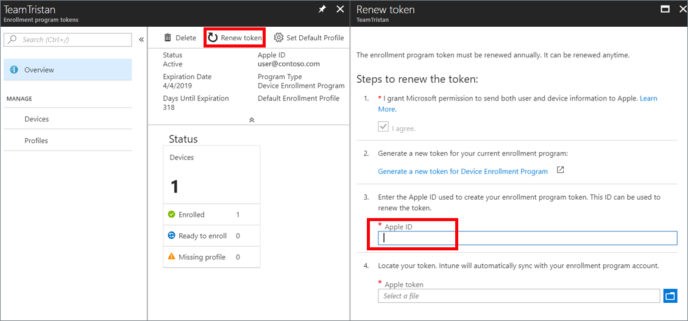

---
# required metadata

title: Enroll iOS devices - Device Enrollment Program
titleSuffix: Microsoft Intune
description: Learn how to enroll corporate-owned iOS devices using the Device Enrollment Program.
keywords:
author: ErikjeMS
ms.author: erikje
manager: dougeby
ms.date: 05/04/2018
ms.topic: article
ms.prod:
ms.service: microsoft-intune
ms.technology:
ms.assetid: 7ddbf360-0c61-11e8-ba89-0ed5f89f718b

# optional metadata

#ROBOTS:
#audience:
#ms.devlang:
ms.reviewer: dagerrit
ms.suite: ems
#ms.tgt_pltfrm:
ms.custom: intune-azure

---

# Automatically enroll iOS devices with Apple's Device Enrollment Program

[!INCLUDE [azure_portal](./includes/azure_portal.md)]

This article helps you enable iOS device enrollment for devices purchased through Apple's [Device Enrollment Program (DEP)](https://deploy.apple.com). You can enable DEP enrollment for large numbers of devices without ever touching them. You can ship devices like iPhones and iPads directly to users. When the user turns on the device, Setup Assistant runs with preconfigured settings and the device enrolls into management.

To enable DEP enrollment, you use both the Intune and Apple DEP portals. A list of serial numbers or a purchase order number is required so you can assign devices to Intune for management. You create DEP enrollment profiles containing settings that applied to devices during enrollment.

By the way, DEP enrollment does not work with the [device enrollment manager](device-enrollment-manager-enroll.md).

## What is supervised mode?
Apple introduced supervised mode in iOS 5. An iOS device in supervised mode can be managed with more controls. As such, it is especially useful for corporate-owned devices. Intune supports configuring devices for supervised mode as part the Apple Device Enrollment Program (DEP). 

<!--
**Steps to enable enrollment programs from Apple**
1. [Get an Apple DEP token and assign devices](#get-the-apple-dep-token)
2. [Create an enrollment profile](#create-an-apple-enrollment-profile)
3. [Synchronize DEP-managed devices](#sync-managed-device)
4. [Assign DEP profile to devices](#assign-an-enrollment-profile-to-devices)
5. [Distribute devices to users](#end-user-experience-with-managed-devices)
-->
## Prerequisites
- Devices purchased in [Apple's Device Enrollment Program](http://deploy.apple.com)
- [MDM Authority](mdm-authority-set.md)
- [Apple MDM Push certificate](apple-mdm-push-certificate-get.md)

## Get an Apple DEP token

Before you can enroll iOS devices with DEP, you need a DEP token (.p7m) file from Apple. This token lets Intune sync information about DEP devices that your corporation owns. It also permits Intune to upload enrollment profiles to Apple and to assign devices to those profiles.

You use the Apple DEP portal to create a DEP token. You also use the DEP portal to assign devices to Intune for management.

> [!NOTE]
> If you delete the token from the Intune classic portal before migrating to Azure, Intune might restore a deleted Apple DEP token. You can delete the DEP token again from the Azure portal.

### Step 1. Download the Intune public key certificate required to create the token.

1. In the [Intune in the Azure portal](https://aka.ms/intuneportal), choose **Device enrollment** > **Apple enrollment** > **Enrollment Program Tokens** > **Add**.

    

2. Grant permission to Microsoft to send user and device information to Apple by selecting **I agree**.

   

3. Choose **Download your public key** to download and save the encryption key (.pem) file locally. The .pem file is used to request a trust-relationship certificate from the Apple Device Enrollment Program portal.

### Step 2. Use your key to download a token from Apple.

1. Choose **Create a token for Apple's Device Enrollment Program** to open Apple's Deployment Program portal, and sign in with your company Apple ID. You can use this Apple ID to renew your DEP token.
2.  In Apple's [Deployment Programs portal](https://deploy.apple.com), choose **Get Started** for **Device Enrollment Program**.

3. On the **Manage Servers** page, choose **Add MDM Server**.
4. Enter the **MDM Server Name**, and then choose **Next**. The server name is for your reference to identify the mobile device management (MDM) server. It is not the name or URL of the Microsoft Intune server.

5. The **Add &lt;ServerName&gt;** dialog box opens, stating **Upload Your Public Key**. Choose **Choose File…** to upload the .pem file, and then choose **Next**.

6. Go to  **Deployment Programs** &gt; **Device Enrollment Program** &gt; **Manage Devices**.
7. Under **Choose Devices By**, specify how devices are identified:
    - **Serial Number**
    - **Order Number**
    - **Upload CSV File**.

   

8. For **Choose Action**, choose **Assign to Server**, choose the &lt;ServerName&gt; specified for Microsoft Intune, and then choose **OK**. The Apple portal assigns the specified devices to the Intune server for management and then displays **Assignment Complete**.

   In the Apple portal, go to **Deployment Programs** &gt; **Device Enrollment Program** &gt; **View Assignment History** to see a list of devices and their MDM server assignment.

### Step 3. Save the Apple ID used to create this token.

In Intune in the Azure portal, provide the Apple ID for future reference.

### Step 4. Upload your token.
In the **Apple token** box, browse to the certificate (.pem) file, choose **Open**, and then choose **Create**. With the push certificate, Intune can enroll and manage iOS devices by pushing policy to enrolled mobile devices. Intune automatically synchronizes with Apple to see your enrollment program account.

## Create an Apple enrollment profile

Now that you've installed your token, you can create an enrollment profile for DEP devices. A device enrollment profile defines the settings applied to a group of devices during enrollment.

1. In Intune in the Azure portal, choose **Device enrollment** > **Apple Enrollment** > **Enrollment program tokens**.
2. Select a token, choose **Profiles**, and then choose **Create profile**.

    

3. Under **Create Profile**, enter a **Name** and **Description** for the profile for administrative purposes. Users do not see these details. You can use this **Name** field to create a dynamic group in Azure Active Directory. Use the profile name to define the enrollmentProfileName parameter to assign devices with this enrollment profile. Learn more about [Azure Active Directory dynamic groups](https://docs.microsoft.com/azure/active-directory/active-directory-groups-dynamic-membership-azure-portal#using-attributes-to-create-rules-for-device-objects).

    

4. For **User Affinity**, choose whether devices with this profile must enroll with or without an assigned user.
    - **Enroll with User Affinity** - Choose this option for devices that belong to users and that want to use the company portal for services like installing apps. This option also lets users authenticate their devices by using the company portal. If using ADFS, user affinity requires [WS-Trust 1.3 Username/Mixed endpoint](https://technet.microsoft.com/library/adfs2-help-endpoints). [Learn more](https://technet.microsoft.com/itpro/powershell/windows/adfs/get-adfsendpoint).

    - **Enroll without User Affinity** - Choose this option for device unaffiliated with a single user. Use this for devices that perform tasks without accessing local user data. Apps like the Company Portal app don’t work.

5. If you chose **Enroll with User Affinity**, you have the option to let users authenticate with Company Portal instead of the Apple Setup Assistant.

    

    > [!NOTE]
    > Multifactor authentication (MFA) doesn't work during DEP enrollment if you have profile properties set to **Enroll with User Affinity**. After enrollment, MFA works as expected on devices. Devices can't prompt users who need to change their password when they first sign in. Additionally, users with expired passwords aren't prompted to reset their password during enrollment. Users must use a different device to reset the password.

6. Choose **Device Management Settings** and select whether or not you want devices using this profile to be supervised.

    

    **Supervised** devices give you more management options and disabled Activation Lock by default. Microsoft recommends using DEP as the mechanism for enabling supervised mode, especially for organizations that are deploying large numbers of iOS devices.

    Users are notified that their devices are supervised in two ways:

   - The lock screen says: "This iPhone is managed by Contoso."
   - The **Settings** > **General** > **About** screen says: "This iPhone is supervised. Contoso can monitor your Internet traffic and locate this device."

     > [!NOTE]
     > A device enrolled without supervision can only be reset to supervised by using the Apple Configurator. Resetting the device in this manner requires connecting an iOS device to a Mac with a USB cable. Learn more about this on [Apple Configurator docs](http://help.apple.com/configurator/mac/2.3).

7. Choose whether or not you want locked enrollment for devices using this profile. **Locked enrollment** disables iOS settings that allow the management profile to be removed from the **Settings** menu. After device enrollment, you cannot change this setting without factory resetting the device. Such devices must have the **Supervised** Management Mode set to *Yes*. 

8. Choose whether or not you want the devices using this profile to be able to **Sync with computers**. If you choose **Allow Apple Configurator by certificate**, you must choose a certificate under **Apple Configurator Certificates**.

9. If you chose **Allow Apple Configurator by certificate** in the previous step, choose an Apple Configurator Certificate to import.

10. Choose **OK**.

11. Choose **Setup Assistant Settings** to configure the following profile settings:
    

    |                 Setting                  |                                                                                               Description                                                                                               |
    |------------------------------------------|---------------------------------------------------------------------------------------------------------------------------------------------------------------------------------------------------------|
    |     <strong>Department Name</strong>     |                                                             Appears when users tap <strong>About Configuration</strong> during activation.                                                              |
    |    <strong>Department Phone</strong>     |                                                          Appears when the user clicks the <strong>Need Help</strong> button during activation.                                                          |
    | <strong>Setup Assistant Options</strong> |                                                     The following optional settings can be set up later in the iOS <strong>Settings</strong> menu.                                                      |
    |        <strong>Passcode</strong>         | Prompt for passcode during activation. Always require a passcode unless the device is secured or has access controlled in some other manner (that is, kiosk mode that restricts the device to one app). |
    |    <strong>Location Services</strong>    |                                                                 If enabled, Setup Assistant prompts for the service during activation.                                                                  |
    |         <strong>Restore</strong>         |                                                                If enabled, Setup Assistant prompts for iCloud backup during activation.                                                                 |
    |   <strong>iCloud and Apple ID</strong>   |                         If enabled, Setup Assistant prompts the user to sign in an Apple ID and the Apps & Data screen will allow the device to be restored from iCloud backup.                         |
    |  <strong>Terms and Conditions</strong>   |                                                   If enabled, Setup Assistant prompts users to accept Apple's terms and conditions during activation.                                                   |
    |        <strong>Touch ID</strong>         |                                                                 If enabled, Setup Assistant prompts for this service during activation.                                                                 |
    |        <strong>Apple Pay</strong>        |                                                                 If enabled, Setup Assistant prompts for this service during activation.                                                                 |
    |          <strong>Zoom</strong>           |                                                                 If enabled, Setup Assistant prompts for this service during activation.                                                                 |
    |          <strong>Siri</strong>           |                                                                 If enabled, Setup Assistant prompts for this service during activation.                                                                 |
    |     <strong>Diagnostic Data</strong>     |                                                                 If enabled, Setup Assistant prompts for this service during activation.                                                                 |

12. Choose **OK**.

13. To save the profile, choose **Create**.

## Sync managed devices
Now that Intune has permission to manage your devices, you can synchronize Intune with Apple to see your managed devices in Intune in the Azure portal.

1. In Intune in the Azure portal, choose **Device enrollment** > **Apple Enrollment** > **Enrollment program tokens** > choose a token in the list > **Devices** > **Sync**.
   

   To comply with Apple’s terms for acceptable enrollment program traffic, Intune imposes the following restrictions:
   - A full sync can run no more than once every seven days. During a full sync, Intune fetches the complete updated list of serial numbers assigned to the Apple MDM server connected to Intune. After an Enrollment Program device is deleted from Intune portal without being unassigned from the Apple MDM server in the DEP portal, it won't be re-imported to Intune until the full sync is run.   
   - A sync is run automatically every 24 hours. You can also sync by clicking the **Sync** button (no more than once every 15 minutes). All sync requests are given 15 minutes to finish. The **Sync** button is disabled until a sync is completed. This sync will refresh existing device status and import new devices assigned to the Apple MDM server.   

## Assign an enrollment profile to devices
You must assign an enrollment program profile to devices before they can enroll.

>[!NOTE]
>You can also assign serial numbers to profiles from the **Apple Serial Numbers** blade.

1. In Intune in the Azure portal, choose **Device enrollment** > **Apple Enrollment** > **Enrollment program tokens** > choose a token in the list.
2. Choose **Devices** > choose devices in the list > **Assign profile**.
3. Under **Assign profile**, choose a profile for the devices and then choose **Assign**.

### Assign a default profile

You can pick a default profile to be applied to all devices enrolling with a specific token.

1. In Intune in the Azure portal, choose **Device enrollment** > **Apple Enrollment** > **Enrollment program tokens** > choose a token in the list.
2. Choose **Set Default Profile**, choose a profile in the drop-down list, and then choose **Save**. This profile will be applied to all devices that enroll with the token.

## Distribute devices
You have enabled management and syncing between Apple and Intune, and assigned a profile to  let your DEP devices enroll. You can now distribute devices to users. Devices with user affinity require each user be assigned an Intune license. Devices without user affinity require a device license. An activated device cannot apply an enrollment profile until the device is factory reset.

See [Enroll your iOS device in Intune with the Device Enrollment Program](/intune-user-help/enroll-your-device-dep-ios).

## Renew a DEP token  
1. Go to deploy.apple.com.  
2. Under **Manage Servers**, choose your MDM server associated with the token file that you want to renew.
3. Choose **Generate New Token**.

    

4. Choose **Your Server Token**.  
5. In [Intune in the Azure portal](https://aka.ms/intuneportal), choose **Device enrollment** > **Apple Enrollment** > **Enrollment program tokens** > choose the token.
    

6. Choose **Renew token** and enter the Apple ID used to create the original token.  
    

8. Upload the newly downloaded token.  
9. Choose **Renew token**. You'll see the confirmation that the token was renewed.   
    
