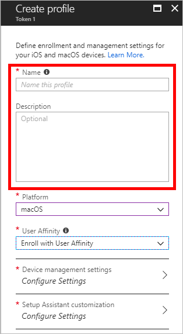
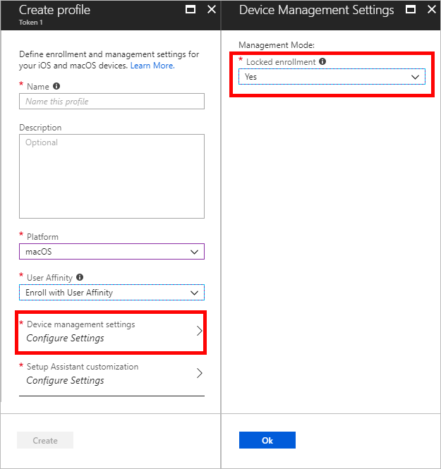
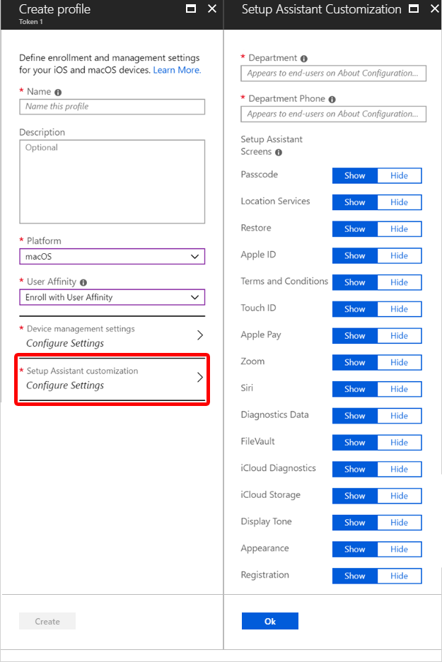

---
# required metadata

title: Enroll macOS devices - Device Enrollment Program or Apple School Manager
titleSuffix: 
description: Learn how to enroll corporate-owned macOS devices using the Device Enrollment Program.
keywords:
author: ErikjeMS
ms.author: erikje
manager: dougeby
ms.date: 12/06/2018
ms.topic: conceptual
ms.service: microsoft-intune
ms.localizationpriority: high
ms.technology:
ms.assetid: 

# optional metadata

#ROBOTS:
#audience:
#ms.devlang:
ms.reviewer: dagerrit
ms.suite: ems
search.appverid: MET150
#ms.tgt_pltfrm:
ms.custom: seodec18
ms.collection: M365-identity-device-management
---

# Automatically enroll macOS devices with the Device Enrollment Program or Apple School Manager

[!INCLUDE [azure_portal](./includes/azure_portal.md)]

You can set up Intune enrollment for macOS devices purchased through Apple's [Device Enrollment Program (DEP)](https://deploy.apple.com) or [Apple School Manager](https://school.apple.com/). You can use either of these enrollments for large numbers of devices without ever touching them. You can ship macOS devices directly to users. When the user turns on the device, Setup Assistant runs with preconfigured settings and the device enrolls into Intune management.

To set up enrollment, you use both the Intune and Apple DEP portals. You create enrollment profiles containing settings that applied to devices during enrollment.

Neither DEP enrollment or Apple School Manager work with the [device enrollment manager](device-enrollment-manager-enroll.md).

<!--
**Steps to enable enrollment programs from Apple**
1. [Get an Apple DEP token and assign devices](#get-the-apple-dep-token)
2. [Create an enrollment profile](#create-an-apple-enrollment-profile)
3. [Synchronize DEP-managed devices](#sync-managed-device)
4. [Assign DEP profile to devices](#assign-an-enrollment-profile-to-devices)
5. [Distribute devices to users](#end-user-experience-with-managed-devices)
-->
## Prerequisites
- Devices purchased in [Apple School Manager](https://school.apple.com/) or [Apple's Device Enrollment Program](http://deploy.apple.com)
- A list of serial numbers or a purchase order number. 
- [MDM Authority](mdm-authority-set.md)
- [Apple MDM Push certificate](apple-mdm-push-certificate-get.md)

## Get an Apple DEP token

Before you can enroll macOS devices with DEP or Apple School Manager, you need a DEP token (.p7m) file from Apple. This token lets Intune sync information about the devices that your organization owns. It also lets Intune upload enrollment profiles to Apple and to these profiles to devices.

You use the Apple portal to create a token. You also use the Apple portal to assign devices to Intune for management.

> [!NOTE]
> If you delete the token from the Intune classic portal before migrating to Azure, Intune might restore a deleted Apple token. You can delete the token again from the Azure portal.

### Step 1. Download the Intune public key certificate required to create the token.

1. In the [Intune in the Azure portal](https://aka.ms/intuneportal), choose **Device enrollment** > **Apple enrollment** > **Enrollment Program Tokens** > **Add**.

    

2. Grant permission to Microsoft to send user and device information to Apple by selecting **I agree**.

   

3. Choose **Download your public key** to download and save the encryption key (.pem) file locally. The .pem file is used to request a trust-relationship certificate from the Apple portal.

### Step 2. Use your key to download a token from Apple.

1. Choose **Create a token for Apple's Device Enrollment Program** or **Create a token via Apple School Manager** to open the appropriate Apple portal, and sign in with your company Apple ID. You can use this Apple ID to renew your token.
2. For DEP, in the Apple portal, choose **Get Started** for **Device Enrollment Program** > **Manage Servers** > **Add MDM Server**.
3. For Apple School Manage, in the Apple portal, choose **MDM Servers** > **Add MDM Server**.
4. Enter the **MDM Server Name**, and then choose **Next**. The server name is for your reference to identify the mobile device management (MDM) server. It is not the name or URL of the Microsoft Intune server.

5. The **Add &lt;ServerName&gt;** dialog box opens, stating **Upload Your Public Key**. Choose **Choose File…** to upload the .pem file, and then choose **Next**.

6. Go to  **Deployment Programs** &gt; **Device Enrollment Program** &gt; **Manage Devices**.
7. Under **Choose Devices By**, specify how devices are identified:
    - **Serial Number**
    - **Order Number**
    - **Upload CSV File**.

   

8. For **Choose Action**, choose **Assign to Server**, choose the &lt;ServerName&gt; specified for Microsoft Intune, and then choose **OK**. The Apple portal assigns the specified devices to the Intune server for management and then displays **Assignment Complete**.

### Step 3. Save the Apple ID used to create this token

In Intune in the Azure portal, provide the Apple ID for future reference.

### Step 4. Upload your token.
In the **Apple token** box, browse to the certificate (.pem) file, choose **Open**, and then choose **Create**. With the push certificate, Intune can enroll and manage macOS devices by pushing policy to enrolled devices. Intune automatically synchronizes with Apple to see your enrollment program account.

## Create an Apple enrollment profile

Now that you've installed your token, you can create an enrollment profile for devices. A device enrollment profile defines the settings applied to a group of devices during enrollment.

1. In Intune in the Azure portal, choose **Device enrollment** > **Apple Enrollment** > **Enrollment program tokens**.
2. Select a token, choose **Profiles**, and then choose **Create profile**.

    

3. Under **Create Profile**, enter a **Name** and **Description** for the profile for administrative purposes. Users do not see these details. You can use this **Name** field to create a dynamic group in Azure Active Directory. Use the profile name to define the enrollmentProfileName parameter to assign devices with this enrollment profile. Learn more about [Azure Active Directory dynamic groups](https://docs.microsoft.com/azure/active-directory/users-groups-roles/groups-dynamic-membership#rules-for-devices).

    

4. For **Platform**, choose **macOS**.

5. For **User Affinity**, choose whether or not devices with this profile must enroll with or without an assigned user.
    - **Enroll with User Affinity** - Choose this option for devices that belong to users and that want to use the Company Portal app for services like installing apps. If using ADFS, user affinity requires [WS-Trust 1.3 Username/Mixed endpoint](https://technet.microsoft.com/library/adfs2-help-endpoints). [Learn more](https://technet.microsoft.com/itpro/powershell/windows/adfs/get-adfsendpoint).Multifactor authentication is not supported for macOS DEP devices with user affinity.

    - **Enroll without User Affinity** - Choose this option for device unaffiliated with a single user. Use this for devices that perform tasks without accessing local user data. Apps like the Company Portal app don’t work.

6. Choose **Device Management Settings** and Choose whether or not you want locked enrollment for devices using this profile. **Locked enrollment** disables macOS settings that allow the management profile to be removed from the **System Preferences** menu or through the **Terminal**. After device enrollment, you cannot change this setting without wiping the device.

    
 
7. Choose **OK**.

8. Choose **Setup Assistant Settings** to configure the following profile settings:
    

    | Department settings | Description |
    |---|---|
    | <strong>Department Name</strong> | Appears when users tap <strong>About Configuration</strong> during activation. |
    | <strong>Department Phone</strong> | Appears when the user clicks the <strong>Need Help</strong> button during activation. |

    You can choose to show or hide a variety of Setup Assistant screens on the device when the user sets it up.
    - If you choose **Hide**, the screen won't be displayed during setup. After setting up the device, the user can still go in to the **Settings** menu to set up the feature.
    - If you choose **Show**, the screen will be displayed during setup. The user can sometimes skip the screen without taking action. But they can then later go into the device's **Settings** menu to set up the feature. 

    | Setup Assistant screen settings | If you choose **Show**, during setup the device will... |
    |------------------------------------------|------------------------------------------|
    | <strong>Passcode</strong> | Prompt the user for a passcode. Always require a passcode unless the device is secured or has access controlled in some other manner (that is, kiosk mode that restricts the device to one app). |
    | <strong>Location Services</strong> | Prompt the user for their location. |
    | <strong>Restore</strong> | Display the Apps & Data screen. This screen gives the user the option to restore or transfer data from iCloud Backup when they set up the device. |
    | <strong>iCloud and Apple ID</strong> | Give the user the options to sign in with their **Apple ID** and use **iCloud**.                         |
    | <strong>Terms and Conditions</strong> | Require the user to accept Apple's terms and conditions. |
    | <strong>Touch ID</strong> | Give the user the option to set up fingerprint identification for the device. |
    | <strong>Apple Pay</strong> | Give the user the option to set up Apple Pay on the device. |
    | <strong>Zoom</strong> | Give the user to the option to zoom the display when they set up the device. |
    | <strong>Siri</strong> | Give the user the option to set up Siri. |
    | <strong>Diagnostic Data</strong> | Display the Diagnostics screen to the user. This screen gives the user the option to send diagnostic data to Apple. |
    | <strong>FileVault</strong> | Give the user the option to set up FileVault encryption. |
    | <strong>iCloud Diagnostics</strong> | Give the user the option to send iCloud diagnostic data to Apple. |
    | <strong>iCloud Storage</strong> | Give the user the option to use iCloud storage. |    
    | <strong>Display Tone</strong> | Give the user the option to turn on Display Tone. |
    | <strong>Appearance</strong> | Display the Appearance screen to the user. |
    | <strong>Registration</strong>| Require the user to register the device. |
    | <strong>Privacy</strong>| Display the Privacy screen to the user. |
    | <strong>Screen Time</strong>| Display the Screen Time screen to the user. |
   

10. Choose **OK**.

11. To save the profile, choose **Create**.

## Sync managed devices
Now that Intune has permission to manage your devices, you can synchronize Intune with Apple to see your managed devices in Intune in the Azure portal.

1. In Intune in the Azure portal, choose **Device enrollment** > **Apple Enrollment** > **Enrollment program tokens** > choose a token in the list > **Devices** > **Sync**.
   

   To comply with Apple’s terms for acceptable enrollment program traffic, Intune imposes the following restrictions:
   - A full sync can run no more than once every seven days. During a full sync, Intune fetches the complete updated list of serial numbers assigned to the Apple MDM server connected to Intune. After an Enrollment Program device is deleted from Intune portal without being unassigned from the Apple MDM server in the DEP portal, it won't be re-imported to Intune until the full sync is run.   
   - A sync is run automatically every 24 hours. You can also sync by clicking the **Sync** button (no more than once every 15 minutes). All sync requests are given 15 minutes to finish. The **Sync** button is disabled until a sync is completed. This sync will refresh existing device status and import new devices assigned to the Apple MDM server.   

## Assign an enrollment profile to devices
You must assign an enrollment program profile to devices before they can enroll.

1. In Intune in the Azure portal, choose **Device enrollment** > **Apple Enrollment** > **Enrollment program tokens** > choose a token in the list.
2. Choose **Devices** > choose devices in the list > **Assign profile**.
3. Under **Assign profile**, choose a profile for the devices > **Assign**.

### Assign a default profile

You can pick a default macOS and iOS profile to be applied to all devices enrolling with a specific token. 

1. In Intune in the Azure portal, choose **Device enrollment** > **Apple enrollment** > **Enrollment program tokens** > choose a token in the list.
2. Choose **Set Default Profile**, choose a profile in the drop-down list, and then choose **Save**. This profile will be applied to all devices that enroll with the token.

## Distribute devices
You have enabled management and syncing between Apple and Intune, and assigned a profile to let your devices enroll. You can now distribute devices to users. Devices with user affinity require each user be assigned an Intune license. Devices without user affinity require a device license. An activated device cannot apply an enrollment profile until the device is wiped.

## Renew a DEP token  
1. Go to deploy.apple.com.  
2. Under **Manage Servers**, choose your MDM server associated with the token file that you want to renew.
3. Choose **Generate New Token**.

    

4. Choose **Your Server Token**.  
5. In [Intune in the Azure portal](https://aka.ms/intuneportal), choose **Device enrollment** > **Apple Enrollment** > **Enrollment program tokens** > choose the token.
    

6. Choose **Renew token** and enter the Apple ID used to create the original token.  
    

8. Upload the newly downloaded token.  
9. Choose **Renew token**. You'll see the confirmation that the token was renewed.   
    

## Next steps

After enrolling macOS devices, you can start [managing them](device-management.md).
