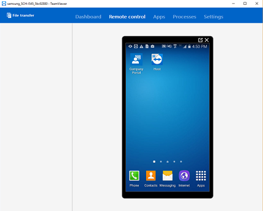

---
# required metadata

title: How to use remotely administer Android devices using TeamViewer
titlesuffix: "Azure portal"
description: Learn how to remotely administer Android devices using TeamViewer."
keywords:
author: arob98
ms.author: angrobe
manager: angrobe
ms.date: 08/09/2017
ms.topic: article
ms.prod:
ms.service: microsoft-intune
ms.technology:
ms.assetid: 72cdd888-efca-46e6-b2e7-fb9696bb2fba

# optional metadata

#ROBOTS:
#audience:
#ms.devlang:
ms.reviewer: davidra
ms.suite: ems
#ms.tgt_pltfrm:
ms.custom: intune-azure
---

# Provide remote assistance for Intune managed Android devices

Intune can use the [TeamViewer](https://www.teamviewer.com) software, purchased separately, to enable you to give remote assistance to users of Android devices. Use the information in this topic to get started.

## Before you start

### Required permissions

Ensure that the user of the Azure portal has the following permissions assigned to them as an [Intune role](https://docs.microsoft.com/intune-azure/access-control/role-based-access-control):
- To let the admin modify the TeamViewer connector settings, grant the **Update Remote Assistance** permission.
- To let the admin initiate a new remote assistance request, grant the **Request Remote Assistance** permission. Users with the **Request Remote Assistance** permission can request to initiate a session for any user. They are not limited by any Intune role assignment scope. Intune role assignment scopes do not limit the devices or users for which Remote Assistance requests can be initiated.

>[!NOTE]
>By enabling TeamViewer, you are allowing the TeamViewer for Intune Connector to create TeamViewer sessions, read Active Directory data, and save the TeamViewer account access token.

### Configure the Intune TeamViewer connector

Before you can provide remote assistance to Android devices, you must configure the Intune TeamViewer connector, using the following steps:

1. Sign into the Azure portal.
2. Choose **More Services** > **Monitoring + Management** > **Intune**.
3. On the **Intune** blade, choose **Devices**.
4. On the **Devices and groups** blade, choose **Setup** > **TeamViewer Connector**.
5. On the **TeamViewer Connector** blade, click **Enable**, then view and accept the TeamViewer service license agreement.
6. Choose **Log in to TeamViewer & Authorize**.
7. A web page opens to the TeamViewer site. Enter your TeamViewer license credentials, and then click **Sign In**.

## How to remotely administer an Android device

1. Sign into the Azure portal.
2. Choose **More Services** > **Monitoring + Management** > **Intune**.
3. On the **Intune** blade, choose **Devices**.
4. On the **Devices** blade, choose **Manage** > **All devices**.
5. Select the device that you want to remotely administer, and then, on the device properties blade, choose **More** > **New Remote Assistance Session**.
6. After Intune connects to the TeamViewer service, you'll see some information about the Android device. Choose **Connect** to start the remote session.

In the TeamViewer window, you can perform a range of remote actions on the Android device, including remote control of the device. For full details of the actions you can perform, see the [TeamViewer documentation](https://www.teamviewer.com/support/documents/).

When you are finished, close the TeamViewer window.

## End-user notifications

An end user sees a notification flag on the Company Portal app icon on their device, and also see a notification when they open the app. They can then accept the remote assistance request.

