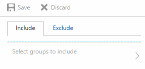

---
# required metadata

title: Assign device profiles in Microsoft Intune - Azure | Microsoft Docs
description: Use the Azure portal to assign device profiles and policies to users and devices. Learn how to exclude groups from a profile assignment in Microsoft Intune.
keywords:
author: MandiOhlinger
ms.author: mandia
manager: dougeby
ms.date: 03/07/2019
ms.topic: conceptual
ms.prod:
ms.service: microsoft-intune
ms.localizationpriority: high
ms.technology:
ms.assetid: f6f5414d-0e41-42fc-b6cf-e7ad76e1e06d

# optional metadata

#ROBOTS:
#audience:
#ms.devlang:
ms.reviewer: heenamac
ms.suite: ems
search.appverid: MET150
#ms.tgt_pltfrm:
ms.custom: intune-azure
ms.collection: M365-identity-device-management
---

# Assign user and device profiles in Microsoft Intune

[!INCLUDE [azure_portal](./includes/azure_portal.md)]

You create a profile, and it includes all the settings you entered. The next step is to deploy or "assign" the profile to your Azure Active Directory (Azure AD) user or device groups. When it's assigned, the users and devices receive your profile, and the settings you entered are applied.

This article shows you how to assign a profile, and includes some information on using scope tags and applicability rules on your profiles.

## Assign a device profile

1. In the [Azure portal](https://portal.azure.com), select **All Services** > filter on **Intune** > select **Intune**.
2. Select **Device configuration** > **Profiles**. All the profiles are listed.
3. Select the profile you want to assign > **Assignments**.
4. Choose to **Include** groups or **Exclude** groups, and then select your groups. When you select your groups, you're choosing an Azure AD group. To select multiple groups, hold down the **Ctrl** key, and select your groups.

    

5. **Save** your changes.

## Use scope tags or applicability rules

When you create or update a profile, you can also add scope tags and applicability rules to the profile.

**Scope tags** are a great way to assign and filter policies to specific groups, such as Human Resources or All US-NC employees. [Use RBAC and scope tags for distributed IT](scope-tags.md) has more information.

On Windows 10 devices, you can add **applicability rules** so the profile only applies to a specific OS version or a specific Windows edition. [Applicability rules](device-profile-create.md#applicability-rules) has more information.

## Exclude groups from a profile assignment

Intune device configuration profiles let you exclude groups from policy assignment. For example, you can assign a device profile to the **All corporate users** group, but exclude members in the **Senior Management Staff** group.

When you exclude groups, exclude only users, or exclude only device groups (not a mixture of groups) from an assignment, Intune doesn't consider any user-to-device relationship. Including user groups while excluding device groups may not get the results you expect. When using mixed groups, or if there are other conflicts, inclusion takes precedence over exclusion.

For example, you want to assign a device profile to all devices in your organization, except kiosk devices. You include the **All Users** group, but exclude the **All Devices** group. In this case, all your users and their devices get the policy, even if the user’s device is in the **All Devices** group.

Exclusion only looks at the direct members of the group. It doesn't include devices that are associated with a user. However, devices that don't have a user don't get the policy. This happens because those devices have no relationship to the **All Users** group.

If you include **All Devices**, and exclude **All Users**, then all the devices receive the policy. In this scenario, the intent is to exclude devices that have an associated user from this policy. However, it doesn't exclude the devices because the exclusion only compares direct group members.

## Next steps

See [monitor device profiles](device-profile-monitor.md) for guidance on monitoring your profiles, and the devices running your profiles.