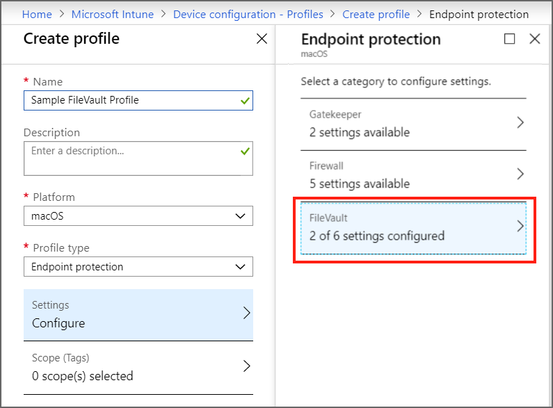
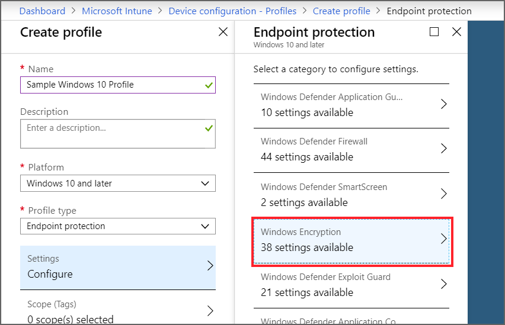

---
# required metadata
title: Encrypt devices in Microsoft Intune by using the platforms supported encryption methods 
titleSuffix: Microsoft Intune
description: Encrypt devices with built-in encryption methods like BitLocker or FileVault, and manage the recovery keys for those encrypted devices from within the Intune portal. 
keywords:
author: brenduns
ms.author: brenduns
manager: dougeby
ms.date: 07/18/2019
ms.topic: conceptual
ms.service: microsoft-intune
ms.localizationpriority: high
ms.technology:
ms.assetid:  

# optional metadata

#audience:
#ms.devlang:
ms.reviewer: annovich
ms.suite: ems
search.appverid: MET150
#ms.tgt_pltfrm:
ms.custom: intune-azure

---

# Use device Encryption with Intune  

Use Intune to manage a devices built-in disk or drive encryption to protect data on your devices.  

Configure disk encryption as part of a device configuration profile for endpoint protection. The following platforms and encryption technologies are supported by Intune:  
- macOS: FileVault2   
- Windows 10 and later: BitLocker  

Intune also provides a built-in [encryption report](encryption-monitor.md) that presents details about the encryption status of devices, across all your managed devices.  

## FileVault encryption for macOS  

Use Intune to configure FileVault2 disk encryption on devices that run macOS. Then, use the Intune encryption report to view encryption details for those devices and to manage recovery keys for FileVault encrypted devices.  

FileVault2 is a whole-disk encryption program that is included with macOS. You can use Intune to configure FileVault2 on devices that run **macOS 10.13 or later**.  

To configure FileVault, create a [device configuration profile](device-profile-create.md) for endpoint protection for the macOS platform. FileVault settings are one of the available settings categories for macOS endpoint protection.  

After you create a policy to encrypt devices with FileVault, the policy is applied to devices in two stages. First, the device is prepared to enable Intune to retrieve and back up the recovery key. This is referred to as escrow. After the key is escrowed, the disk encryption can start.

For details about the FileVault setting you can manage with Intune, see [FileVault](endpoint-protection-macos.md#filevault) in the Intune article for macOS endpoint protection settings.  

### How to configure macOS FileVault 

1. Sign in to [Intune](https://go.microsoft.com/fwlink/?linkid=2090973) and go to **Device configuration** > **Profiles** > **Create profile**.  

2. Set the following options:  

   1. Platform: macOS  
   2. Profile type: Endpoint protection  

3. Select **Settings** > **FileVault**.

4. For *FileVault*, select **Enable**.   

5. For *Recovery key type*, only **Personal key** is supported.  

   Consider adding a message to help guide end-users on how to retrieve the recovery key for their device. This information can be useful for your end-users when you use the setting for Personal recovery key rotation, which can automatically generate a new recovery key for a device periodically.  
   
   For example:  To retrieve a lost or recently rotated recovery key, sign in to the Intune Company Portal website from any device. In the portal, go to *Devices* and select the device that has FileVault enabled, and then select *Get recovery key*. The current recovery key is displayed.  

6. Configure the remaining settings to meet your business needs, and then select **OK**.  

7. Complete configuration of additional settings, and then save the profile.  

###  Manage FileVault  

After Intune encrypts a macOS device with FileVault, you can view and manage the FileVault recovery keys when you view the Intune [encryption report](encryption-monitor.md).  

## BitLocker encryption for Windows 10  

Use Intune to configure BitLocker Drive Encryption on devices that run Windows 10. Then, use the Intune encryption report to view encryption details for those devices. You can also access important information for BitLocker from your devices, as found in Azure Active Directory (Azure AD).  

BitLocker is available on devices that run **Windows 10 or later**.  

Configure BitLocker when you create a [device configuration profile](device-profile-create.md) for endpoint protection for the Windows 10 or later platform. BitLocker settings are in the Windows Encryption settings category for Windows 10 endpoint protection.    

 

### How to configure Windows 10 BitLocker  

1. Sign in to [Intune](https://go.microsoft.com/fwlink/?linkid=2090973) and go to Device configuration > Profiles > Create profile.  

2. Set the following options:  
   - Platform: Windows 10 and later  
   - Profile type: Endpoint protection   

3. Select **Settings** > **Windows Encryption**.

4. Configure settings for BitLocker to meet your business needs, and then select **OK**.  

5. Complete configuration of additional settings, and then save the profile.  

### Manage BitLocker  

After Intune encrypts a Windows 10 device with BitLocker, you can view and retrieve BitLocker recovery keys when you view the Intune [encryption report](encryption-monitor.md).  

## Next steps  

Create [a device compliance](compliance-policy-create-windows.md) policy  

Use the encryption report, to manage:  
- [BitLocker recovery keys](encryption-monitor.md#bitlocker-recovery-keys)
- [FileVault recovery keys](encryption-monitor.md#filevault-recovery-keys)

Review the encryption settings you can configure with Intune for:  
- [BitLocker](endpoint-protection-windows-10.md#windows-encryption)  
- [FileVault](endpoint-protection-macos.md#filevault)  
 
 
