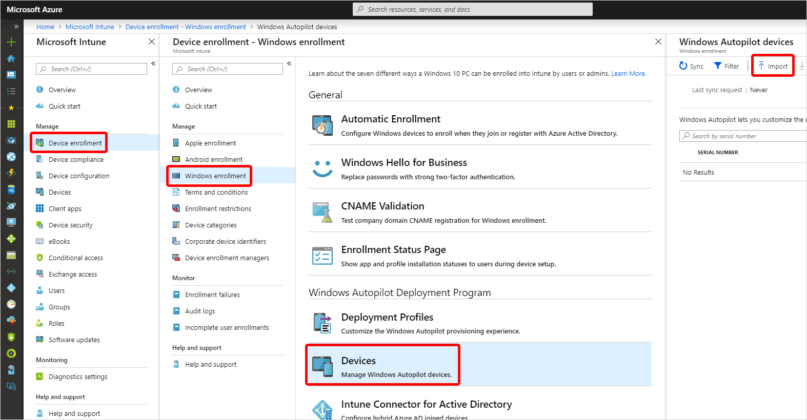
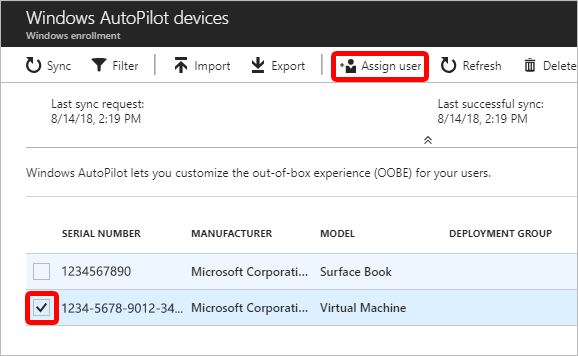

---
# required metadata

title: Enroll devices using Windows Autopilot
titleSuffix: Microsoft Intune
description: Learn how to enroll Windows 10 devices using Windows Autopilot.
keywords:
author: ErikjeMS
ms.author: erikje
manager: dougeby
ms.date: 10/5/2018
ms.topic: article
ms.prod:
ms.service: microsoft-intune
ms.technology:
ms.assetid: a2dc5594-a373-48dc-ba3d-27aff0c3f944

---

# Enroll Windows devices by using the Windows Autopilot  
The Windows Autopilot simplifies enrolling devices. Building and maintaining customized operating system images is a time-consuming process. You might also spend time applying these custom operating system images to new devices to prepare them for use before giving them to your end users. With Microsoft Intune and Autopilot, you can give new devices to your end users without the need to build, maintain, and apply custom operating system images to the devices. When you use Intune to manage Autopilot devices, you can manage policies, profiles, apps, and more after they're enrolled. For an overview of benefits, scenarios, and prerequisites, see [Overview of Windows Autopilot](https://docs.microsoft.com/windows/deployment/windows-autopilot/windows-10-autopilot).

## Prerequisites
- [Windows automatic enrollment enabled](https://docs.microsoft.com/intune-classic/deploy-use/set-up-windows-device-management-with-microsoft-intune#enable-windows-10-automatic-enrollment)
- [Azure Active Directory Premium subscription](https://docs.microsoft.com/azure/active-directory/active-directory-get-started-premium) <!--&#40;[trial subscription](http://go.microsoft.com/fwlink/?LinkID=816845)&#41;-->

## Add devices

You can add Windows Autopilot devices by importing a CSV file with their information.

1. In [Intune in the Azure portal](https://aka.ms/intuneportal), choose **Device enrollment** > **Windows enrollment** > **Devices** > **Import**.

    

2. Under **Add Windows Autopilot devices**, browse to a CSV file listing the devices that you want to add. The file should list the serial numbers, Windows product IDs, hardware hashes, and optional order IDs of the devices.

    

3. Choose **Import** to start importing the device information. Importing can take several minutes.

4. After import is complete, choose **Device enrollment** > **Windows enrollment** > **Windows Autopilot** > **Devices** > **Sync**. A message displays that the synchronization is in progress. The process might take a few minutes to complete, depending on how many devices are being synchronized.

5. Refresh the view to see the new devices.

## Create an Autopilot device group

1. In [Intune in the Azure portal](https://aka.ms/intuneportal), choose **Groups** > **New group**.
2. In the **Group** blade:
    1. For **Group type**, choose **Security**.
    2. Type a **Group name** and **Group description**.
    3. For **Membership type**, choose either **Assigned** or **Dynamic Device**.
3. If you chose **Assigned** for **Membership type** in the previous step, then in the **Group** blade, choose **Members** and add Autopilot devices to the group.
    Autopilot devices that aren't yet enrolled are devices where the name equals the serial number of the device.
4. If you chose **Dynamic Devices** for **Membership type** above, then in the **Group** blade, choose **Dynamic device members** and type any of the following code in the **Advanced rule** box.
    - If you want to create a group that includes all of your Autopilot devices, type `(device.devicePhysicalIDs -any _ -contains "[ZTDId]")`
    - If you want to create a group that includes all of your Autopilot devices with a specific order ID, type: `(device.devicePhysicalIds -any _ -eq "[OrderID]:179887111881") `
    - If you want to create a group that includes all of your Autopilot devices with a specific Purchase Order ID, type: `(device.devicePhysicalIds -any _ -eq "[PurchaseOrderId]:76222342342")`
    
    After adding the **Advanced rule** code, choose **Save**.
5. Choose **Create**.  

## Create an Autopilot deployment profile
Autopilot deployment profiles are used to configure the Autopilot devices.
1. In [Intune in the Azure portal](https://aka.ms/intuneportal), choose **Device enrollment** > **Windows enrollment** > **Deployment Profiles** > **Create Profile**.
2. Type a **Name** and optional **Description**.
3. If you want all devices in the assigned groups to automatically convert to Autopilot, set **Convert all targeted devices to Autopilot** to **Yes**. All non-Autopilot devices in assigned groups will register with the Autopilot deployment service. Allow 48 hours for the registration to be processed. When the device is unenrolled and reset, Autopilot will enroll it. After a device is registered in this way, disabling this option or removing the profile assignment won't remove the device from the Autopilot deployment service. You must instead [remove the device directly](enrollment-autopilot.md#delete-autopilot-devices).
4. For **Deployment mode**, choose one of these two options:
    - **User-driven**: Devices with this profile are associated with the user enrolling the device. User credentials are required to enroll the device.
    - **Self-deploying (preview)**: (requires the most recent [Windows 10 Insider Preview Build](https://docs.microsoft.com/windows-insider/at-work-pro/)) Devices with this profile aren't associated with the user enrolling the device. User credentials aren't required to enroll the device.
5. In the **Join to Azure AD as** box, choose **Azure AD joined**.
6. Choose **Out-of-box experience (OOBE)**, configure the following options, and then choose **Save**:
    - **Language (Region)***: Choose the language to use for the device. This option is only available if you chose **Self-deploying** for **Deployment mode**.
    - **Automatically configure keyboard***: If a **Language (Region)** is selected, choose **Yes** to skip the keyboard selection page. This option is only available if you chose **Self-deploying** for **Deployment mode**.
    - **End-user license agreement (EULA)**: (Windows 10, version 1709 or later) Choose if you want to show the EULA to users.
    - **Privacy settings**: Choose if you want to show privacy settings to users.
    - **Hide change account options (Windows Insider only)**: Choose **Hide** to prevent change account options from displaying on the company sign-in and domain error pages. This option requires [company branding to be configured in Azure Active Directory](https://docs.microsoft.com/azure/active-directory/fundamentals/customize-branding).
    - **User account type**: Choose the user's account type (**Administrator** or **Standard** user).
    - **Apply computer name template (Windows Insider only)**: Choose **Yes** to create a template to use when naming a device during enrollment. Names must be 15 characters or less, and can have letters, numbers, and hyphens. Names can't be all numbers. Use the [%SERIAL% macro](https://docs.microsoft.com/windows/client-management/mdm/accounts-csp) to add a hardware-specific serial number. Or, use the [%RAND:x% macro](https://docs.microsoft.com/windows/client-management/mdm/accounts-csp) to add a random string of numbers, where x equals the number of digits to add. 

6. Choose **Create** to create the profile. The Autopilot deployment profile is now available to assign to devices.

*Both **Language (Region)** and **Automatically configure keyboard** are only available if you chose **Self-deploying (preview)** for **Deployment mode** (requires the most recent [Windows 10 Insider Preview Build](https://docs.microsoft.com/windows-insider/at-work-pro/)).

## Assign an Autopilot deployment profile to a device group

1. In [Intune in the Azure portal](https://aka.ms/intuneportal), choose **Device enrollment** > **Windows enrollment** > **Deployment profiles** > choose a profile.
2. In the specific profile blade, choose **Assignments**. 
3. Choose **Select groups**, then in the **Select groups** blade, choose the group(s) that you want to assign the profile to, then choose **Select**.

## Edit an Autopilot deployment profile
After you've created an Autopilot deployment profile, you can edit certain parts of the deployment profile.   

1. In [Intune in the Azure portal](https://aka.ms/intuneportal), choose **Device enrollment**.
2. Under **Windows enrollment**, in the **Windows Autopilot** section, choose **Deployment Profiles**.
3. Select the profile you would like to edit.
4. Click **Properties** on the left to change the name or description of the deployment profile. Click **Save** after you make changes.
5. Click **Settings** to make changes to the OOBE settings. Click **Save** after you make changes.

> [!NOTE]
> Changes to the profile are applied to devices assigned to that profile. However, the updated profile won't be applied to a device that has already enrolled in Intune until after the device is reset and reenrolled.

## Alerts for Windows Autopilot unassigned devices  <!-- 163236 -->  

Alerts will show how many Autopilot program devices don't have Autopilot deployment profiles. Use the information in the alert to create profiles and assign them to the unassigned devices. When you click the alert, you see a full list of Windows Autopilot devices and detailed information about them.

To see alerts for unassigned devices, in [Intune in the Azure portal](https://aka.ms/intuneportal), choose **Device enrollment** > **Overview** > **Unassigned devices**.  

## Assign a user to a specific Autopilot device

You can assign a user to a specific Autopilot device. This assignment pre-fills a user from Azure Active Directory in the [company-branded](https://docs.microsoft.com/azure/active-directory/fundamentals/customize-branding) sign-in page during Windows setup. It also lets you set a custom greeting name. It doesn't pre-fill or modify Windows sign-in. Only licensed Intune users can be assigned in this manner.

Prerequisites: Azure Active Directory Company Portal has been configured and the most recent [Windows 10 Insider Preview Build](https://docs.microsoft.com/windows-insider/at-work-pro/).

1. In the [Intune in the Azure portal](https://aka.ms/intuneportal), choose **Device enrollment** > **Windows enrollment** > **Devices** > choose the device > **Assign user**.

    

2. Choose an Azure user licensed to use Intune and choose **Select**.

    

3. In the **User Friendly Name** box, type a friendly name or just accept the default. This string is the friendly name that displays when the user signs in during Windows setup.

    

4. Choose **Ok**.

## Delete Autopilot devices

You can delete Windows Autopilot devices that aren't enrolled.

1. If the devices are enrolled in Intune, you must first [delete them from the Azure Active Directory portal](devices-wipe.md#delete-devices-from-the-azure-active-directory-portal).

2. In the [Intune in the Azure portal](https://aka.ms/intuneportal), choose **Device enrollment** > **Windows enrollment** > **Devices**.

3. Under **Windows Autopilot devices**, choose the devices you want to delete, and then choose **Delete**.

4. Confirm the deletion by choosing **Yes**. It can take a few minutes to delete.

## Using Autopilot in other portals
If you aren't interested in mobile device management, you can use Autopilot in other portals. While using other portals is an option, we recommend you only use Intune to manage your Autopilot deployments. When you use Intune and another portal, Intune isn't able to:  

- Display changes to profiles created in Intune, but edited in another portal
- Synchronize profiles created in another portal
- Display changes to profile assignments done in another portal
- Synchronize profile assignments done in another portal
- Display changes to the device list that were made in another portal

## Redeploying Windows Autopilot

You can group Windows devices by a correlator ID when enrolling using [Autopilot for existing devices](https://techcommunity.microsoft.com/t5/Windows-IT-Pro-Blog/New-Windows-Autopilot-capabilities-and-expanded-partner-support/ba-p/260430) through Configuration Manager. The correlator ID is a parameter of the Autopilot configuration file. The [Azure AD device attribute enrollmentProfileName](https://docs.microsoft.com/azure/active-directory/users-groups-roles/groups-dynamic-membership#using-attributes-to-create-rules-for-device-objects) is automatically set to equal "OfflineAutopilotprofile-<correlator ID>". This allows arbitrary Azure AD dynamic groups to be created based off correlator ID by using the enrollmentprofileName attribute for offline Autopilot enrollments.

If you're upgrading old Windows versions that don't support Autopilot registration, you can use an offline Autopilot profile. Autopilot can help during a clean install of Windows 10 1809 or greater. As part of the offline profile, you can specify a correlator ID. 

WARNING: Because the correlator ID is not pre-listed in Intune, users can choose to enroll under any correlator ID they want. If the user creates a correlator ID matching an Autopilot or Apple DEP profile name, the device will be added to any dynamic Azure AD device group based off the enrollmentProfileName attribute. To avoid this conflict:
- Always create dynamic group rules matching against the *entire* enrollmentProfileName value
- Never name Autopilot or Apple DEP profiles beginning with "OfflineAutopilotprofile-".

## Next steps
After you configure Windows Autopilot for registered Windows 10 devices, learn how to manage those devices. For more information, see [What is Microsoft Intune device management?](https://docs.microsoft.com/intune/device-management)
