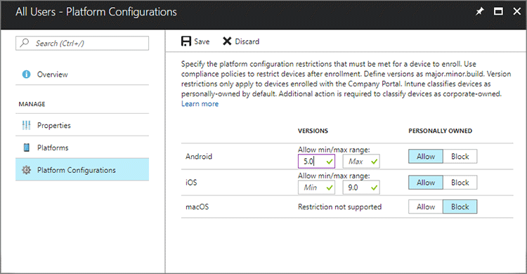

---
# required metadata

title: Set enrollment restrictions in Intune
titleSuffix: "Intune on Azure"
description: Restrict enrollment by platform and set a device enrollment limit in Intune. "
keywords:
author: nathbarn
ms.author: nathbarn
manager: angrobe
ms.date: 06/28/2017
ms.topic: article
ms.prod:
ms.service: microsoft-intune
ms.technology:
ms.assetid: 9691982c-1a03-4ac1-b7c5-73087be8c5f2

# optional metadata

#ROBOTS:
#audience:
#ms.devlang:
ms.reviewer: dagerrit
ms.suite: ems
#ms.tgt_pltfrm:
ms.custom: intune-azure
---

# Set enrollment restrictions

[!INCLUDE[azure_portal](./includes/azure_portal.md)]

As an Intune admin, you can set the following restrictions for device enrollment:

- Maximum number of enrolled devices
- Device platforms that can enroll:
  - Android
  - iOS
  - macOS
  - Windows
- Platform operating system version (iOS and Android only)
  - Minimum version
  - Maximum version
- Restrict personally owned devices (iOS, Android, macOS only)

>[!NOTE]
>This is not a security feature, as compromised devices can misrepresent their operating system version information. This is a best-effort barrier for non-malicious users.

## Set the default number of enrolled devices

1. In the Intune portal, choose **Device enrollment**, choose **Enrollment restrictions**.

2. Under **Enrollment restrictions** > **Device Type Restrictions**, select **Default**.
3. Under **All Users**, select **Platforms**. Choose **Allow** or **Block** for each platform:
  - **Android**
  - **iOS**
  - **macOS**
  - **Windows**

  Click **Save**.
4. Under **All Users**, select **Platform Configurations** and select the following configurations:
  - **Versions** - Specify **Min** and **Max** platform operating system versions for Android and iOS devices.
  - **Personally Owned** - Specify whether to **Allow** or **Block** for Android, iOS, and macOS devices.
  

## Create device type restrictions

1. In the Intune portal, choose **Device enrollment**, choose **Enrollment restrictions**, and then choose **Create**.

2. Under **Device Type Restrictions**, select **Default**.

3. On the **All Users** blade, select **Platforms**.

4. For platforms that are allowed to enroll in Intune, select **Allow**. For platforms that you want to block from enrolling, select **Block**. Platforms are set to **Allow** by default.

    >[!NOTE]
    >These settings do not apply to or block Windows enrollments that use the Intune software client. These settings affect only enrollment using mobile device management.

6. Select **Save**.

7. Select **Platform Configurations**.

8. Choose whether to **Allow** or **Block** personally owned iOS and Android devices from enrolling.

9. Select **Save**.

## Set device limit restrictions

1. In the Intune portal, choose **Device enrollment**, and then choose **Enrollment restrictions**.

3. Under **Device Limit Restrictions**, select **Default**.

4. On the **All Users** blade, select **Device Limit**.

5. Select the maximum number of devices that a user can enroll, and then select **Save**.
