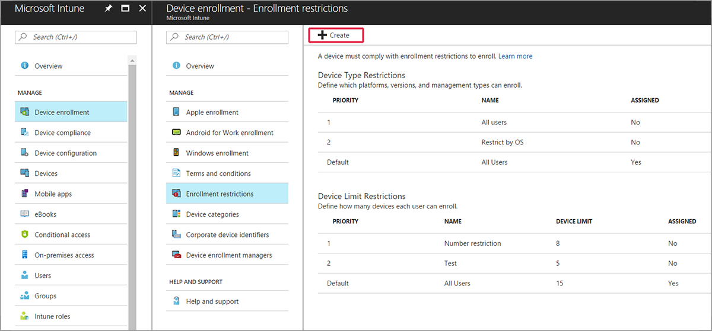
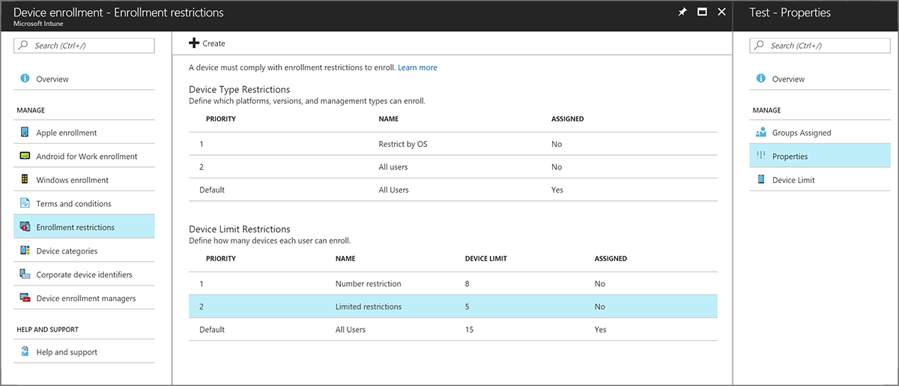

---
# required metadata

title: Set enrollment restrictions in Intune
titleSuffix: "Intune on Azure"
description: Restrict enrollment by platform and set a device enrollment limit in Intune. "
keywords:
author: nathbarn
ms.author: nathbarn
manager: angrobe
ms.date: 06/28/2017
ms.topic: article
ms.prod:
ms.service: microsoft-intune
ms.technology:
ms.assetid: 9691982c-1a03-4ac1-b7c5-73087be8c5f2

# optional metadata

#ROBOTS:
#audience:
#ms.devlang:
ms.reviewer: dagerrit
ms.suite: ems
#ms.tgt_pltfrm:
ms.custom: intune-azure
---

# Set enrollment restrictions

[!INCLUDE[azure_portal](./includes/azure_portal.md)]

As an Intune admin, you can set the following restrictions for device enrollment:

- Maximum number of enrolled devices
- Device platforms that can enroll:
  - Android
  - iOS
  - macOS
  - Windows
- Platform operating system version (iOS and Android only)
  - Minimum version
  - Maximum version
- Restrict personally owned devices (iOS, Android, macOS only)

>[!NOTE]
>Enrollment restrictions are not a security feature. Compromised devices can misrepresent their operating system version information. This is a best-effort barrier for non-malicious users.

## Set default enrollment restrictions
The default enrollment restrictions apply to all users who aren't assigned higher priority enrollment restrictions.  
1. In the Intune portal, choose **Device enrollment**, choose **Enrollment restrictions**.

2. Under **Enrollment restrictions** > **Device Type Restrictions**, select **Default**.
3. Under **All Users**, select **Platforms**. Choose **Allow** or **Block** for each platform:
  - **Android**
  - **iOS**
  - **macOS**
  - **Windows**

  Click **Save**.
4. Under **All Users**, select **Platform Configurations** and select the following configurations:
  - **Versions** - Specify **Min** and **Max** platform operating system versions for Android and iOS devices.
  - **Personally Owned** - Specify whether to **Allow** or **Block** for Android, iOS, and macOS devices.
  
  Click **Save**.

## Create new enrollment restrictions

1. In the Intune portal, choose **Device enrollment**, choose **Enrollment restrictions**, and then choose **Create**.

2. Specify the **Name** and **Description** of the enrollment restriction for administrative purposes. These do not display to end users.
3. Select the **Restriction Type** to create:
  - **Device Type Restriction** - Specify platform restrictions:
    - Device platforms that can enroll:
      - Android
      - iOS
      - macOS
      - Windows
    - Platform operating system version (iOS and Android only)
      - Minimum version
      - Maximum version
    - Restrict personally owned devices (iOS, Android, macOS only)
  - **Device Limit Restrictions** - Specify the maximum number of enrolled devices per user
4. Click **Create** to create the new enrollment restriction.
5. Select **Groups Assigned** to assign these enrollment restrictions to groups of users, and then select **Assign**.
6. Choose the groups to assign this restriction. You can multi-select groups with the **Ctrl** key. Choose **Select** to save your selections, and then **Assign** to apply the enrollment restrictions to groups.

7. You can adjust the priority of enrollment restrictions by dragging and dropping the enrollment restrictions up or down.
