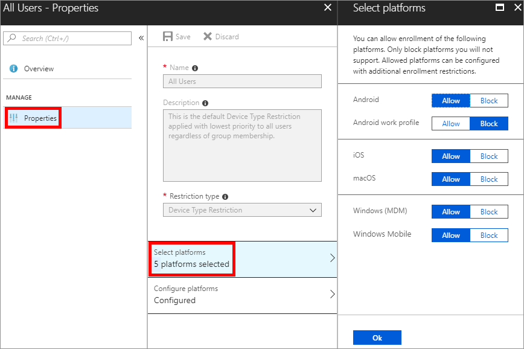
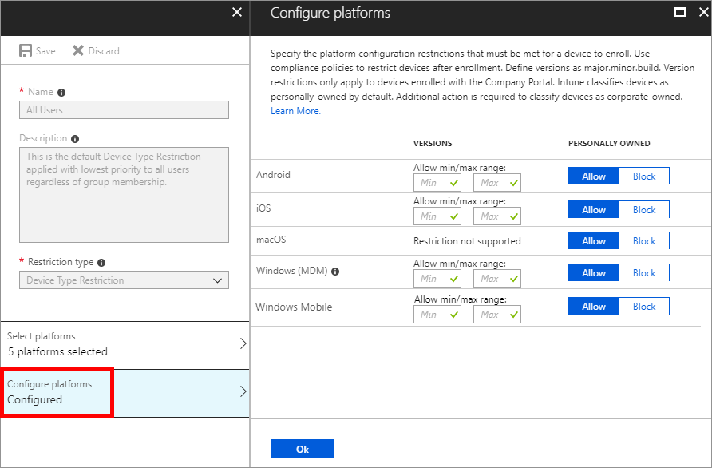
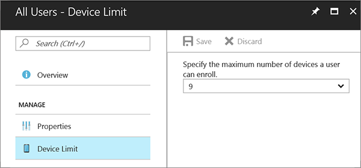

---
# required metadata

title: Set enrollment restrictions in Microsoft Intune
titlesuffix:
description: Restrict enrollment by platform and set a device enrollment limit in Intune.
keywords:
author: ErikjeMS
ms.author: erikje
manager: dougeby
ms.date: 03/02/2018
ms.topic: article
ms.prod:
ms.service: microsoft-intune
ms.technology:
ms.assetid: 9691982c-1a03-4ac1-b7c5-73087be8c5f2

# optional metadata

#ROBOTS:
#audience:
#ms.devlang:
ms.reviewer: dagerrit
ms.suite: ems
#ms.tgt_pltfrm:
ms.custom: intune-azure
---

# Set enrollment restrictions

[!INCLUDE [azure_portal](./includes/azure_portal.md)]

As an Intune administrator, you can create and manage enrollment restrictions that define the number and types of devices that can enroll into management with Intune. You can create multiple restrictions and apply them to different user groups. You can set the [priority order](#change-enrollment-restriction-priority) for your different restrictions.

>[!NOTE]
>Enrollment restrictions are not security features. Compromised devices can misrepresent their character. These restrictions are a best-effort barrier for non-malicious users.

>[!NOTE]
>The group-assigned enrollment restrictions and priority functionality mentioned in this article are in the process of being rolled out across the Intune customer base. Until this rollout is complete, you might not have access to the group and priority features.

The specific enrollment restrictions that you can create include:

- Maximum number of enrolled devices.
- Device platforms that can enroll:
  - Android
  - Android work profile
  - iOS
  - macOS
  - Windows
- Platform operating system version for iOS, Android, Android work profile, and Windows. (Only Windows 10 versions can be used. Leave this blank if Windows 8.1 is allowed.)
  - Minimum version.
  - Maximum version.
- Restrict personally owned devices (iOS, Android, Android work profile, macOS, Windows only).

## Default restrictions

Default restrictions are automatically provided for both device type and device limit enrollment restrictions. You can change the options for the defaults. Default restrictions apply to all user and userless enrollments. You can override these defaults by creating new restrictions with higher priorities.

## Create a restriction

1. Sign in to the Azure portal.
2. Select **More Services**, search for **Intune**, and then choose **Intune**.
3. Select **Device enrollment** > **Enrollment restrictions**.
4. Select **Create restriction**.
5. Give the restriction a name and description.
6. Choose a **Restriction type**, and then select **Create**.
7. For device limit restrictions, select **Device limit** to set the maximum number of devices that a user can enroll.
8. For device type restrictions, select **Platforms** and **Platform configurations** to allow or block various platforms and versions.
9. Select **Assignments** > **+ Select groups**.
10. Under **Select groups**, select one or more groups, and then choose **Select**. The restriction applies only to groups to which it's assigned. If you don't assign a restriction to at least one group, it won't have any effect.
11. Select **Save**.
12. The new restriction is created with a priority just above the default. You can [change the priority](#change-enrollment-restriction-priority).

## Set device type restrictions

You can change the settings for a device type restriction by following the steps below. These restrictions don't effect on devices that have already been enrolled. Devices enrolled with [Intune PC agent](intune-classic/deploy-use/manage-windows-pcs-with-microsoft-intune.md) can't be blocked with this feature.

1. Sign in to the Azure portal.
2. Select **More Services**, search for **Intune**, and then choose **Intune**.
3. Select **Device enrollment** > **Enrollment restrictions**.
4. Under **Device Type Restrictions** > choose the restriction that you want to set > **Properties** > **Select platforms**. Choose **Allow** or **Block** for each platform listed.
    
5. Choose **OK**.
6. Choose **Configure platforms**.
    
7. Choose the minimum and maximum **Versions** for the platforms listed. Supported version formats include:
    - Android work profile support major.minor.rev.build.
    - iOS supports major.minor.rev. Operating system versions don't apply to Apple devices that enroll with the Device Enrollment Program, Apple School Manager, or the Apple Configurator app.
    - Windows supports major.minor.rev.build for Windows 10 only.
8. Choose whether to **Allow** or **Block** **Personally owned** devices for each platform listed.
9. Choose **OK**.

### Android device type restrictions
- If you block personally owned Android devices from enrollment, personally owned Android work profile devices can still enroll.
- By default, your Android work profile devices settings are the same as your settings for your Android devices. After you change your Android work profile settings, that's no longer the case.
- If you block personal Android work profile enrollment, only corporate Android devices can enroll as Android work profile.

### Windows device type restrictions
After the Windows platform device type restriction is set to **Block**, Intune checks to make sure that each new Windows enrollment request has been authorized as a corporate enrollment. Unauthorized enrollments will be blocked.

The following methods qualify as being authorized as a Windows corporate enrollment:
 - The enrolling user is using a [device enrollment manager account]( device-enrollment-manager-enroll.md).
- The device enrolls through [Windows AutoPilot](enrollment-autopilot.md).
- The device’s IMEI number is listed in **Device enrollment** > **[Corporate device identifiers](corporate-identifiers-add.md)**. (Not supported for Windows Phone 8.1.)
- The device enrolls through a [bulk provisioning package](windows-bulk-enroll.md).
- The device enrolls through [automatic enrollment from SCCM for co-management]( sccm/core/clients/manage/co-management-overview#how-to-configure-co-management.md).
 
The following enrollments are marked as corporate by Intune, but since they do not offer the Intune administrator per-device control, they will be blocked:
 - [Automatic MDM enrollment](windows-enroll#enable-windows-10-automatic-enrollment) with [Azure Active Directory join during Windows setup](azure/active-directory/device-management-azuread-joined-devices-frx.md).
- [Automatic MDM enrollment](windows-enroll#enable-windows-10-automatic-enrollment) with [Azure Active Directory join from Windows setup]( azure/active-directory/device-management-azuread-joined-devices-setup.md).
 
The following personal enrollment methods will also be blocked:
- [Automatic MDM enrollment](windows-enroll.md#enable-windows-10-automatic-enrollment) with [Add Work Account from Windows Settings]( azure/active-directory/device-management-azuread-registered-devices-windows10-setup.md).
- [MDM enrollment only]( https://docs.microsoft.com/en-us/windows/client-management/mdm/mdm-enrollment-of-windows-devices#connecting-personally-owned-devices-bring-your-own-device) option from Windows Settings.

## Set device limit restrictions

You can change the settings for a device limit restriction by following these steps:

1. Sign in to the Azure portal.
2. Select **More Services**, search for **Intune**, and then choose **Intune**.
3. Select **Device enrollment** > **Enrollment restrictions**.
4. Under **Device Limit Restrictions**, choose the restriction that you want to set.
5. Select **Device Limit**, and then in the drop-down list, select the maximum number of devices a user can enroll.
    
6. Select **Save**.

Users see a notification that tells them when they've met their limit of enrolled devices. For example, on iOS, it looks like this:

## Change enrollment restriction priority

Priority is used when a user exists in multiple groups that are assigned restrictions. Users are subject only to the highest priority restriction assigned to a group that they are in. For example, Joe is in group A assigned to priority 5 restrictions and also in group B assigned to priority 2 restrictions. Joe is subject only to the priority 2 restrictions.

When you create a restriction, it's added to the list just above the default.

Device enrollment includes default restrictions for both device type and device limit restrictions. These two restrictions apply to all users unless they're overridden by higher-priority restrictions.

You can change the priority of any non-default restriction.

1. Sign in to the Azure portal.
2. Select **More Services**, search for **Intune**, and then choose **Intune**.
3. Select **Device enrollment** > **Enrollment restrictions**.
4. Hover over the restriction in the priority list.
5. Using the three vertical dots, drag the priority to the desired position in the list.
