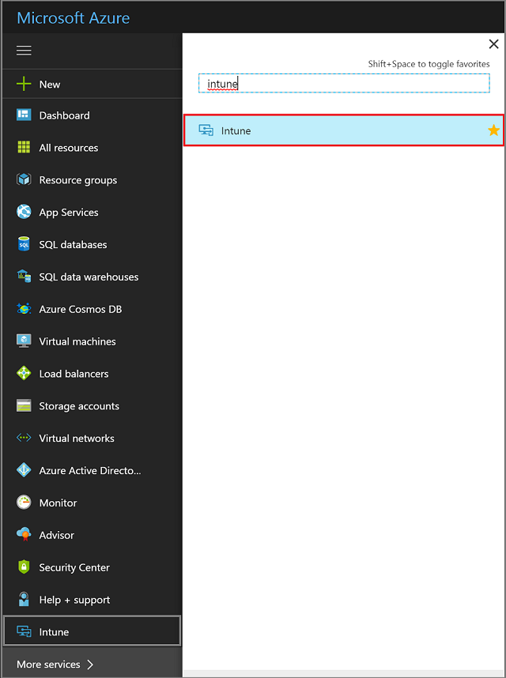

---
# required metadata

title: Sign up for a 30-day free trial of Microsoft Intune
titleSuffix: Microsoft Intune
description: Learn how to sign up for a 30-day free trial of Microsoft Intune.
keywords:
author: dougeby
ms.author: dougeby
manager: dougeby
ms.date: 03/04/2018
ms.topic: conceptual
ms.prod:
ms.service: microsoft-intune
ms.technology:
ms.assetid: 195931c0-8208-43bd-b0af-b1f8e469a32c

# optional metadata

#ROBOTS:
#audience:
#ms.devlang:
#ms.reviewer:
ms.suite: ems
#ms.tgt_pltfrm:
ms.custom: get-started

---

# Sign up for a Microsoft Intune free trial

This article walks you through signing up for a trial of Intune standalone for the Azure portal.

1. Visit the [Intune Sign up](https://portal.office.com/Signup/Signup.aspx?OfferId=40BE278A-DFD1-470a-9EF7-9F2596EA7FF9&dl=INTUNE_A&ali=1#0%20) page and fill out the form to sign up for a trial subscription.
2. If you have a work or school account and want to use that for your Intune trial, follow [these sign-in instructions](/intune/account-sign-up) instead.

* If most of your IT operations and users are in a different locale than you, you may want to select that locale under **Where's your company located?**.

2. At the end of the sign-up process, you get a message with your new account information.   

  

At this point, if you click **You're ready to go**, you are taken to the Office 365 Admin Center, where you can add users to your test environment.   However, if you want to go directly into the Intune Azure portal, open a new browser window, and enter **https://portal.azure.com** in the address bar. You are taken to the Azure sign-in page where you can use the credentials you were given to sign in. Use this address whenever you want to sign into your Intune trial.   

The first time you sign on to the Intune [Azure portal](https://portal.azure.com), you may not see Intune on your Azure dashboard. To add the Intune service to your Azure dashboard:
1. Choose **All services >** in the list of Azure services to the left of the dashboard, and enter **Intune** in the search box.
2. Choose **Intune** from the list, and select the star to add the service to the list of services.  
3. Then choose **Intune** in the list of services to open the Intune dashboard.

When you sign up for a trial, you will also receive an email message that contains your account information at the email address that you provided during the sign-up process. This email confirms your trial is active.

## Keeping the admin experiences straight

There are two portals that you might use:
- The Intune dashboard in Azure ([portal.azure.com](https://portal.azure.com)) where you can explore the [capabilities of Intune](what-is-intune.md). Normally, you’ll do your work in the Intune dashboard.
- The Office 365 Admin center ([portal.office.com](https://portal.office.com)) where you can add and manage users, if you are not using Azure Active Directory for that. You can also manage other aspects of your account, including billing and support.

## Next steps

### Integration with other products
Learn more about using your Azure Active Directory user accounts with Intune:
- [Identity requirements](https://docs.microsoft.com/active-directory/active-directory-hybrid-identity-design-considerations-overview#design-considerations-overview)
- [Directory synchronization requirements](https://docs.microsoft.com/active-directory/active-directory-hybrid-identity-design-considerations-directory-sync-requirements)
- [Multi-factor authentication requirements](https://docs.microsoft.com/active-directory/active-directory-hybrid-identity-design-considerations-multifactor-auth-requirements)

Learn more about using [Intune with System Center Configuration Manager](https://docs.microsoft.com/sccm/mdm/understand/hybrid-mobile-device-management)
