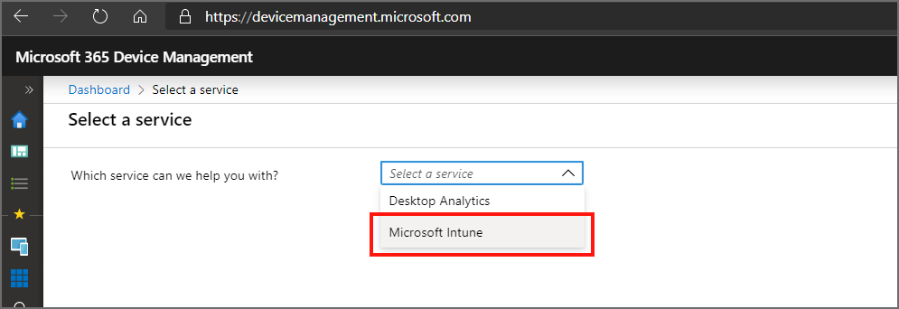
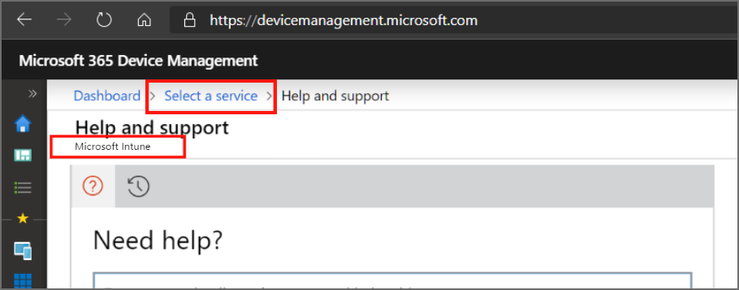
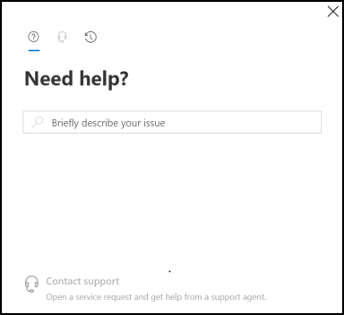
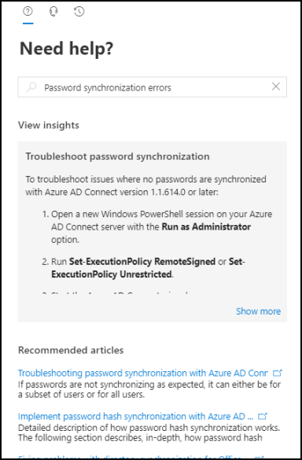
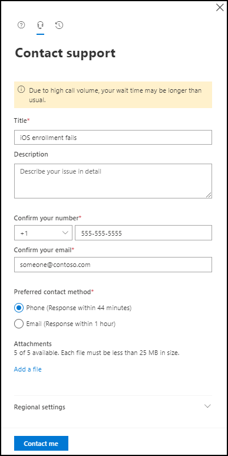
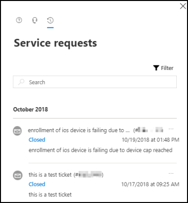
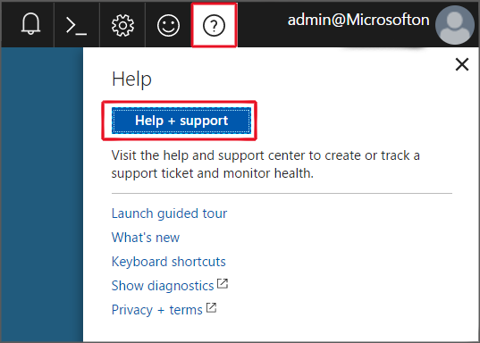
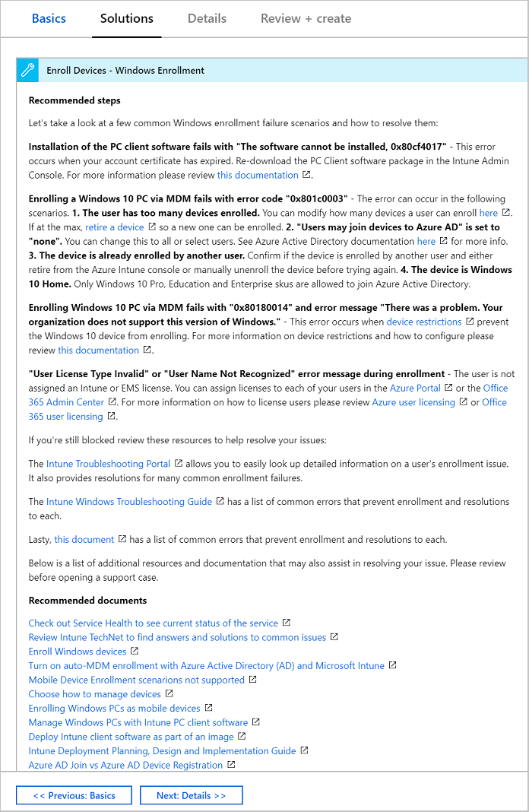
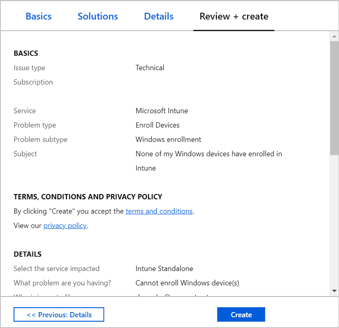

---
# required metadata

title: How to get support for Microsoft Intune
titleSuffix: Microsoft Intune
description: Get online and telephone support for Microsoft Intune paid and trial subscriptions.
keywords:
author: brenduns
ms.author: brenduns
manager: dougeby
ms.date: 10/28/2019
ms.topic: conceptual
ms.service: microsoft-intune
ms.localizationpriority: high
ms.technology:
ms.assetid: 7fc95d17-098e-4da5-8a09-a96476569dd9

# optional metadata

#audience:
#ms.devlang:
ms.reviewer: srik
ms.suite: ems
search.appverid: MET150
#ms.tgt_pltfrm:
ms.custom: intune-classic
ms.collection: M365-identity-device-management
---

# How to get support for Microsoft Intune  

[!INCLUDE [azure_portal](./includes/note-for-both-portals.md)]  
  
Microsoft provides global technical, pre-sales, billing, and subscription support for Microsoft Intune. Support is available both online and by phone for paid and trial subscriptions. Online technical support is available in English and Japanese. Phone support and online billing support are available in additional languages.

As an Intune admin, you can use the **Help and Support** option to file an on-line support ticket for Intune from the Azure portal. To create and manage a support incident, your account must have an Azure Active Directory (Azure AD) role that includes the *action* **microsoft.office365.supportTickets/tickets/manage**. For information about Azure AD roles and permissions that are required to create a support ticket, see [administrator roles in Azure Active Directory](https://docs.microsoft.com/azure/active-directory/active-directory-assign-admin-roles-azure-portal).  

>[!IMPORTANT]  
> For technical support with third-party products that work with Intune (like Saaswedo, Cisco, or Lookout), contact the supplier of that product first. Before you open a request with Intune support, make sure you configured the other product correctly.
>
> For information about troubleshooting issues related to Microsoft Intune, see the [Troubleshoot section](help-desk-operators.md) of the Intune documentation.

## Help and support experience  

The Help and support experience for Intune is available from the [Microsoft 365 Device Management portal](https://devicemanagement.microsoft.com) and from all of the blades (or pages) under Intune in the Azure portal. 

The *Help and support* experience is similar to the experience seen in the [Microsoft 365 admin center](https://admin.microsoft.com/), and replaces the previous *Help + support*, which remains in place for other services in Azure. 

To access Help and support, use the following options:  
- **Device Management Dashboard:**
  - After you've selected a feature area for Intune, select the option for **Help and support**.
  - From any node in the Device Management portal, select the **?** icon in the upper-right corner of the portal, and then use the drop-down to select the service you want help with. The **?** icon in the Device Management portal supports multiple services, and you must select the specific service you want assistance for.  

    

    After you select a service, you'll see the *Help and support* page for that service where you can specify details to [find solutions](#find-solutions) for a specific problem .  

    When the results of your search don't seem to match expectations for your service, check to ensure the correct service was selected. The service selection appears just after *Help and support*.  If the right service wasn't selected, click on *Select a service* to return to the service selection drop-down.  

     

- **In the Azure portal:**
  - Select **Help and support** from any Intune blade or page.

  > [!NOTE]  
  > If your instance of Intune is hosted on the private cloud for government, also known as a sovereign cloud like Azure Government, see [Intune support for private cloud for government](#intune-support-for-private-cloud-for-government), later in this article. The Intune *Help and support* experience won’t be available on the private cloud for government until later this year. 

  When you open Help and Support, the portal displays the **Need help?** window:  

  

  In the left top corner there are three icons that you can select to open different panes of the *Need Help?* window. The pane your viewing is identified by the underline.

  Customers with a **Premier** or **Unified** support contract have [additional options](#premier-and-unified-support-customers) for support, and see a banner in *Need help?* that resembles the following image:  
  

  *Need Help?* opens to the *Find Solutions* pane. However, if you have an active support case the window opens to the *Service requests* pane where you can view details about your active and closed support cases.

  
### Find solutions  

  

On the *Find solutions* pane, specify a few details about an issue in the provided text box. Based on the text you provide about an issue, the pane populates with insights that are potential matches. You'll also get links to recommended articles that might help you resolve the issue.

When a strong match is found for the details you describe, troubleshooting tips can appear right in the *Need help?* window. 

For example, you might enter **Password synchronization errors**. The results include troubleshooting guidance directly in the pane, and links to recommended articles from our documentation library.  

 

### Contact support  

  

From the *contact support* pane, you can submit a request for assistance. This pane is available after you provide some basic keywords on the *find solutions* pane.  

When requesting assistance, provide a description of the problem with as much detail as needed.  After confirming your phone and email contact information, select the method of contact you prefer. The window displays a response time for each contact method, which gives you an expectation of when you'll be contacted. Before submitting your request, attach files like logs or screenshots that can help fill in details about the issue.  

After you fill in the required information, select **Contact me** to submit the request. 

  ### Service requests  

  

The *Service requests* pane displays your case history. Active cases are at the top of the list, with closed issues also available for review.  

If you have an active support case number, you can enter it here to jump to that issue, or you can select any incident from the list of active and closed incidents to view more information about it.

When you’re done viewing details for an incident, select the left arrow that appears at the top of the service request window just above the icons for the three *Need Help?* pane icons. The back arrow returns the display to the list of support incidents you’ve opened.  

### Premier and Unified support customers  

As a customer with a **Premier** or **Unified** support contract, you can specify a severity for your issue, and schedule a support callback for a specific time and day. These options are available when you open or submit a new issue and when you edit an active support case.  

**Severity** - The options to specify the severity of an issue depend on your support contract:
- *Premier*: Severity of A, B, or C
- *Unified*: Critical, or non-critical  

Selecting either a severity **A** or **Critical** issue limits you to a phone support case, which provides the fastest option to get support.  

**Callback schedule** - You can request a callback on a specific day and time. 

## Azure Help + support experience 

When you use the left navigation pane **Help + support**, or use the **?** option in the upper-right corner of the Azure portal, you open the Azure Help + support experience, which is distinct from the Intune Help and support experience.  

Beginning in April of 2019, you can't access the Azure *Help + support* experience to get assistance with Intune, unless your subscription is on a private cloud for government.  

If your instance of Intune doesn't run on a private cloud for government, navigating through Azure *Help + support* redirects you to the Intune *Help and support* experience to create and manage support incidents.  

## Intune support for private cloud for government

When your Intune subscription hosted on the private cloud for government, which is also known as a sovereign cloud like Azure Government, you don’t yet have access to the newer Intune Help and support experience.  Instead, use the following information go get support for Intune. 

### Create an online support ticket 

>[!IMPORTANT]    
> As *Help and support* transitions to a new system which is not yet available for the private cloud for government, when you create a support incident, the portal identifies a support case that uses a 15 digit identification number. When the 15-digit case is created, a mirror of that case is created for use by Microsoft Support. This mirror case is created in a new support system, uses an 8-digit case ID, and is used by support services to track all work and communications for your support incident. Shortly after your 15-digit case is created, you’ll receive an email that identifies the 8-digit number of the mirrored support case that is used by support services.  
> 
> Support personal work and communicate from the 8-digit support case, and only use the 8-digit support case to log communications and track incident progress. Therefore, you’ll receive email updates from that 8-digit support case that serve as your case-work track record. No details are logged into the 15-digit support incident. When support concludes and the 8-digit support case closes, that status is reflected in by the 15-digit support case that you can view from within the azure portal.  No other updates or status changes should be expected for the 15-digit support case.  
> 
> When transitions between support tools completes later this year, the support experience Intune hosted on the government cloud will resemble the default *Help and support* experience that’s currently available for Intune subscriptions hosted on the public cloud.  

1. Sign in to the Azure portal (<https://portal.azure.com>) with your Intune admin credentials, select the **?** icon in the upper-right corner of the portal, and then select **Help + support** to go to the [Azure Help + support](https://portal.azure.com/#blade/Microsoft_Azure_Support/HelpAndSupportBlade/overview) page.

   

2. On the Azure **Help + support** page, select **New support request**.

   

3. On the **Basics** tab, for most Intune technical support issues, choose the following options:
   - **Issue type**: **Technical**
   - **Subscription**: <*your subscription*>
   - **Service**: **Microsoft Intune**
   - **Problem type**: Choose your problem type from the drop-down menu.
   - **Problem subtype**: Choose the problem subtype from the drop-down menu.
   - **Subject**: Briefly describe the issue you want help with.

   

   Choose **Next: Solutions** to continue.
4. On the **Solutions** tab, review the recommended steps that might help you solve your problem without filing a ticket. If you still want to create a support request after looking through the steps, click **Next: Details**.

   
5. On the **Details** tab, fill out the details for your problem, the support method, your contact information, and then click **Next: Review + create**.

   
6. Review the information, verify that it's correct, and then choose **Create** to submit your support request.

   

>[!IMPORTANT]
>If you have a billing or subscription question, you can open a case to get support through the [Microsoft 365 admin center](https://admin.microsoft.com/Support/SupportEntry.aspx).

### View support requests  

You can view your support requests from within the Azure portal. However, limited information is available.  To view your incidents: 

1. Sign in to  Azure (<https://portal.azure.com>) with your Intune admin credentials, select the **?** icon in the upper-right corner of the portal, and then select **Help + support** to go to the [Azure Help + support](https://portal.azure.com/#blade/Microsoft_Azure_Support/HelpAndSupportBlade/overview) page.

2. On the **Help + support** page you can view the list of **Recent support requests**.

   > [!IMPORTANT]  
   > Private cloud for government customers can only view the 15-digit support case number, and the incident status. All case communications and tracking of work or alerts are sent by email and reference the 8-digit support case number that is created as a mirror of the support case opened from within the Intune console.   

## Additional resources  

- [Billing and subscription management support](https://support.office.com/article/Contact-Office-365-for-business-support-Admin-Help-32a17ca7-6fa0-4870-8a8d-e25ba4ccfd4b)
- [Volume licensing](https://go.microsoft.com/fwlink/p/?LinkID=282015)
- [Troubleshoot Intune issues](help-desk-operators.md)
