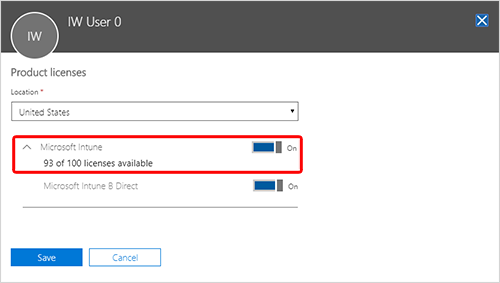
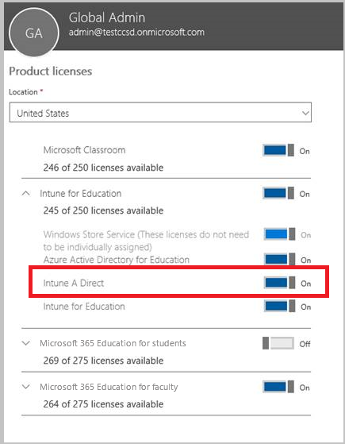

---
# required metadata

title: Assign Microsoft Intune licenses
description: Assign licenses to users so they can enroll in Intune
keywords:
author: ErikjeMS
ms.author: erikje
manager: dougeby
ms.date: 10/31/2017
ms.topic: conceptual
ms.service: microsoft-intune
ms.subservice: fundamentals
ms.localizationpriority: high
ms.assetid: bb4314ea-88b5-44d3-92ce-4c6aff0587a4

# optional metadata

#ROBOTS:
#audience:
#ms.devlang:
ms.reviewer: chmaguir
ms.suite: ems
search.appverid: MET150
#ms.tgt_pltfrm:
ms.custom: intune-classic; get-started
ms.collection: M365-identity-device-management
---

# Assign licenses to users so they can enroll devices in Intune

Whether you manually add users or synchronize from your on-premises Active Directory, you must first assign each user an Intune license before users can enroll their devices in Intune. For a list of licenses, see [Licenses that include Intune](../licenses.md).

## Assign an Intune license in the Microsoft 365 admin center

You can use the [Microsoft 365 admin center](http://go.microsoft.com/fwlink/p/?LinkId=698854) to manually add cloud-based users and assign licenses to both cloud-based user accounts and accounts synchronized from your on-premises Active Directory to Azure AD.

1. Sign in to the [Microsoft 365 admin center](http://go.microsoft.com/fwlink/p/?LinkId=698854) using your tenant administrator credentials, and then choose **Users** > **Active Users**.

2. Select the user account that you want to assign an Intune user license to, and then choose **Product licenses** > **Edit**.

3. Toggle **Intune** or **Enterprise Mobility + Security** to **On**, and choose **Save**.

   

4. The user account now has the permissions needed to use the service and enroll devices into management.

> [!NOTE]
> Users will appear in the Classic Intune portal only after they have enrolled a device using the Intune PC client. Also, you can select a group of users to edit at once,  either selecting to add or replace a license for all selected users.

## Assign an Intune license by using Azure Active Directory

You can also assign Intune licenses to users by using Azure Active Directory. For more information, see the [License users in Azure Active Directory article](https://docs.microsoft.com/azure/active-directory/active-directory-licensing-group-assignment-azure-portal). 

## Use School Data Sync to assign licenses to users in Intune for Education

If you are an educational organization, you can use School Data Sync (SDS) to assign Intune for Education licenses to synced users. Just choose the Intune for Education checkbox when you're setting up your SDS profile.  

When you assign an Intune for Education license, make sure that Intune A Direct license is also assigned.

See this [overview of School Data Sync](https://support.office.com/article/Overview-of-School-Data-Sync-and-Classroom-f3d1147b-4ade-4905-8518-508e729f2e91) to learn more about SDS.

## How user and device licenses affect access to services

* Each **user** that you assign a user software license to may access and use the online services and related software (including System Center software) to manage applications and up to 15 MDM devices. The Intune PC agent allows 5 physical and 1 virtual machine per user license.
* You can purchase licenses for any devices separately from user licenses. Device licenses do not need to be assigned to the devices. Each device that accesses and uses the online services and related software (including System Center software) must have a device license.
* If a device is used by more than one user, each requires a device software license or all users require a user software license.

## Understanding the type of licenses you have purchased

How you purchased Intune determines your subscription information:

- If you purchased Intune through an Enterprise Agreement, you can find your subscription information in the Volume License portal under **Subscriptions**.
- If you purchased Intune through a Cloud Solution Provider, check with your reseller.
- If you purchased Intune with a CC# or Invoice, then your licenses will be user-based.

## Use PowerShell to selectively manage EMS user licenses
Organizations that use Microsoft Enterprise Mobility + Security (formerly Enterprise Mobility Suite) might have users who only require Azure Active Directory Premium or Intune services in the EMS package. You can assign one or a subset of services using [Azure Active Directory PowerShell cmdlets](https://msdn.microsoft.com/library/jj151815.aspx).

To selectively assign user licenses for EMS services, open PowerShell as an administrator on a computer with the [Azure Active Directory Module for Windows PowerShell](https://msdn.microsoft.com/library/jj151815.aspx#bkmk_installmodule) installed. You can install PowerShell on a local computer or on an ADFS server.

You must create a new license SKU definition that applies only to the desired service plans. To do this, disable the plans you don’t want to apply. For example, you might create a license SKU definition that does not assign an Intune license. To see a list of available services, type:

    (Get-MsolAccountSku | Where {$_.SkuPartNumber -eq "EMS"}).ServiceStatus

You can run the following command to exclude the Intune service plan. You can use the same method to expand to an entire security group or you can use more granular filters.

**Example 1** 
Create a new user on the command line and assign an EMS license without enabling the Intune portion of the license:

    Connect-MsolService

    New-MsolUser -DisplayName “Test User” -FirstName FName -LastName LName -UserPrincipalName user@<TenantName>.onmicrosoft.com –Department DName -UsageLocation US

    $CustomEMS = New-MsolLicenseOptions -AccountSkuId "<TenantName>:EMS" -DisabledPlans INTUNE_A
    Set-MsolUserLicense -UserPrincipalName user@<TenantName>.onmicrosoft.com -AddLicenses <TenantName>:EMS -LicenseOptions $CustomEMS

Verify with:

    (Get-MsolUser -UserPrincipalName "user@<TenantName>.onmicrosoft.com").Licenses.ServiceStatus

**Example 2** 
Disable the Intune portion of EMS license for a user that is already assigned with a license:

    Connect-MsolService

    $CustomEMS = New-MsolLicenseOptions -AccountSkuId "<TenantName>:EMS" -DisabledPlans INTUNE_A
    Set-MsolUserLicense -UserPrincipalName user@<TenantName>.onmicrosoft.com -LicenseOptions $CustomEMS

Verify with:

    (Get-MsolUser -UserPrincipalName "user@<TenantName>.onmicrosoft.com").Licenses.ServiceStatus

