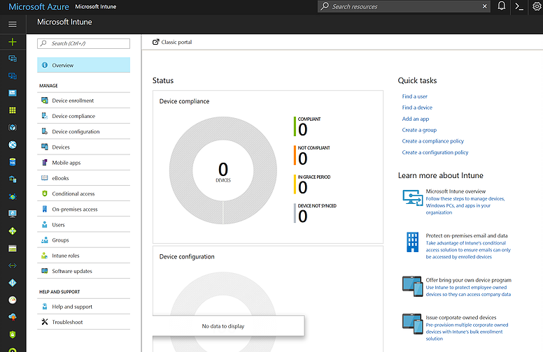
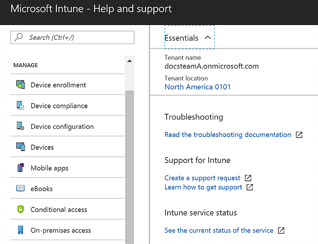

---
# required metadata

title: Getting started with Intune
titleSuffix: "Intune on Azure"
description: "Learn the basics of what Intune is before you get into using it."
keywords:
author: barlanmsft
ms.author: barlan
manager: angrobe
ms.date: 06/27/2017
ms.topic: article
ms.prod:
ms.service: microsoft-intune
ms.technology:
ms.assetid: 6bfab644-c1e2-4154-a254-e95b9a1d75f2

# optional metadata

#ROBOTS:
#audience:
#ms.devlang:
ms.reviewer:
ms.suite: ems
#ms.tgt_pltfrm:
ms.custom: intune-azure
---

# What is Microsoft Intune?

[!INCLUDE[azure_portal](./includes/azure_portal.md)]

Microsoft Intune is one of Azure’s newest services. It offers tools for managing your organization’s mobile devices, PCs, and apps that are [regularly updated](whats-new.md). Aside from the modern Azure console, Intune also allows you to use the Classic console. The Classic console is the first version of Intune, and where you still go to [manage Windows PCs with the Intune software client](/intune-classic/deploy-use/pc-management-comparison.md). The Classic portal, which is built in Silverlight, is used for a small number of tasks. Everything else, including mobile device and app management, is accomplished in the Azure portal. The getting started guide takes you through the basic tasks you need to accomplish to be successful using Intune in the Azure portal.

## What does Intune in the Azure portal provide?

Intune in the Azure portal provides you with:

* An integrated console for all your [Enterprise Mobility + Security (EMS) components](https://docs.microsoft.com/enterprise-mobility-security)
* An HTML-based console built on web standards that supports [modern web browsers](supported-devices-browsers.md)
* [Azure Active Directory groups](groups-get-started.md) to provide compatibility across all your Azure applications
* Automation through the [Microsoft Graph API](intune-graph-apis.md)

## Prerequisites

Before you start, you must have an Intune admin and tenant account activated. You can sign up for those accounts [here](https://portal.office.com/Signup/Signup.aspx?OfferId=40BE278A-DFD1-470a-9EF7-9F2596EA7FF9&dl=INTUNE_A&ali=1#0%20). If your organization is an Intune subscriber and you’re a new admin that wants to learn Intune, these activities can be completed in your live tenant. Make sure you’re only working on test devices!

You also need to make sure that you are the global admin for your organization to complete all of the tasks in the guide.
