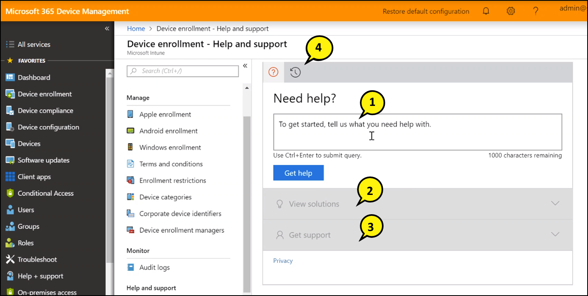
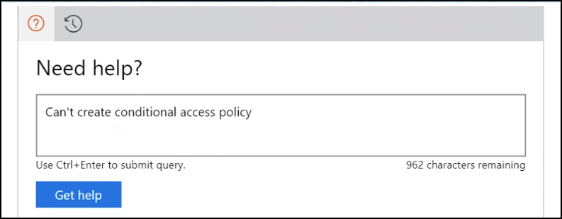

---
# required metadata

title: How to get support for Microsoft Intune
titlesuffix: Microsoft Intune
description: Get online and telephone support for Microsoft Intune paid and trial subscriptions.
keywords:
author: brenduns
ms.author: brenduns
manager: dougeby
ms.date: 10/25/2018
ms.topic: article
ms.prod:
ms.service: microsoft-intune
ms.technology:
ms.assetid: 7fc95d17-098e-4da5-8a09-a96476569dd9

# optional metadata

#audience:
#ms.devlang:
ms.reviewer: cacamp
ms.suite: ems
#ms.tgt_pltfrm:
ms.custom: intune-classic

---

# How to get support for Microsoft Intune

[!INCLUDE [azure_portal](./includes/note-for-both-portals.md)]

Microsoft provides global technical, pre-sales, billing, and subscription support for Microsoft Intune. Support is available both online and by phone for paid and trial subscriptions. Online technical support is available in English and Japanese. Phone support and online billing support are available in additional languages.

>[!IMPORTANT]
> For technical support with third-party products that work with Intune (like Saaswedo, Cisco, or Lookout), contact the supplier of that product first. Before you open a request with Intune support, make sure you configured the other product correctly.
> 
> For information about troubleshooting issues related to Microsoft Intune, see the [Troubleshoot section](help-desk-operators.md) of the Intune documentation.

As an IT admin, you can use the **Help + Support** option to file an on-line support ticket for Intune from the Azure portal. To create a support ticket, your account must be assigned one of the following [administrator roles in Azure Active Directory](https://docs.microsoft.com/azure/active-directory/active-directory-assign-admin-roles-azure-portal): 

- Intune administrator 
- Global administrator 
- Service administrator  

## Get context-sensitive help 
After you  sign in to the Azure portal and open Intune, you can select **Help and support** from any Intune blade in the Azure portal to view solutions to common problems for that area of Intune. 

If the common solutions don't help, you can select **support request** to create a new support request that opens to the **Basics** blade of the Azure *Help + support* page. To continue and create a support ticket, go to *step 3* in the following procedure, [Create an online support ticket](#create-an-online-support-ticket). 

## Create an online support ticket

1. Sign in to the Azure portal (<https://portal.azure.com>) with your Intune admin credentials, select the <strong>?</strong> icon in the upper-right corner of the portal, and then select <strong>Help + support</strong> to go to the [Azure Help + support](https://ms.portal.azure.com/#blade/Microsoft_Azure_Support/HelpAndSupportBlade/overview) page.
   	

2. On the Azure *Help _+_ support* page, select **New support request**.

	

3. On the **Basics** blade, for most Intune technical support issues, choose the following options:
   - **Issue type**: **Technical**
   - **Service**: **Microsoft Intune**
   - **Support plan**: **Technical support - included**  (for Intune technical issues, support is complimentary) or **Premier**
    
     >[!IMPORTANT]
     >- If you are a **Premier customer** and don't see **Support plan: Premier**, contact your Technical Account Manager for help linking your contract and tenant.
     >- Support for Intune, and for Intune when used with Configuration Manager, is free of charge. To review details of the Premier Support offering, see the [Description of Services](https://enterprise.microsoft.com/en-us/services/services-list/) documentation, section 5.3.3 "Advisory Services."

     Choose **Next** to continue.

4. On the **Problem** blade, to make sure your request is addressed by the right subject matter expert for your problem, select the following options:

   - **Severity**
   - **Problem type**
   - **Category**

     These details also let us provide **Related help** that might solve your problem without filing a ticket.

     

     To help the support team research and resolve your problem, enter the following information:
    
   - **Details**
   - **Date**
   - **Time**
   - **Supplemental data**

   Choose **Next**.

5. Provide **Contact information** for this support request. Microsoft support uses this information to contact you.
6. Choose **Create** to submit your support request.

>[!IMPORTANT]
>If you have a billing or subscription question, you can open a case to get support through the [Office Admin Center](https://portal.office.com/Support/SupportEntry.aspx).

## View support requests
You can view a support request from within the Azure portal. To do so:

1. Sign in to  Azure (<https://portal.azure.com>) with your Intune admin credentials, select the <strong>?</strong> icon in the upper-right corner of the portal, and then select <strong>Help + support</strong> to go to the [Azure Help + support](https://ms.portal.azure.com/#blade/Microsoft_Azure_Support/HelpAndSupportBlade/overview) page.

2. On the **Help + support** page you can view the list of **Recent support requests**, and select them to view additional details.

## Help and Support pilot
*The following information applies only when you use the Device Management portal and are part of the Help and Support pilot*.  

The Help and Support pilot for Intune is a new experience that is available in the [Microsoft 365 Device Management portal](http://devicemanagement.microsoft.com) to some but not all tenants. This new experience replaces the previous Help and Support experience when accessed from some locations of the Device Management console.  

In the Device Management portal, you access the new experience when you select **Help and Support** from any blade under **All services** > **Device Management**, except for the **Troubleshooting** blade. When you access Help and Support from other locations like **Troubleshooting**, by using the **?** option in the upper right of the console banner, or when you select **Help + Support** from the left pane list of services, you access the original experience.  

In the new experience, you gain access to the **Need help?** view, as seen in the following image:  

In this view you can do the following actions:

1. [Specify details](#context-sensitive-help) about the specific problem you want help with  
2. [View context-sensitive guidance](#context-sensitive-help) and related solutions that are based on the details you specified  
3. [Get support](#get-support), using either email or the phone  
4. [View support cases](#view-support-cases) you have previously opened using this new workflow  

### Context-sensitive help
When you open Help and Support from a location that is supported by the pilot, the **Need help?**  page opens. On this page, you can specify details about your issue. As you enter details, the console offers common queries based on the keywords you use. You can select an offered choice or complete your own issue description. If you enter your own description, select **Get help** to submit it.  

The following are examples of queries you might submit:
  
- *Can’t restore iOS device*  
- *Can’t create conditional access policy*
  
After selecting an offered choice or submitting your own query, the results appear under **View solutions**. The results include both Intune specific self-help guidance and additional results returned from a web-search based on the query criteria.  

### Get support  
If the self-help or web-based guidance doesn’t help you resolve the issue, you can use the console to open an email or phone support issue.  
On the **Need help?** page, select the option you want to use.  

- For an email request, provide your email address and optionally, you can add attachments to your submission. Select **Send** to open the request.  

  
  
- For a phone request, provide your phone number. Optionally, you can include your email address and add attachments to your submission. Select Call me to submit the request.  

   

### View support cases
Select the history button to view the support incidents that you've created.  

- Only the support cases that you open by using the pilot workflow are visible from within this workflow. To view them, use a Help and Support view from the Device Management console that is part of the pilot. These cases have numbers that are eight digits long.  

- Cases that you opened before joining the pilot are unchanged. To view them, you must use a help and support view that isn't part of the pilot. These cases have numbers that start with **117** or **118** and are 15 digits long.  To view a support case that was opened before you joined the pilot, see [View support requests](#view-support-requests).

## Additional resources
- [Contact assisted phone support for Microsoft Intune](phone-support-contact.md)
- [Billing and subscription management support](https://support.office.com/article/Contact-Office-365-for-business-support-Admin-Help-32a17ca7-6fa0-4870-8a8d-e25ba4ccfd4b)
- [Volume licensing](http://go.microsoft.com/fwlink/p/?LinkID=282015)
- [Troubleshoot Intune issues](help-desk-operators.md)