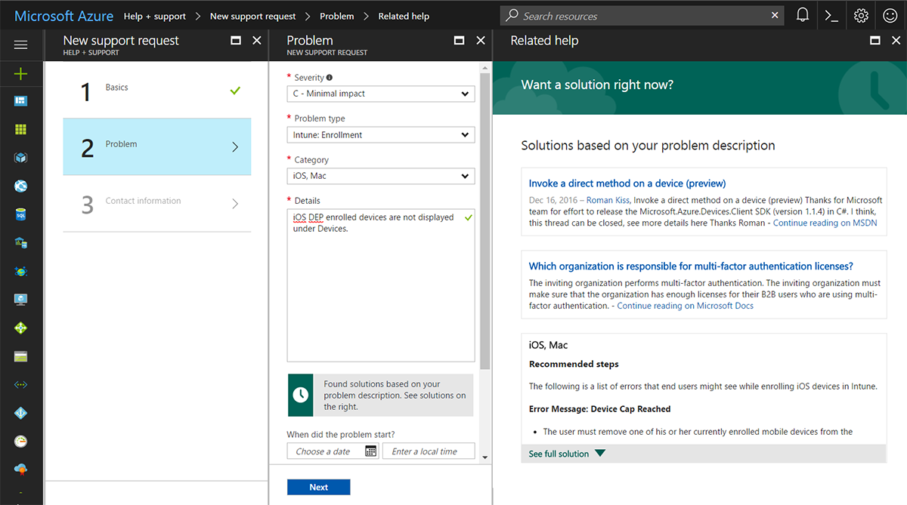

---
# required metadata

title: How to get support for Microsoft Intune
titleSuffix: "Intune on Azure"
description: Support is available both online and by telephone for paid and trial subscriptions."
keywords:
author: robstackmsft
ms.author: robstack
manager: angrobe
ms.date: 06/14/2017
ms.topic: article
ms.prod:
ms.service: microsoft-intune
ms.technology:
ms.assetid: 7fc95d17-098e-4da5-8a09-a96476569dd9

# optional metadata

#ROBOTS:
#audience:
#ms.devlang:
ms.reviewer: cacamp
ms.suite: ems
#ms.tgt_pltfrm:
ms.custom: intune-classic

---

# How to get support for Microsoft Intune

[!INCLUDE[azure_portal](./includes/azure_portal.md)]

Microsoft provides global technical, pre-sales, billing, and subscription support for Microsoft Intune. Support is available both online and by phone for paid and trial subscriptions. Online technical support is available in English and Japanese. Phone support and online billing support are available in additional languages.

Support for Intune, and for Intune when used with Configuration Manager, is free of charge. Premier Support customers incur charges for procedure questions (for example, how to go about configuring an Intune feature).

>[!IMPORTANT]
> For technical support with products that work with Intune but not made by Microsoft, for example SaaSwedo, Cisco, or Lookout, contact the supplier of that product first. Before you open a request with Intune support, ensure you configured the other product correctly.

## Create an online support ticket

If you are unable to find answers by using the self-help resources, you can create an online support ticket.

**Limit each support ticket to a single issue**. This helps us serve you better. Here's why:

- Support engineers are likely to specialize in specific areas, and it's easier to identify the right subject matter experts to help with your issue.
- Engineering teams can prioritize their work in product areas where the most incidents are being generated.
- It's easier to escalate challenging issues to the correct resource.

### File an Azure support ticket
As an IT admin, you can file a support ticket from the Azure portal by using the following steps:

1. Use your Intune admin credentials to log on to [Azure Help + support](https://portal.azure.com/#blade/Microsoft_Azure_Support/HelpAndSupportBlade/overview).

2. In the Azure Help and support workspace, select **New support request**.

	
3. On the **Basics** blade, for most Intune 	technical support issues, choose the following:
	- **Issue type**: **Technical**
	- **Service**: **Microsoft Intune**
	- **Support plan**: **Technical support - included**  (For Intune technical issues, support is complimentary.)

	Choose **Next** to continue.
4. On the **Problem** screen, specify details such as **Severity**, **Problem type**, and **Category** to help us ensure your request is addressed by the best subject matter expert for your problem. This also lets us provide **Related help** that might solve your problem without filing a ticket.

	

	Provide **Details**, **Date**, **Time** and supplemental data can help us research and resolve your problem, and then choose **Next**.
5. Provide **Contact information** for this support request. Microsoft support uses this information to contact you.
6. Choose **Create** to submit your support request.

## Additional resources
- [Contact assisted phone support for Microsoft Intune](phone-support-contact.md)
- [Microsoft System Center Configuration Manager and System Center Endpoint Protection Solution Center](http://www.microsoft.com/en-us/server-cloud/products/system-center-2012-r2/resources.aspx)
- [Volume Licensing Service Center](http://go.microsoft.com/fwlink/p/?LinkID=282016)
- [Billing and subscription management support](http://support.microsoft.com/oas/default.aspx?prid=15371)
- [Volume licensing](http://go.microsoft.com/fwlink/p/?LinkID=282015)
- [Professional Support Options](https://support.microsoft.com/gp/offerprophone)
