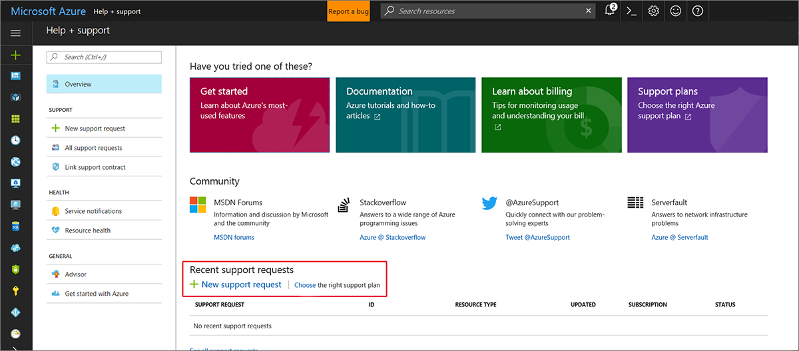

---
# required metadata

title: How to get support for Microsoft Intune
titlesuffix: Microsoft Intune
description: Get online and telephone support for Microsoft Intune paid and trial subscriptions.
keywords:
author: brenduns
ms.author: brenduns
manager: dougeby
ms.date: 09/17/2018
ms.topic: article
ms.prod:
ms.service: microsoft-intune
ms.technology:
ms.assetid: 7fc95d17-098e-4da5-8a09-a96476569dd9

# optional metadata

#audience:
#ms.devlang:
ms.reviewer: cacamp
ms.suite: ems
#ms.tgt_pltfrm:
ms.custom: intune-classic

---

# How to get support for Microsoft Intune

[!INCLUDE [azure_portal](./includes/note-for-both-portals.md)]

Microsoft provides global technical, pre-sales, billing, and subscription support for Microsoft Intune. Support is available both online and by phone for paid and trial subscriptions. Online technical support is available in English and Japanese. Phone support and online billing support are available in additional languages.

>[!IMPORTANT]
> For technical support with third-party products that work with Intune (like Saaswedo, Cisco, or Lookout), contact the supplier of that product first. Before you open a request with Intune support, make sure you configured the other product correctly.
> 
> For information about troubleshooting issues related to Microsoft Intune, see the [Troubleshoot section](help-desk-operators.md) of the Intune documentation.

As an IT admin, you can use the **Help + Support** option to file an on-line support ticket for Intune from the Azure portal. To create a support ticket, your account must have one of the following roles in Azure Active Directory: 

- Intune administrator 
- Global administrator 
- Service administrator  

For details, see [Assigning administrator roles](https://docs.microsoft.com/azure/active-directory/active-directory-assign-admin-roles-azure-portal).

## Get context-sensitive help 
After you  sign in to the Azure portal and open Intune, you can select **Help and support** from any Intune blade in the Azure portal to view solutions to common problems for that area of Intune. 

If the common solutions don't help, you can select **support request** to create a **New support request**. When you select *New support request*, you open the **Basics** blade of the Azure *Help + support* page. To continue and create a support ticket, go to *step 3* in the following procedure, [Create an online support ticket](#create-an-online-support-ticket). 

## Create an online support ticket

1. Sign in to the Azure portal (<https://portal.azure.com>) with your Intune admin credentials, select the <strong>?</strong> icon in the upper-right corner of the portal, and then select <strong>Help + support</strong> to go to the [Azure Help + support](https://ms.portal.azure.com/#blade/Microsoft_Azure_Support/HelpAndSupportBlade/overview) page.
   	

2. On the Azure *Help _+_ support* page, select **New support request**.

	

3. On the **Basics** blade, for most Intune technical support issues, choose the following options:
   - **Issue type**: **Technical**
   - **Service**: **Microsoft Intune**
   - **Support plan**: **Technical support - included**  (for Intune technical issues, support is complimentary) or **Premier**
    
     >[!IMPORTANT]
     >- If you are a **Premier customer** and don't see **Support plan: Premier**, contact your Technical Account Manager for help linking your contract and tenant.
     >- Support for Intune, and for Intune when used with Configuration Manager, is free of charge. To review details of the Premier Support offering, see the [Description of Services](https://enterprise.microsoft.com/en-us/services/services-list/) documentation, section 5.3.3 "Advisory Services."

     Choose **Next** to continue.

4. On the **Problem** blade, to make sure your request is addressed by the right subject matter expert for your problem, select the following options:

   - **Severity**
   - **Problem type**
   - **Category**

     These details also let us provide **Related help** that might solve your problem without filing a ticket.

     

     To help the support team research and resolve your problem, enter the following information:
    
   - **Details**
   - **Date**
   - **Time**
   - **Supplemental data**

   Choose **Next**.

5. Provide **Contact information** for this support request. Microsoft support uses this information to contact you.
6. Choose **Create** to submit your support request.

>[!IMPORTANT]
>If you have a billing or subscription question, you can open a case to get support through the [Office Admin Center](https://portal.office.com/Support/SupportEntry.aspx).

## View support requests
You can view a support request from within the Azure portal. To do so:

1. Sign in to  Azure (<https://portal.azure.com>) with your Intune admin credentials, select the <strong>?</strong> icon in the upper-right corner of the portal, and then select <strong>Help + support</strong> to go to the [Azure Help + support](https://ms.portal.azure.com/#blade/Microsoft_Azure_Support/HelpAndSupportBlade/overview) page.

2. On the **Help + support** page you can view the list of **Recent support requests**, and select them to view additional details.

## Additional resources
- [Contact assisted phone support for Microsoft Intune](phone-support-contact.md)
- [Billing and subscription management support](https://support.office.com/article/Contact-Office-365-for-business-support-Admin-Help-32a17ca7-6fa0-4870-8a8d-e25ba4ccfd4b)
- [Volume licensing](http://go.microsoft.com/fwlink/p/?LinkID=282015)
- [Troubleshoot Intune issues](help-desk-operators.md)