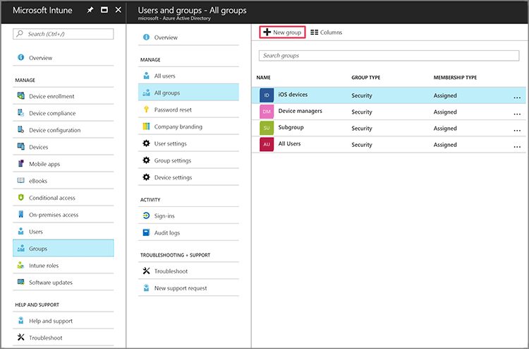

---
# required metadata

title: Add groups to organize users and devices
titleSuffix: Microsoft Intune
description: Add groups to organize users and devices by geography, department, or hardware specifics.
keywords:
author: ErikjeMS
ms.author: erikje
manager: dougeby
ms.date: 06/13/2018
ms.topic: conceptual
ms.service: microsoft-intune
ms.localizationpriority: high
ms.technology:
ms.assetid: f0a2b858-a824-4598-ab81-bdd8e62ac3b3

# optional metadata

#ROBOTS:
#audience:
#ms.devlang:
ms.reviewer: amyros
ms.suite: ems
search.appverid: MET150
#ms.tgt_pltfrm:
ms.custom: intune-azure
ms.collection: M365-identity-device-management
---

# Add groups to organize users and devices
Intune uses Azure Active Directory (AD) groups to manage devices and users. As an Intune admin, you can set up groups to suit your organizational needs. Create groups to organize users or devices by geographic location, department, or hardware characteristics. Use groups to manage tasks at scale. For example, you can set policies for many users or  deploy apps to a set of devices.

You can add the following types of groups:
- **Assigned groups** - Manually add users or devices into a static group
- **Dynamic groups** - (Using Azure Active Directory Premium) Let you dynamically build either user or device groups defined with either simple or advanced rules

## Add a new group

Use the following steps to create a new group.
1. Sign into the [Azure portal](https://portal.azure.com).
2. Choose **All services** > **Intune**. Intune is located in the **Monitoring + Management** section.
3. On the **Intune** pane, choose **Groups** and then choose **New group** in the **All groups** pane.
   
4. For **Group type**, choose one of the following options:
    - **Security**: Security groups are a good resource to use when you populate user groups. Because security groups define who can access which resources, security groups can translate well to Intune user groups. Security groups that are synced from Active Directory to Azure Active Directory, or which you create directly in Azure Active Directory through the Microsoft 365 admin center or the Azure portal are available to you to use when you create user groups in Intune.
    - **Office 365**

5. Type a **Name** and **Description** for the new group. These properties only appear in the management portal and are not displayed to users.

6. Choose **Membership type**:
   - **Assigned** to create group with manually assigned members. Learn more about [Azure AD assigned groups](https://docs.microsoft.com/azure/active-directory/active-directory-groups-create-azure-portal).
   - **Dynamic User** to create a user group defined with a **Dynamic query**.
   - **Dynamic Device** to create a device group defined with a **Dynamic query**.

   

   Azure AD lets you create dynamic groups based on rules that define membership. Learn to [create attribute-based dynamic groups](https://docs.microsoft.com/azure/active-directory/active-directory-groups-dynamic-membership-azure-portal).

7. You can select **Enable Office features** to give user group members access to shared Office 365 apps. Learn more about [Office 365 Groups](https://support.office.com/article/Learn-about-Office-365-groups-b565caa1-5c40-40ef-9915-60fdb2d97fa2).
8. Choose **Create** to add the new group.

## Groups and policies

When you create groups, consider how you will apply [policies](device-compliance-get-started.md). For example, you might have policies that are specific to a device operating system, and policies that are specific to different roles in your organization, or to organizational units that you've already defined in Active Directory. It might be useful to have separate device groups for iOS, Android, and Windows, as well as a user group for each organizational role.

You'll probably also want to create a default policy that applies to all groups and devices, to establish the basic compliance requirements of your organization. Then, you can create more specific policies for the broadest categories of users and devices. For example, you might create email policies for each of the device operating systems.

## See also
- [Manage access to resources with Azure Active Directory groups](https://docs.microsoft.com/azure/active-directory/active-directory-manage-groups)
- [Intune classic groups in the Azure portal](groups-get-started.md)
