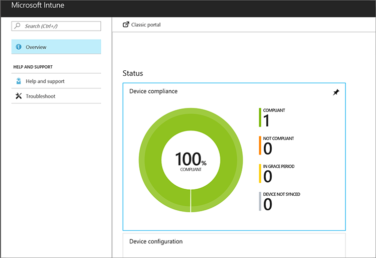
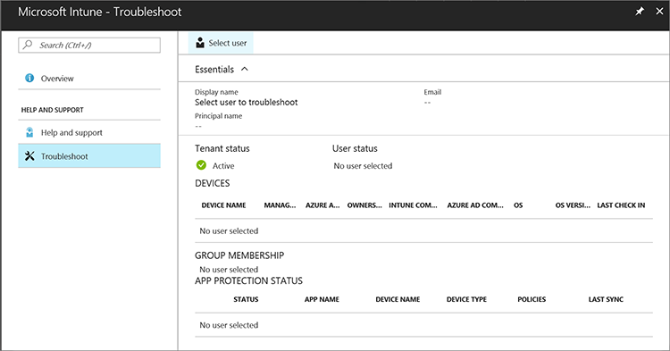

# Use the troubleshooting portal to help users

[!INCLUDE[azure_portal](./includes/azure_portal.md)]

The troubleshooting portal lets help desk operators and Intune administrators view user information to address user help requests. Organizations that include help desk operators in their staff can assign the **Help desk operator** to a group of users, who can then use the Troubleshoot blade to help users.

For example, when a user contacts support with a technical issue with Intune, the help desk operator enters the user's name. Intune shows useful data that can help resolve many tier-1 issues including:
- User status
- Assignments
- App install failure
- Compliance issues
- Device not responding
-	Device not getting VPN or Wi-Fi settings
-	App installation failure

## Add help desk operators
As an Intune admin, you can assign the Help Desk Operator role to a user group. Members of that group can use the admin portal to troubleshoot users' problems. Each help desk operator must have an Intune license to access the Intune portal. Learn how to [assign Intune licenses](licenses-assign.md).

To add help desk users:
1. [Add users to Intune](users-add.md) if necessary.
2. [Create a help desk group](groups-add.md) and add users to the group.
3. [Assign the RBAC Help Desk Operator role](role-based-access-control.md#built-in-roles)

  
  You can also [create a custom role](role-based-access-control.md#custom-roles) with the following permissions:
    - MobileApps: Read
    - ManagedApps: Read
    - ManagedDevices: Read
    - Organization: Read
    - DeviceCompliancePolices: Read
    - DeviceConfigurations: Read

4. To give help desk operators permission to view the service health and open support tickets for Intune, [grant users admin permissions](https://docs.microsoft.com/azure/active-directory/active-directory-users-assign-role-azure-portal) as a **Service administrator**. Do not give **Intune Service administrator** permission because this directory role has more rights than those needed for help desk operators.

## Access the troubleshooting portal

Help desk staff and Intune administrators can access the troubleshooting portal in two ways:
- Open [http://aka.ms/intunetroubleshooting](http://aka.ms/intunetroubleshooting) in a web browser to view just the troubleshooting portal.
  
- Sign in to the Azure portal, choose  **More Services** > **Monitoring + Management** > **Intune**, and then go **Help and Support** > **Troubleshoot**.

Click **Select user** to view a user and that user's details.

## Use the troubleshooting portal

In the troubleshooting portal, you can choose **Select user** to view a users' information. User information can help you understand the current state of users and their devices. The troubleshooting portal shows the following troubleshooting details:
- **Account status**
- **User status**
- **Devices** with device actions
- **Group membership**
- **App protection status**
