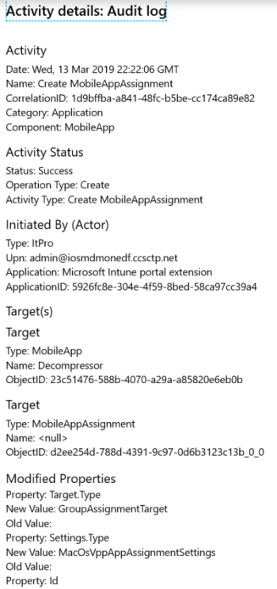

---
# required metadata

title: Audit changes and events in Microsoft Intune - Azure | Microsoft Docs
description: Learn how to review audit logs that record Microsoft Intune activities.
keywords: 
ms.author: dougeby
author: dougeby
manager: dougeby
ms.date: 03/18/2019
ms.topic: troubleshooting
ms.service: microsoft-intune
ms.localizationpriority: medium
ms.technology:
ms.assetid: 6ee841cc-5694-4ba1-8f66-1d58edec30a4

# optional metadata

#ROBOTS:
#audience:
#ms.devlang:
#ms.reviewer: [ALIAS]
#ms.suite: ems
search.appverid: MET150
#ms.tgt_pltfrm:
#ms.custom:
ms.collection: M365-identity-device-management
---

# Use audit logs to track and monitor events in Microsoft Intune

Audit logs include a record of activities that generate a change in Microsoft Intune. Create, update (edit), delete, assign, and remote actions all create audit events that administrators can review for most Intune workloads. By default, auditing is enabled for all customers. It can't be disabled.

> [!NOTE]
> Audit events started recording on the December 2017 feature release. Prior events aren't available.

## Who can access the data?

Users with the following permissions can review audit logs:

- Global Administrator
- Intune Service Administrator
- Administrators assigned to an Intune role with **Audit data** - **Read** permissions

## Audit logs for Intune workloads

You can review audit logs in the monitoring group for each Intune workload:

1. Sign in to [Intune](https://go.microsoft.com/fwlink/?linkid=2090973).
2. Choose the workload you want to review audit logs. For example, select **Devices**.
3. Under **Monitoring**, choose **Audit logs**.

## Route logs to Azure Monitor

Audit logs and operational logs can also be routed to Azure Monitor. In **Audit logs**, select **Export Data Settings**:

For more information on this feature, see [send log data to storage, event hubs, or log analytics](review-logs-using-azure-monitor.md).

## Review audit events

An audit log has a default list view that shows the following items:

- Date and time of the occurrence
- Initiated by (Actor)
- Application Name
- Activity
- Target(s)
- Category
- Status

To see more specific information about an event, select an item in the list:

> [!NOTE]
> **Initiated by (actor)** includes information on who ran the task, and where it was run. For example, if you run the activity in Intune in the Azure portal, then **Application** always lists **Microsoft Intune portal extension** and the **Application ID** always uses the same GUID.
> 
> The **Target(s)** section lists multiple targets and the properties that were changed.  

## Filter audit events

Each workload has a menu item that pre-filters the category of audit events associated with that pane. A separate filter option lets you change to different categories, and event action details within that category. You can search by UPN, such as the user who did the action. A date range filter allows 24 hours, 7 days, or 30-day options. By default, the last 30 days of audit events are shown.

## Use Graph API to retrieve audit events

For details on using the graph API to get up to one year of audit events, see [List auditEvents](https://docs.microsoft.com/graph/api/intune-auditing-auditevent-list?view=graph-rest-1.0).

## Next steps

[Send log data to storage, event hubs, or log analytics](review-logs-using-azure-monitor.md).

[Review client app protection logs](apps/app-protection-policy-settings-log.md).
