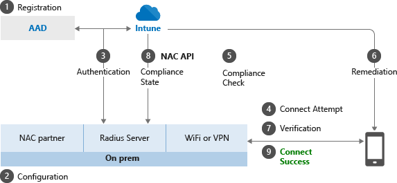

---
# required metadata

title: Network access control integration with Microsoft Intune - Azure | Microsoft Docs
description: Network access control (NAC) solutions check enrollment and compliance for devices with Intune. NAC includes certain behaviors and works with conditional access. See the steps to get onboarded, and get a list of partner solutions.
keywords:
author: brenduns
ms.author: brenduns
manager: dougeby
ms.date: 12/18/2017
ms.topic: article
ms.prod:
ms.service: microsoft-intune
ms.technology:
ms.assetid: aa7ecff7-8579-4009-8fd6-e17074df67de

# optional metadata

#ROBOTS:
#audience:
#ms.devlang:
ms.reviewer: davidra
ms.suite: ems
#ms.tgt_pltfrm:
ms.custom: intune-azure

---

# Network access control (NAC) integration with Intune

Intune integrates with network access control partners to help organizations secure corporate data when devices try to access on-premises resources.

## How do Intune and NAC solutions help protect your organization resources?

NAC solutions check the device enrollment and compliance state with Intune to make access control decisions. If the device isn't enrolled, or is enrolled and not compliant with Intune device compliance policies, then then device should be redirected to Intune for enrollment and/or for a device compliance check.

### Example

If the device is enrolled and compliant with Intune, the NAC solution should allow the device access to corporate resources. For example, users can be allowed or denied access when trying to access corporate Wi-Fi or VPN resources.

## Feature behaviors

Devices that are actively syncing to Intune can't move from **Compliant** / **Noncompliant** to **Not Synched** (or **Unknown**). The **Unknown** state is reserved for newly enrolled devices that haven't been evaluated for compliance yet.

For devices that are blocked from access to resources, the blocking service should redirect all users to the [management portal](https://portal.manage.microsoft.com) to determine why the device is blocked.  If the users visit this page, their devices are synchronously reevaluated for compliance.

## NAC and conditional access

NAC works with conditional access to provide access control decisions. For more information, see [Common ways to use conditional access with Intune](conditional-access-intune-common-ways-use.md).

## How the NAC integration works

The following list is an overview on how NAC integration works when integrated with Intune. The first three steps, 1-3, explain the onboarding process. Once the NAC solution is integrated with Intune, steps 4-9 describe the ongoing operation.

1. Register the NAC partner solution with Azure Active Directory (AAD), and grant delegated permissions to the Intune NAC API.
2. Configure the NAC partner solution with the appropriate settings including the Intune discovery URL.
3. Configure the NAC partner solution for certificate authentication.
4. User connects to corporate Wi-Fi access point or makes a VPN connection request.
5. NAC partner solution forwards the device information to Intune, and asks Intune about the device enrollment and compliance state.
6. If the device is not compliant or not enrolled, the NAC partner solution instructs the user to enroll or fix the device compliance.
7. The device attempts to reverify its compliance and/or the enrollment state.
8. Once the device is enrolled and compliant, NAC partner solution gets the state from Intune.
9. Connection is successfully established which allows the device access to corporate resources.

## Next steps

- [Integrate Cisco ISE with Intune](http://www.cisco.com/c/en/us/td/docs/security/ise/2-1/admin_guide/b_ise_admin_guide_21/b_ise_admin_guide_20_chapter_01000.html)
- [Integrate Citrix NetScaler with Intune](http://docs.citrix.com/en-us/netscaler-gateway/12/microsoft-intune-integration/configuring-network-access-control-device-check-for-netscaler-gateway-virtual-server-for-single-factor-authentication-deployment.html)
- [Integrate HP Aruba Clear Pass with Intune](https://support.arubanetworks.com/Documentation/tabid/77/DMXModule/512/Command/Core_Download/Default.aspx?EntryId=23757)
- [Integrate Squadra security Removable Media Manager (secRMM) with Intune](http://www.squadratechnologies.com/StaticContent/ProductDownload/secRMM/9.9.0.0/secRMMIntuneAccessControlSetupGuide.pdf)