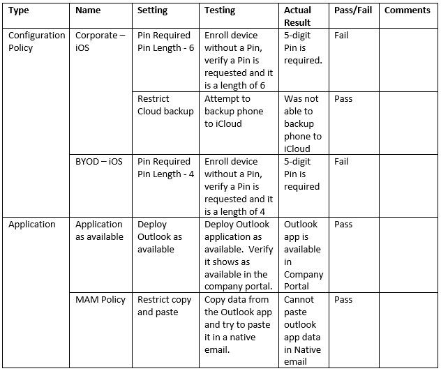
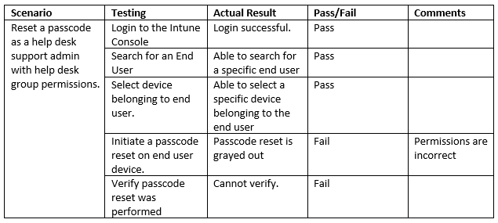
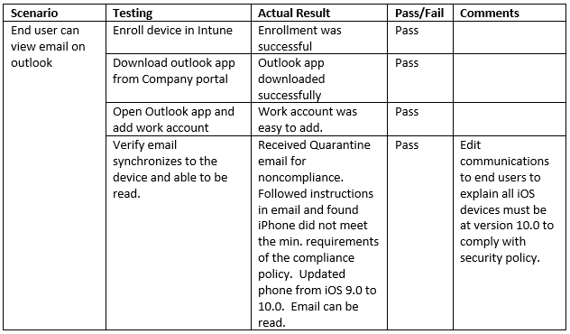

---
# required metadata

title: Intune testing and validation | Microsoft Docs
description: This article helps you with all details that need to be considered when testing and validating Intune cloud-only solution in your environment.
keywords:
author: andredm7
ms.author: andredm
manager: angrobe
ms.date: 12/20/2016
ms.topic: article
ms.prod:
ms.service: microsoft-intune
ms.technology:
ms.assetid: 4f82ee0c-4bd6-4623-9b10-9249d316ccf5

# optional metadata

#ROBOTS:
#audience:
#ms.devlang:
ms.reviewer: jeffbu, cgerth
ms.suite: ems
#ms.tgt_pltfrm:
ms.custom: intune-classic

---

# Intune testing and validation

[!INCLUDE[note for both-portals](./includes/note-for-both-portals.md)]

The testing phase should be during and after the implementation phase, you will need to have test accounts, groups, and devices for testing all required IT (admin) and end user (use case) scenarios previously identified.

It's recommended to incorporate your IT support/helpdesk staff in the testing phase so that support documentation is created, and the IT support/helpdesk staff become comfortable supporting the product. If a component or scenario does not function based on the use cases, make sure to document the necessary changes and include the reason a change was made.

## Before you begin

It’s recommended to document the following:

-   **Test criteria:** Identifies the benchmarks to be measured against.

-   **Design components:** must exist in at least 1 testing criteria.

If a design component does not exist in at least 1 test criteria that aligns to a requirement or scenario, consider whether the design component is required or not. In addition, make sure to have the following items:

-   **Accounts:** The accounts used in testing should be test accounts that are licensed for EMS and Office 365 to test all use case scenarios.

-   **Devices:** The devices used at this point should be test devices that could potentially be wiped or reset to factory defaults.

-   **Integration components:** All integration components (Certificate Connector, Intune service to service connector for hosted Exchange, and Intune on-premises Exchange connector) should be installed and configured if needed.

Design changes could be needed to accommodate unforeseen difficulties. In addition, all design changes should be fully documented with the reason for each change. Here's an example to illustrate what a change could be:

-   You might realize that you don’t meet the requirements of Network Device Enrollment Service (NDES), and you also learn that the VPN and Wi-Fi profiles can be configured with a root CA satisfying the same requirements without a NDES implementation.

You might experience challenges or issues that require technical guidance, or specialized troubleshooting during the testing and validation process. It’s recommended to seek assistance through the Microsoft support channels.

-   [Learn how to get Intune support](/intune-classic/troubleshoot/how-to-get-support-for-microsoft-intune)

-   [General troubleshooting tips for Microsoft Intune](/intune-classic/troubleshoot/general-troubleshooting-tips-for-microsoft-intune).

-   [Learn how to get support for Microsoft Intune.](/intune-classic/troubleshoot/how-to-get-support-for-microsoft-intune)

-   [Contact assisted phone support for Microsoft Intune](/intune-classic/troubleshoot/contact-assisted-phone-support-for-microsoft-intune)

## Functional validation testing

Functional validation consists of testing each component and configuration to determine if it is working correctly. An example of validation testing is in the table below.

## Use case validation testing

Use case validation testing should be performed to verify the scenarios are complete and functional. There are two types of use case scenarios, IT admin and end user.

### IT Admin

IT Admin validation testing should be performed to validate that Administrative action performed on a device or user functions correctly. Below is an example of an IT admin end to end validation scenario.

### End user

End user validation testing should be performed to validate that the end user experience is as expected and presented correctly in all user communications. It is important to validate the end user experience is correct as failure to validate can lead to lower adoption rates and higher volume of helpdesk calls.

## Next Steps

Now that you have tested and validated your Intune functional and user case scenarios, you're ready for your Intune production rollout. Refer to [Additional resources](planning-guide-resources.md) for more information.
