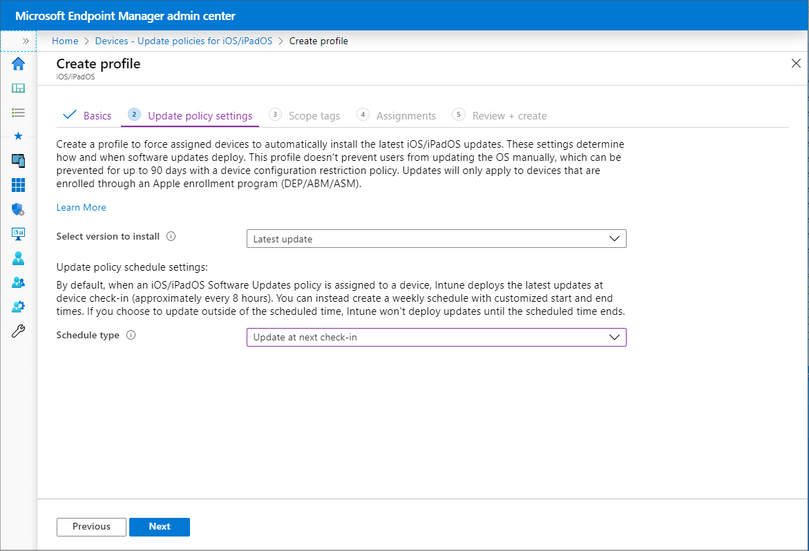
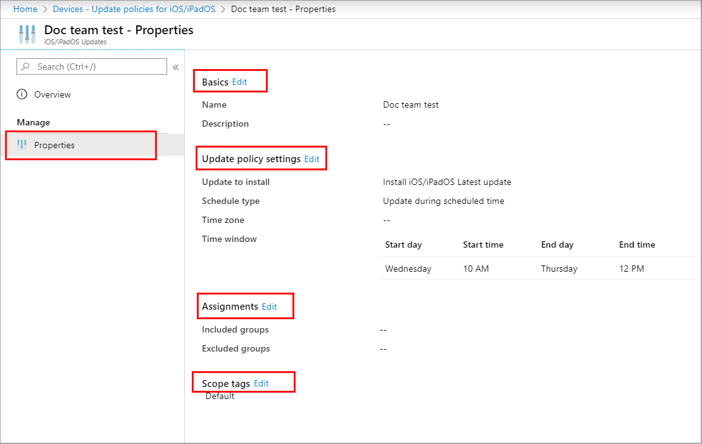

---
# required metadata

title: Configure iOS software update policies in Microsoft Intune - Azure | Microsoft Docs
description: In Microsoft Intune, create or add a configuration policy to restrict when software updates automatically install on iOS devices managed or supervised by Intune. You can choose the date and time when updates aren't installed. You can also assign this policy to groups, users, or devices, and check for any installation failures. 
keywords:
author: brenduns 
ms.author: brenduns
manager: dougeby
ms.date: 10/19/2019
ms.topic: conceptual
ms.service: microsoft-intune
ms.localizationpriority: high
ms.technology:

# optional metadata

#ROBOTS:
#audience:
#ms.devlang:
#ms.reviewer: tisilver
#ms.suite: ems
search.appverid: MET150
#ms.tgt_pltfrm:
#ms.custom:
ms.collection: M365-identity-device-management
---

# Add iOS software update policies in Intune

Software update policies let you force supervised iOS devices to automatically install the latest available OS update. When configuring a policy, you can add the days and times when you don't want devices to install an update.

This feature applies to:

- iOS 10.3 and later (supervised)

The device checks in with Intune about every 8 hours. If an update is available, and it's not during a restricted time, then the device downloads and installs the latest OS update. There isn't any user interaction needed to update the device. The policy doesn't prevent a user from updating the OS manually.

## Configure the policy

1. Sign in to [Intune](https://go.microsoft.com/fwlink/?linkid=2090973).
2. Select **Software updates** > **Update policies for iOS** > **Create**.
3. On the **Basics** tab, specify a name for this policy, specify a description (optional), and then select **Next**.

    

4. On the **Update policy settings** tab, specify a restricted time frame when updates aren't forcibly installed.  
   - Overnight blocks aren't supported and might not function. For example, don't configure a policy with a *Start time* of 8 PM and an *End time* of 6 AM.
   - A policy that starts at 12 AM and ends at 12 AM is evaluated as 0 hours and not 24 hours, which result in no restriction.

   When setting the restricted timeframe, enter the following details:

   - **Days**: Choose the day(s) of week when updates aren't installed. For example, check Monday, Wednesday, and Friday to prevent updates from being installed on these days.
   - **Time zone**: Choose a time zone.
   - **Start time**: Choose the start time of the restricted time frame. For example, enter 5 AM so updates aren't installed starting at 5 AM.
   - **End time**: Choose the end time of the restricted time frame. For example, enter 1 AM so updates can be installed starting at 1 AM.
  
   > [!IMPORTANT]  
   > A policy that has a *Start time* and *End time* set to 12 AM is evaluated as 0 hours, and not 24 hours. This results in no restriction.  
    
   If you want to delay the visibility of software updates for a specific amount of time on your supervised iOS devices, configure those settings in [Device Restrictions](../configuration/device-restrictions-ios.md#general). Software update policies override any device restrictions. When you set both a software update policy and restriction to delay visibility of software updates, the device forces a software update per the policy. The restriction applies so that users don't see the option to update the device themselves, and the update is pushed at the first time window as defined by your iOS update policy.

   After configuring *Update policy settings*, select **Next**. 

5. On the **Scope tags** tab, select **+ Select scope tags** to open the *Select tags* pane if you want to apply them to the update policy.
   
   - On the **Select tags** pane, choose one or more tags, and then click **Select** to add them to the policy and return to the *Scope tags* pane.  

   When ready, select **Next** to continue to *Assignments*.

6. On the **Assignments** tab, choose **+ Select groups to include** and then assign the update policy to one or more groups. Use **+ Select groups to exclude** to fine-tune the assignment. When ready, select **Next** to continue. 

   The devices used by the users targeted by the policy are evaluated for update compliance. This policy also supports userless devices.

7. On the **Review + create** tab, review the settings, and then select **Create** when ready to save your iOS update policy. Your new policy is displayed in the list of update policies for iOS.

For guidance from the Intune support team, see [Delay visibility of software updates in Intune for supervised devices](https://techcommunity.microsoft.com/t5/Intune-Customer-Success/Delaying-visibility-of-software-updates-in-Intune-for-supervised/ba-p/345753).

> [!NOTE]
> Apple MDM doesn't allow you to force a device to install updates by a certain time or date.

## Edit a policy
You can edit an existing policy, including changing the restricted times:

1. In **Software updates**, select **Update policies for iOS** and then select the policy you want to edit.

2. While viewing the policies **Properties**, select **Edit** for the policy page you want to modify.  
      

3. After introducing a change, select **Review + save** > **Save** to save your edits, and return to the policies *Properties*.  
 
> [!NOTE]
> If the **Start time** and **End time** are both set to 12am, then Intune does not check for restrictions on when to install updates. This means than any configurations you have for **Select times to prevent update installations** are ignored, and updates can install at any time.  

## Monitor device installation failures
<!-- 1352223 -->
**Software updates** > **Installation failures for iOS devices** shows a list of supervised iOS devices targeted by an update policy, attempted an update, and couldn't be updated. For each device, you can view the status on why the device hasn't been automatically updated. Healthy, up-to-date devices aren't shown in the list. "Up-to-date" devices include the latest update that the device itself supports.

## Next steps

[Monitor its status](../configuration/device-profile-monitor.md).
