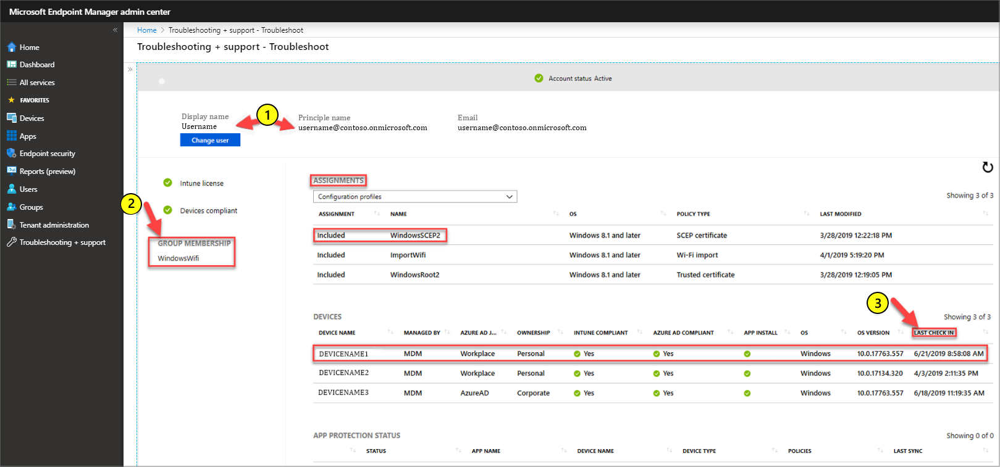

---
# required metadata

title: Troubleshoot deployment of SCEP certificate profiles to devices with Intune | Microsoft Docs
description: Troubleshoot sending a SCEP certificate profile to a device with Intune
keywords:
author: brenduns
ms.author: brenduns
manager: dougeby
ms.date: 01/15/2020
ms.topic: conceptual
ms.service: microsoft-intune
ms.subservice: configuration
ms.localizationpriority: high
ms.technology:

# optional metadata

#ROBOTS:
#audience:
#ms.devlang:
ms.reviewer: lacranda
ms.suite: ems
search.appverid: MET150
#ms.tgt_pltfrm:
ms.custom: intune-azure
ms.collection: M365-identity-device-management
---

# Troubleshoot deployment of a SCEP certificate profile to devices in you manage with Microsoft Intune

Use the following information to help you troubleshoot deployment of Simple Certificate Enrollment Protocol (SCEP) certificate profiles with Intune.

This article references Step 1 of the [SCEP communication flow overview](troubleshoot-scep-certificate-profiles.md).

<!-- Platforms? Just WIndows currently...  
with Android, iOS/iPad, and Windows devices.  
-->

## Validate that the device received the policy

To validate the profile has reached the device you expect, in the [Microsoft Endpoint Manager Admin Center](https://go.microsoft.com/fwlink/?linkid=2109431) go to **Troubleshooting + Support** > **Troubleshoot**.  On the *Troubleshoot* window, set **Assignments** to **Configuration profiles** and then validate the following configurations:

1. Specify a User that should receive the SCEP certificate profile.

2. Review the users Group Membership to ensure they are in the security group you used with the SCEP certificate profile.

3. Review when the device last checked in with Intune.



## Validate the policy was processed by a Windows device

The arrival of the policy for the profile is logged in a Windows device’s *DeviceManagement-Enterprise-Diagnostics-Provider* > **Admin** log, with an event ID **306**. 

To open the log:

1. On the device, run **eventvwr.msc** to open Windows Event Viewer.

2. Expand **Applications and Services Logs** > **Microsoft** > **Windows** > **DeviceManagement-Enterprise-Diagnostic-Provider** > **Admin**.

3. Look for Event **306**, which resembles the following example:

   ```
   Event ID:      306
   Task Category: None
   Level:         Information
   User:          SYSTEM
   Computer:      <Computer Name>
   Description:
   SCEP: CspExecute for UniqueId : (ModelName_<ModelName>_LogicalName_<LogicalName>_Hash_<Hash>) InstallUserSid : (<UserSid>) InstallLocation : (user) NodePath : (clientinstall)  KeyProtection: (0x2) Result : (Unknown Win32 Error code: 0x2ab0003).
   ```

   The error code **0x2ab0003** translates to **DM_S_ACCEPTED_FOR_PROCESSING**.

   A non-successful error code might provide indication of the underlying problem.

## Next steps

If the profile reaches the device, the next step is to review the [device to NDES server communication](troubleshoot-scep-certificate-device-to-ndes.md).