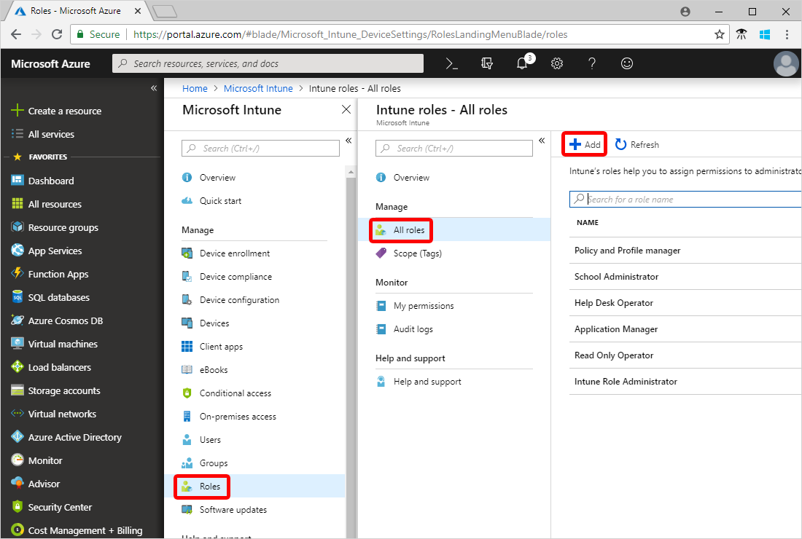

# Quickstart: Create and assign a custom role

In this quickstart, you'll create a custom role with specific permissions for a helpdesk operator dedicated to lost passwords and devices. Then you'll assign the roll to a group of such operators. By creating custom roles like this one, you can control access to all parts of your mobile device management system.

If you don’t have an Intune subscription, [sign up for a free trial account](free-trial-sign-up.md).

## Sign in to Intune

Sign in to the [Intune](https://aka.ms/intuneportal) as a Global Administrator or an Intune Service Administrator.

## Create a custom role

Include a sentence or two to explain only what is needed to complete the
procedure.

1. In Intune, choose **Roles** > **All roles** > **Add**.

2. Under **Add custom role**, in the **Name** box, enter *Remote device helpdesk*.
3. In the **Description** box, enter *This role lets a helpdesk operator help locate lost devices and reset forgotten passcodes*.
4. Choose **Configure** > **Remote tasks**.
5. Set the following permissions to **Yes**:
    - **Disable lost mode**
    - **Enable lost mode**
    - **Locate device**
    - **Play lost mode sound**
    - **Remote lock**
    - **Reset passcode**
    - **Wipe**
6. Choose **OK** > **OK** > **Create**.

## Assign the custom role to a group

Before your helpdesk operator can enjoy the new permissions, you must assign the role to a group that contains the helpdesk user.

1. In Intune, choose **Roles** > **All roles** > **Remote device helpdesk**.
2. Under **Intune roles**, choose **Assignments** > **Assign**.
3. In the **Assignment name** box, enter *Helpdesk ops*.
4. Choose **Member (Groups)** > **Add**.
5. Choose a group that contains your helpdesk operators who will handle remote devices.
6. Choose **Select** > **OK**.
7. Choose **Scope (Groups)** > **Select groups to include** > choose the same group as before.
8. Choose **Select** > **OK** > **OK**.

## Clean up resources

To delete the custom role, choose **Roles** > **All roles** > choose the ellipses next to the role > **Delete**.

## Next steps

After you've created and assigned a custom role, helpdesk personnel can remotely help users such as by [resetting the device passcode](device-passcode-reset.md).