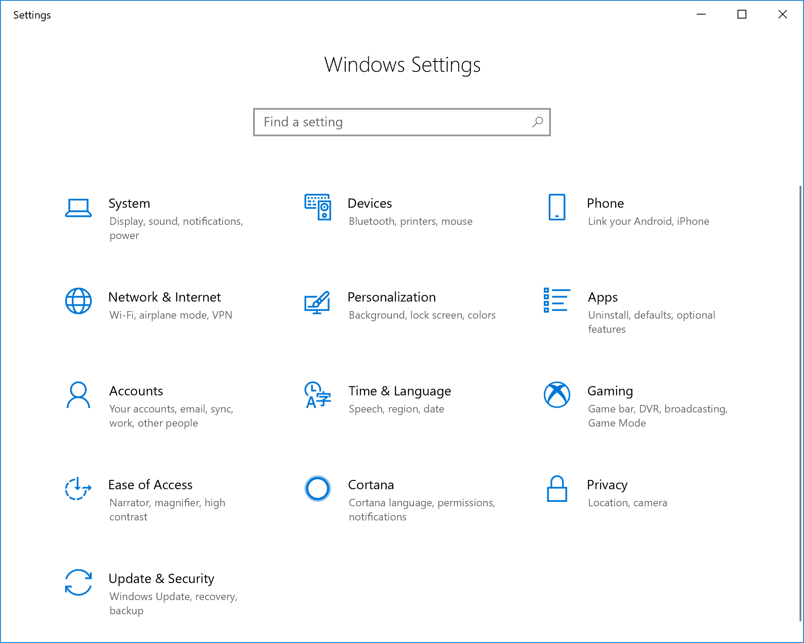
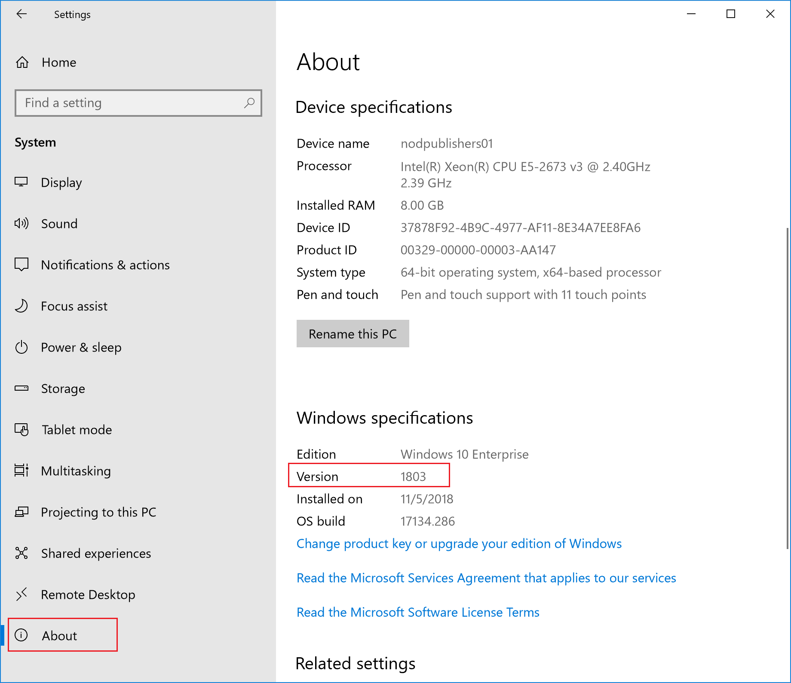
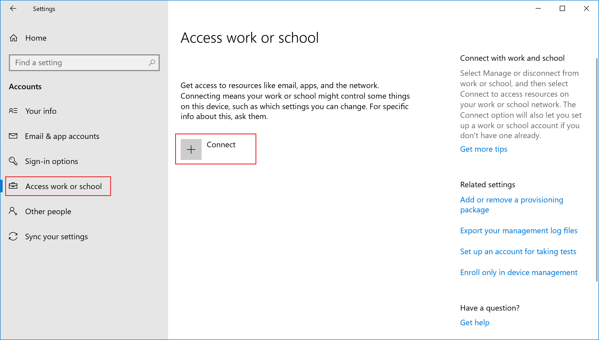
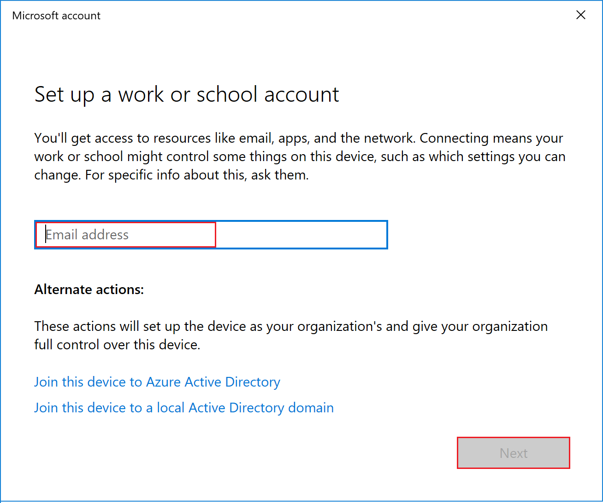

---
# required metadata

title: Quickstart - Enroll your Windows 10 Desktop device in Microsoft Intune
description: Quickstart - Use the Company Portal to enroll your Windows 10 Desktop device into Microsoft Intune.
services: microsoft-intune
author: ErikRe
ms.author: erikre
manager: dougeby
ms.date: 12/05/2018
ms.topic: quickstart
ms.prod:
ms.service: microsoft-intune
ms.localizationpriority: high
ms.technology:
ms.assetid: 658a7655-a6df-4dbe-b56c-22c7fc60e706

# optional metadata

#ROBOTS:
#audience:
#ms.devlang:
ms.reviewer: 
ms.suite: ems
search.appverid: MET150
#ms.tgt_pltfrm:
ms.custom: intune
ms.collection: M365-identity-device-management
---

# Quickstart: Enroll your Windows 10 device

In this quickstart, you'll first take the role of an Intune user and enroll your Windows 10 device into Microsoft Intune. Then, you return to Intune and confirm the enrolled device.

Enrolling your devices into Microsoft Intune allows your Windows 10 devices to get access to your organization’s secure data, including email, files, and other resources. This is true for both Windows 10 desktop and Windows 10 Mobile devices. Enrolling your devices helps secure this access for both you and your organization, and helps keep your work data separate from your personal data.

> [!TIP]
> Find out what happens when you [enroll your device in Intune](/intune-user-help/what-happens-if-you-install-the-company-portal-app-and-enroll-your-device-in-intune-windows) and what that means for the [information on your device](/intune-user-help/what-info-can-your-company-see-when-you-enroll-your-device-in-intune).

If you don’t have an Intune subscription, [sign up for a free trial account](free-trial-sign-up.md).

## Prerequisites

- Microsoft Intune subscription - [sign up for a free trial account](free-trial-sign-up.md)
- To complete this quickstart, you must complete the steps to [setup automatic enrollment in Intune](quickstart-setup-auto-enrollment.md).

## Confirm your Windows 10 Desktop version

Before enrolling your Windows 10 Desktop, you must confirm the version of Windows that you have installed.

1. Right-click the Windows **Start** icon and select **Settings** to display Windows Settings options.

   

2. Select **System** > **About**. 

   

    > [!TIP]
    > You can also type the phrase "About your PC" into the **search bar**, then select **About your PC**.

3. In the **Settings** window you will see a list of **Windows specifications** for your PC. Within this list, locate the **Version**.

4. Confirm that the Windows 10 **Version** is **1607 or higher**.

    > [!IMPORTANT]
    > The steps presented in this quickstart are for Windows 10 version **1607 or higher**, if your version is **1511 or less**, continue with [these steps](/intune-user-help/enroll-windows-10-device.md).  

## Enroll Windows 10 Desktop

1. Return to Windows Settings and select **Accounts**.

   

2. Select **Access work or school** > **Connect**.

    

3. Sign in to Intune with your work or school account, and then select **Next**. If you followed the [create a user and assign a license] quickstart, you can sign in with the user account that you created.

    > [!NOTE]
    > If you setting up an ".onmicrosoft.com", the user account will have **.onmicrosoft.com** as part of the account address. 

   

    You’ll see a message indicating that your company or school is registering your device.

4. When you see the **You’re all set!** screen, select **Done**. You’re done.

5. You will now see the added account as part of the **Access work or school** settings on your Windows Desktop.

   

    If you followed the previous steps, but still can’t access your work or school email account and files, follow the steps in [Troubleshooting steps to follow if you see Access work or school](/intune-user-help/troubleshoot-your-windows-10-device-windows#troubleshooting-steps-to-follow-if-you-see-access-work-or-school).

## Confirm your device enrollment in Intune

1. Sign in to [Intune](https://aka.ms/intuneportal) as a Global Administrator or an Intune Service Administrator.
2. Select **Devices** to view the enrolled devices in Intune.
3. Verify that you have an additional device enrolled within Intune.

   

## Clean up resources

To unenroll your Windows device, see [Remove your Windows device from management](/intune-user-help/unenroll-your-device-from-intune-windows).

## Next steps

In this quickstart, you learned how to enroll a Windows 10 device into Intune. You can learn about other ways to enroll devices across all platforms. For more information about using devices with Intune, see [Use managed devices to get work done](/intune-user-help/use-managed-devices-to-get-work-done).

To follow this series of Intune quickstarts, continue to the next quickstart.

> [!div class="nextstepaction"]
> [Quickstart: Set a required password length for Android devices](quickstart-set-password-length-android.md)
