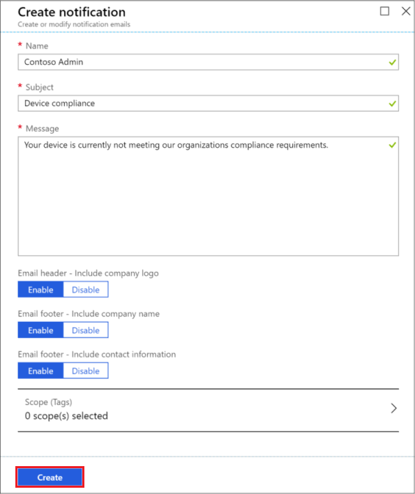
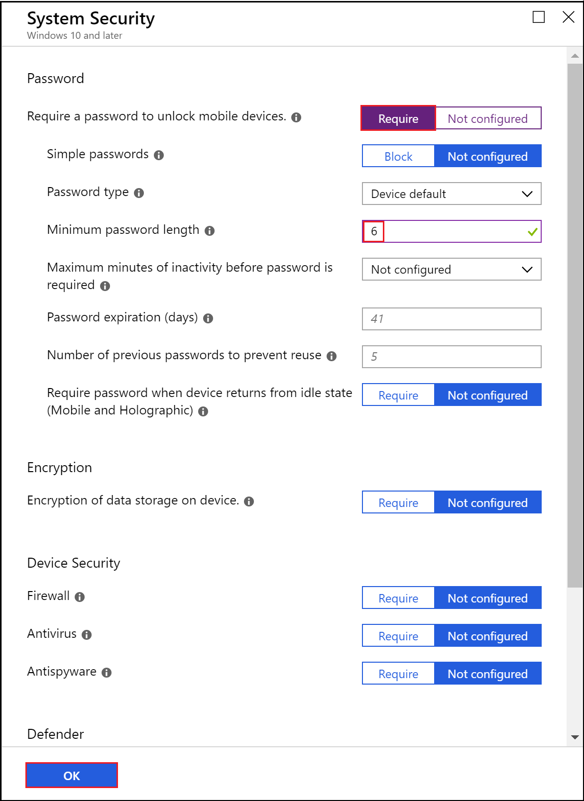

---
# required metadata

title: Quickstart - Send notifications to non-compliant devices
titlesuffix: Microsoft Intune
description: In this quickstart you will use Microsoft Intune to send email notifications to non-compliant devices.
keywords:
author: Erikre
ms.author: erikre
manager: dougeby
ms.date: 10/25/2018
ms.topic: quickstart
ms.prod:
ms.service: microsoft-intune
ms.technology:
ms.assetid: a1b89f2d-7937-46bb-926b-b05f6fa9c749

# optional metadata

#ROBOTS:
#audience:
#ms.devlang:
ms.reviewer: joglocke
ms.suite: ems
#ms.tgt_pltfrm:
ms.custom: intune-azure

---

# Quickstart: Send notifications to non-compliant devices

In this quickstart, you will use Microsoft Intune to send an email notification to the members of your workforce that have non-compliant devices.

By default, when Intune detects a device that isn't compliant, Intune immediately marks the device as noncompliant. Azure Active Directory (AD) [conditional access](https://docs.microsoft.com/azure/active-directory/active-directory-conditional-access-azure-portal) then blocks the device. When a device is not compliant, **actions for noncompliance** also give you flexibility to decide what to do. For example, you can give users a grace period to be compliant before blocking non-compliant devices.

One of the actions you can take when devices don't meet compliance is to send email to those end users. You can also customize an email notification before sending it to end users. Specifically, you can customize the recipients, subject, and message body, including company logo, and contact information. Intune will also include details about the noncompliant device in the email notification.

If you don’t have an Intune subscription, [sign up for a free trial account](free-trial-sign-up.md).

## Prerequisites
- To complete this quickstart, you need at least one device compliance policy. To create a device compliance policy, see [Quickstart: Add a device compliance policy](quickstart-create-policy.md). For more information, see [Noncompliant message and actions with Microsoft Intune](actions-for-noncompliance.md).
- When using device compliance policies to block devices from corporate resources, Azure AD conditional access must be set up. See [Conditional access in Azure Active Directory](https://docs.microsoft.com/azure/active-directory/active-directory-conditional-access-azure-portal) or [common ways to use conditional access with Intune](conditional-access-intune-common-ways-use.md) for guidance.

## Sign in to Intune

Sign in to the [Intune](https://aka.ms/intuneportal) as a Global Administrator or an Intune Service Administrator. Intune is located in the Azure portal by choosing **All services** > **Intune**. Intune is located in the **Monitoring + Management** section.

## Create a notification message template

To send email to your users, create a notification message template. When a device is noncompliant, the details you enter in the template is shown in the email sent to your users.

1. Select **Device compliance** > **Notifications**.
2. Select **Create notification**. Enter the following information:

   - **Name**: Admin
   - **Subject**: Device compliance
   - **Message**: Your device is currently not meeting our organizations compliance requirements.
   - **Email header – Include company logo**: Set to **Enabled** to show your organization's logo.
   - **Email footer – Include company name**: Set to **Enabled** to show your organization's name.
   - **Email footer – Include contact information**: Set to **Enabled** to show your organization's contact information.

   

3. Once you're done adding the information, choose **Create**. The Notification message template is ready to use.

    > [!NOTE]
    > You can also edit a Notification template previously created.

For details about setting your company name, company contact information, and company logo, see [Company information and privacy statement](company-portal-app.md#company-information-and-privacy-statement), [Support information](company-portal-app.md#support-information), and [Company branding customization](company-portal-app.md#company-branding-customization). 

## Add actions for noncompliance

When you create a device compliance policy, Intune automatically creates an action for noncompliance. When a device isn't meeting your compliance policy, this action marks the device as not compliant. You can customize how long the device is marked as not compliant. This action can't be removed.

You can also add another action when you create a compliance policy, or update an existing policy. 

1. In the [Azure portal](https://portal.azure.com), open **Microsoft Intune** > **Device compliance**.
2. Select **Policies** > **Create Policy**.
3. Enter the following information:

   - **Name**: Windows 10 compliance
   - **Description**: Windows 10 compliance policy
   - **Message**: Your device is currently not meeting our organizations compliance requirements.
   - **Platform**: Windows 10 and later
4. Select **Settings** > **System Security** to display the device security-related settings.
5. Set **Require a password to unlock mobile devices** to **Require**. This setting specifies whether to require users to enter a password before access is granted to information on their mobile devices. 
6. Set **Minimum password length** to **6**. This setting specifies the minimum number of digits or characters in the password.

     

7. Click **OK**, **OK**, and **Create** to create your compliance policy.
8. Select the name of your new policy: **Windows 10 compliance**.
9. Select **Properties** > **Action for noncompliance** > **Add**.
10. In the **Action** drop-down box, confirm **Send email to end users** is selected.
11. Select **Message template** > **Contoso Admin** > **Select** to select the message template you created earlier in this topic.
12. Select **OK** > **OK** > **Save** to save your changes.

To assign the policy to a group.

1. Select the **Windows 10 compliance** policy that you created earlier.
2. Select **Assignments**.
3. In the **Assign to** drop-down box, select **All Users**. This will select all **Windows 10 and later** users because the compliance policy has been targeted to this platform.
4. Click **Save**.

When you've successfully created and saved the policy, it will appear in the list of **Device complice - Policies**. Notice in the list that **Assigned** is set to **Yes**.

## Next steps

In this quickstart, you used Intune to create and assign a compliance policy for your workforce's Windows 10 devices to require a password of at least six characters in length.

> [!div class="nextstepaction"]
> [Use Autopilot to enroll Windows devices](tutorial-use-autopilot-enroll-devices.md)
