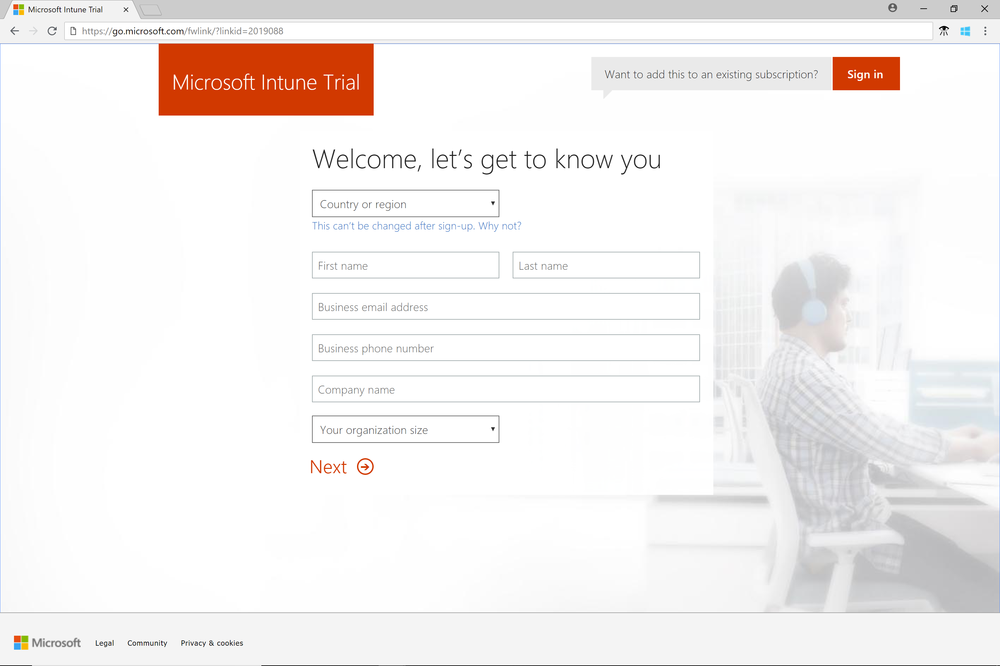

---
# required metadata

title: Quickstart: Try Microsoft Intune for free
titlesuffix: 
description: In this quickstart, you will create a free trial subscription, understand supported configurations and networking requirements, and configure your domain name.
keywords:
author: Erikre
ms.author: erikre
manager: dougeby
ms.date: 09/12/2018
ms.topic: quickstart
ms.prod:
ms.service: microsoft-intune
ms.technology:
ms.assetid: 33f63eca-6c6d-4dc6-8c00-bd3e8524b2be

# optional metadata

#ROBOTS:
#audience:
#ms.devlang:
ms.reviewer:
ms.suite: ems
#ms.tgt_pltfrm:
ms.custom: intune-azure
#Customer intent: As an administrator, I want to create a free subscription to try Intune in a test environment. 
---

# Quickstart: Getting started with Microsoft Intune 

Microsoft Intune helps you protect your workforce's corporate data by managing devices and apps. In this quickstart, you will create a free subscription to try Intune in a test environment.

Intune provides mobile device management (MDM) and mobile app management (MAM) from a secure cloud-based service that is administered using the Microsoft Azure portal. Using Intune, you ensure your workforce's corporate resources (data, devices, or apps) are correctly configured, accessed, and updated, all while remaining compliant with your company's policies and requirements.

## Prerequisites
Before setting up Microsoft Intune, review the following requirements:
    - [Supported operating systems and browsers](supported-devices-browsers.md) 
    - [Network configuration requirements and bandwidth](network configuration requirements and bandwidth.md)

## Sign up for a Microsoft Intune free trial

Trying out Intune is free. If you already have a work or school account, **sign in** with that account and add Intune to your subscription. Otherwise, you can **sign up** for a new account to use Intune for your organization.

> [!IMPORTANT]
> >You can't combine an existing work or school account after you sign up for a new account.

1. Sign up for a free Intune trial subscription by visiting the [Microsoft Intune Trial](https://go.microsoft.com/fwlink/?linkid=2019088) page and fill out the form.

    

    > [!NOTE]
    > If most of your IT operations and users are in a different locale than you, you may want to select that locale under **Country or region**. We use your regional information to deliver the right services. This setting can't be changed later.

2. Create an account using your company name followed by **.onmicrosoft.com**. 

    

    If your organization has its own custom domain that you want to use without **.onmicrosoft.com**, you can change that later in the Office 365 Admin Portal later in this article.

3. View your new account information at the end of the sign-up process.

     

## Sign in to the Azure portal

1. Open a new browser window and enter **https://portal.azure.com** in the address bar. 
2. Use the credentials you were given in the steps above to sign in.

    

3. To view Microsoft Intune in the Azure port, select **All services** from the sidebar on the left side of the page.
4. Search for **Microsoft Intune** in the filter box and select it.
5. Select the **star** to add Intune to the bottom of the list of your favorite services and open the Intune dashboard.

When you sign up for a trial, you will also receive an email message that contains your account information and the email address that you provided during the sign-up process. This email confirms your trial is active.

## Configure a custom domain name

As mentioned above, if your organization has its own custom domain that you want to use without **.onmicrosoft.com**, you can change it in the Office 365 Admin Portal.

> [!IMPORTANT]
> You cannot rename or remove the initial **onmicrosoft.com** domain name. You can add, verify or remove custom domain names used with Intune to keep your business identity clear.

1. Go to [Office 365 management portal](https://portal.office.com/Admin/Default.aspx) and sign into your administrator account.

2. In the navigation pane, choose **Setup** > **Domains**.

3. Choose **Add domain**, and type your custom domain name. Then, select **Next**.

   

4. The **Verify domain** dialog box opens giving you the values to create the TXT record in your DNS hosting provider.
	- **GoDaddy users**: Office 365 Management portal redirects you to GoDaddy's sign-in page. After you enter your credentials and accept the domain change permission agreement, the TXT record is created automatically. You can alternatively [create the TXT record](https://support.office.com/article/Create-DNS-records-at-GoDaddy-for-Office-365-f40a9185-b6d5-4a80-bb31-aa3bb0cab48a).
	- **Register.com users**: Follow the [step-by-step instructions](https://support.office.com/article/Create-DNS-records-at-Register-com-for-Office-365-55bd8c38-3316-48ae-a368-4959b2c1684e#BKMK_verify) to create the TXT record.

For more information about domain names, see [Managing customer domain names in your Azure Active Directory](https://docs.microsoft.com/azure/active-directory/users-groups-roles/domains-manage).

## Next steps

In this quickstart, you've created a free subscription to try Intune in a test environment and optionally configured a custom domain name. To learn more about Microsoft Intune, continue to the next quickstart to add users and assign licenses.

> [!div class="nextstepaction"]
> [Quickstart: Add users and assign licenses](quickstart-add-users-licenses.md)
