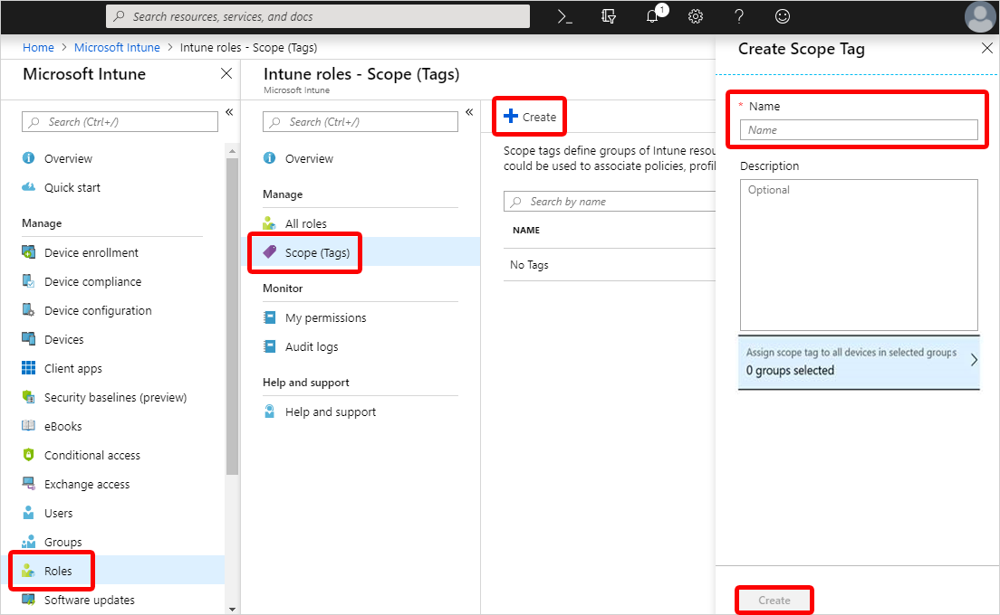

---
# required metadata

title: Filter policies with scope tags in Microsoft Intune - Azure | Microsoft Docs
description: Use scope tags to filter configuration profiles to specific roles.
keywords:
author: ErikjeMS
ms.author: erikje
manager: dougeby
ms.date: 03/08/2019
ms.topic: article
ms.prod:
ms.service: microsoft-intune
ms.technology:
ms.assetid: 

# optional metadata

#ROBOTS:
#audience:
#ms.devlang:
#ms.reviewer:
ms.suite: ems
search.appverid: MET150
#ms.tgt_pltfrm:
ms.custom: intune-azure
ms.collection: M365-identity-device-management
---

# Use RBAC and scope tags for distributed IT

You can use role-based access control (RBAC) and scope tags to make sure that the right admins have the right access and visibility to the right Intune objects. Roles determine what access admins have to which objects. Scope tags determine which objects admins can see.

For example, let’s say that a Seattle regional office admin is assigned the Policy and Profile Manager role. You want this admin to see and manage only the profiles and policies that only apply to Seattle devices. To do this, you would:

1. Create a scope tag called Seattle.
2. Create a role assignment for the Policy and Profile Manager role with: 
    - Members (Groups) = A security group named Seattle IT admins. All admins in this group will have  permission to manage policies and profiles for users/devices in the Scope (Groups).
    - Scope (Groups) = A security group named Seattle users. All users/devices in this group can have their profiles and policies managed by the admins in the Members (Groups). 
    - Scope (Tags) = Seattle. Admins in the Member (Groups) can see devices that also have the Seattle scope tag.
3. Add the Seattle scope tag to policies and profiles that you want admins in Members (Groups) to be able to access.
4. Add the Seattle scope tag to devices that you want visible to admins in the Members (Groups). 

## To create a scope tag

1. In Intune, choose **Roles** > **Scope (Tags)** > **Create**.

    

2. Provide a **Name** and **Description**.
3. Choose **Create**.

## To assign a scope tag to a role

1. In Intune, choose **Roles** > **All roles** > choose a role > **Assignments** > **Assign**.

    

2. Provide an **Assignment name** and **Description**.
3. Choose **Members (Groups)** and choose the groups that you want as part of this assignment. Users in this group will have permissions to manage policies and profiles for users/devices in the Scope (Groups).
4. Choose **Scope (Groups)** and choose the users and groups that you want to be part of this assignment. All users/devices in this group can have their profiles and policies managed by the admins in the Members (Group).
5. Choose **Scope (Tags)** > **Add** > choose the tags that you want to add to this role. Users in Members (Groups) will have access to the policies and profiles that also have the same scope tag.
6. Choose **Select** > **OK** > **OK**. 

## To add a scope tag to a configuration profile
1. In Intune, choose **Device configuration** > **Profiles** > choose a profile > **Properties** > **Scope (Tags)** > **Add**.
2. Under **Select Tags**, choose the tags that you want to add to the profile.
3. Choose **Select** > **OK** > **Save**.

## Scope tag details
When working with scope tags, remember these details:

- You can currently assign scope tags to:
    - Role assignments
    - Device compliance policies
    - Device configuration profiles
    - Windows 10 updates rings
    - Managed devices
    - Apps
    - App configuration policies – managed devices
    - Powershell scripts
    - DEP tokens
- When an admin creates an object in Intune, all scope tags assigned to that admin will be automatically assigned to the new object.
- Intune RBAC doesn't apply to Azure Active Directory roles. So, the Intune Service Admins and Global Admins roles have full admin access to Intune no matter what scope tags they have.
- Administrators in a role assignment with scope tags can also see Intune objects with no scope tags.
- You can only assign a scope tag that you have in your role assignments.
- You can only target groups that are listed in the Scope (Groups) of your role assignment.
- If you have a scope tag assigned to your role, you can't delete all scope tags on an Intune object. At least one scope tag is required.
- If a user has multiple role assignments, permissions in those role assignments extend to different objects as follows:
    - Assign permissions only apply to the objects (like policies or apps) in that role’s assignment Scope (Groups). Assign permissions don’t apply to objects in other role assignments unless the other assignment specifically grants them.
    - Other permissions (such as Create and Read), apply to all objects of the same type (like all policies or all apps) in any of the user’s assignments.
    - Permissions for objects of different types (like policies or apps), don’t apply to each other. A Read permission for a policy, for example, doesn’t provide a Read permission to apps in the user’s assignments.

## Next steps

Manage your [roles](role-based-access-control.md) and [profiles](device-profile-assign.md).
