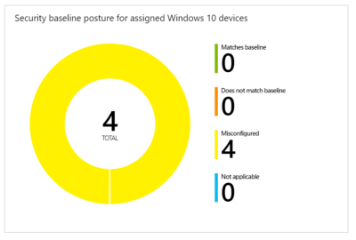
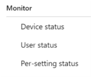

---
# required metadata

title: Check the status of the security baseline in Microsoft Intune - Azure | Microsoft Docs
description: 
keywords:
author: MandiOhlinger 
ms.author: mandia
manager: dougeby
ms.date: 11/20/2018
ms.topic: article
ms.prod:
ms.service: microsoft-intune
ms.technology:
ms.assetid: 

# optional metadata

#ROBOTS:
#audience:
#ms.devlang:
ms.reviewer: joglocke
ms.suite: ems
#ms.tgt_pltfrm:
ms.custom: intune-azure

---

# Monitor the security baseline and profile in Microsoft Intune

There are different monitoring options when using security baselines. You can monitor the security baselines profile that applies to your users and devices. You can also monitor the actual baseline, and any devices that match (or don't match) the recommended values.

This article walks you through both monitoring options.

[Security baselines in Intune](security-baselines.md) provides more details on the security baselines feature in Microsoft Intune.

## Monitor the baseline and your devices

When you monitor the baseline, you get insight into the security state of your devices based on Microsoft's recommendations.

1. In the [Azure portal](https://portal.azure.com/), select **All services** > filter on **Intune** > select **Intune**.
2. Select **Security Baselines (preview)** > **PREVIEW: MDM Security Baseline for October 2018 (beta)**.
3. In **Overview**, the graph shows how many devices are impacted by the baseline, and the different statuses:

    

    The following statuses are available:

    - **Matches baseline**: All the settings in the baseline match the recommended settings.
    - **Does not match baseline**: At least one setting in the baseline doesn't match the recommended settings.
    - **Misconfigured**: At least one setting isn't properly configured. This status means the setting is in a conflict, error, or a pending state.
    - **Not applicable**: At least one setting isn't applicable, and isn't applied.

4. Select one of the statuses that has devices. For example, select the **Misconfigured** status.

5. A list of all the devices with that status is shown. Select a specific device to get more details. In the following example, select **Device configuration** > Choose the profile with an Error state:

    

    Select the Error profile. A list of all settings in the profile, and their state is shown. Scroll to find the setting causing the error:

    

Use this reporting to see any settings in a profile are causing an issue. Also get more details of policies and profiles deployed to devices.

> [!NOTE]
> When a property is set to **Not configured** in the baseline, the setting is ignored, and no restrictions are enforced. The property isn't shown in any reporting.

## Monitor the profile

Monitoring the profile gives you insight into the deployment state of your devices, but not the security state based on the baseline recommendations.

1. In Intune, select **Security Baselines** > **PREVIEW: MDM Security Baseline for October 2018 (beta)** > **Profiles created**.

2. Select a profile. In **Overview**, the image shows how many devices and users have this profile assigned:

    

3. Under **Manage** > **Properties**, a list of all the settings in the baseline are shown. You can also change any of these settings:

    

4. In **Monitor**, you can see the deployment status of the profile on individual devices, the status for each user, and the status for each setting in the baseline:

    

## Next steps

[Monitor device profiles](device-profile-monitor.md) and [see some common issues and resolutions](device-profile-troubleshoot.md).