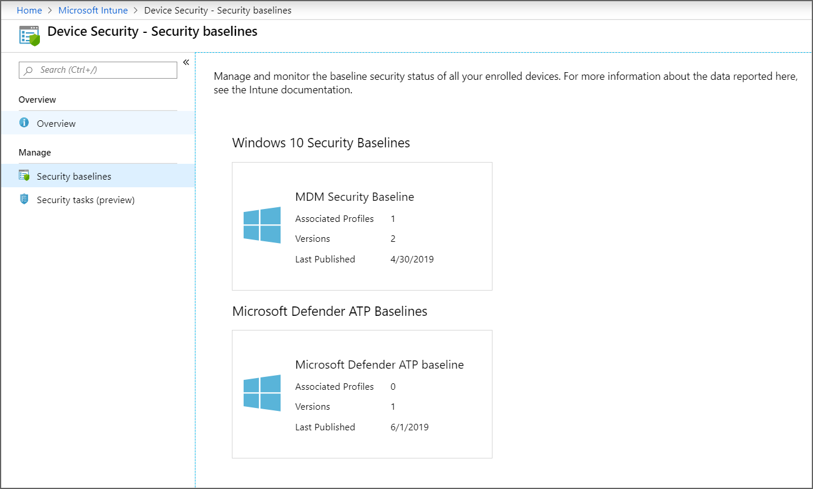
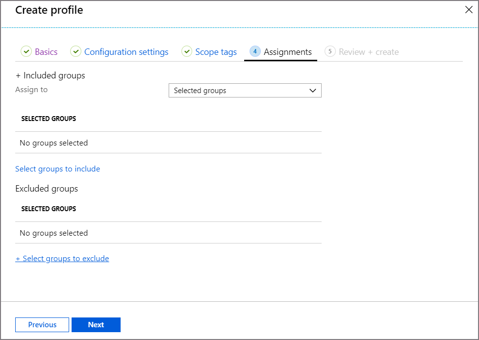
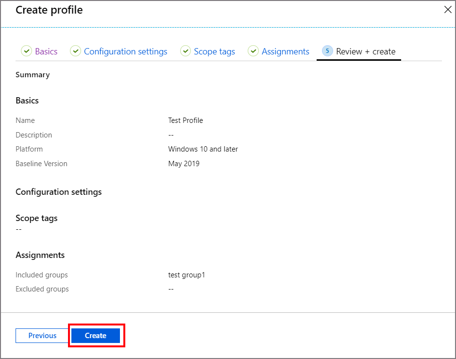

---
# required metadata

title: Use security baselines in Microsoft Intune - Azure | Microsoft Docs
description: Add or configure recommended group security settings to protect user and data on devices using Microsoft Intune for mobile device management. Enable BitLocker, configure Microsoft Defender Advanced Threat Protection, control Internet Explorer, use Smart Screen, set local security policies, require a password, block internet downloads, and more.
keywords:
author: brenduns 
ms.author: brenduns
manager: dougeby
ms.date: 06/20/2019
ms.topic: conceptual
ms.service: microsoft-intune
ms.localizationpriority: high
ms.technology:
ms.assetid: 

# optional metadata

#ROBOTS:
#audience:
#ms.devlang:
ms.reviewer: joglocke
ms.suite: ems
#ms.tgt_pltfrm:
ms.custom: intune-azure
ms.collection: M365-identity-device-management
---

# Use security baselines to configure Windows 10 devices in Intune

Security baselines are pre-configured groups of settings that help you apply a known group of settings and default values for those settings to the devices you manage that run Windows 10 or later. Use of Intune's security baselines can help you secure and protect your users and devices. This article can help you use security baselines to create a profile, assign the profile, and monitor the profile.

This feature applies to:

- Windows 10 version 1809 and later

Each security baseline includes settings and default values that are recommended by the relevant security teams. For example, the *MDM Security Baseline* automatically enables BitLocker for removable drives, automatically requires a password to unlock a device, automatically disables basic authentication, and more.  

Security baselines create a *device configuration profile* in Intune. This profile includes all the settings in the baseline. You then apply or assign this profile to your users, groups, and devices.

After the profile is assigned, you can monitor the profile, and monitor the baseline. For example, you can see which devices match the baseline, or don't match the baseline.

Separate baselines can include the same settings that are found in other baselines, but with different values for those settings. It's important to understand what each baseline configures by default, and to modify those settings to fit your organizational needs.  

> [!NOTE]
> For a security baseline profile that remains in preview, Microsoft doesn't recommend using the profile in a production environment. The settings in the baseline might change over the course of the preview. When security baselines move from preview to be generally available, profiles created by using the preview baseline won't convert to the generally available baseline. You'll need to create a new baseline profile using the generally available baseline. 

The goal of using security baselines is to provide an end-to-end secure workflow when working with Microsoft 365. Some of the benefits include:

- A security baseline includes the best practices and recommendations on settings that impact security. Intune partners with the same Windows security team that creates group policy security baselines. These recommendations are based on guidance and extensive experience.
- If you're brand new to Intune, and not sure where to start, then security baselines gives you an advantage. You can quickly create and deploy a secure profile, knowing that you're helping protect your organization's resources and data.
- If you currently use group policy, migrating to Intune for management is much easier with these baselines. These baselines are natively built in to Intune, and include a modern management experience.

[Windows security baselines](https://docs.microsoft.com/windows/security/threat-protection/windows-security-baselines) is a great resource to learn more about this feature. [Mobile device management](https://docs.microsoft.com/windows/client-management/mdm/) (MDM) is a great resource about MDM, and what you can do on Windows devices.

## Available security baselines 

The following security baseline templates are available for use with Intune.
- **MDM Security Baseline**  
  [View the settings](security-baseline-settings-windows.md)

- **PREVIEW: Windows Defender ATP baseline**  
  [View the settings](security-baseline-settings-defender-atp.md)  
  *(To use this baseline your environment must meet the prerequisites for using [Microsoft Defender Advanced Threat Protection](advanced-threat-protection.md#prerequisites))*.

You can continue to use and edit profiles that you previously created based on a preview template, even when that preview template is no longer available for creating new profiles. 

## Prerequisites
- To manage baselines in Intune, your account must have the [Policy and Profile Manager](role-based-access-control.md#built-in-roles) built-in role.

- Use of some baselines might require you to have an active subscription to additional services, like Microsoft Defender ATP.  

## Co-managed devices

Security baselines on Intune-managed devices are similar to co-managed devices with Configuration Manager. Co-managed devices use System Center Configuration Manager and Microsoft Intune to manage the Windows 10 devices simultaneously. It lets you cloud-attach your existing Configuration Manager investment to the benefits of Intune. [Co-management overview](https://docs.microsoft.com/sccm/comanage/overview) is a great resource if you use Configuration Manager, and also want the benefits of the cloud.

When using co-managed devices, you must switch the **Device configuration** workload (its settings) to Intune. [Device configuration workloads](https://docs.microsoft.com/sccm/comanage/workloads#device-configuration) provides more information.

## Create the profile

1. Sign in to [Intune](https://go.microsoft.com/fwlink/?linkid=20909) and then select **Device security** > **Security baselines**. A list of the available baselines is available. 

    

2. Select the baseline you'd like to use, and then select **Create profile**.  

3. On the **Basics** tab, specify the following properties:

    - **Name**: Enter a name for your security baselines profile. For example, enter *Standard profile for Defender ATP*.
    - **Description**: Enter some text that describes what this baseline does. The description is for you to enter any text you want. It's optional, but definitely recommended.  

   Select **Next** to go to the next tab. After you advanced to a new tab, you can select the tab name to return to a previously viewed tab.  

4. On the Configuration settings tab, view the groups of **Settings** that are available in the baseline you selected. You can expand a group to view the settings in that group, and the default values for those settings in the baseline. To find specific settings:
   - Select a group to expand and review the available settings. 
   - Use the *Search* bar and specify keywords that filter the view to display only those groups that contain your search criteria.  
 
   Each setting has a default configuration in each security baseline. Reconfigure the defaults settings to meet your business needs. Different baselines might contain the same setting, and use different default values for the setting, depending on the intent of the baseline. 

    

5. On the **Scope tags** tab, select **Select scope tags** to open the *Select tags* pane where you can assign scope tags to the profile. 

6. On the **Assignments** tab, select **Select groups to include** and then  assign the baseline to one or more groups. You can also **Select groups to exclude** to fine-tune the assignment.  

   
  
7. When you're ready to deploy the baseline, advance to the **Review + create** tab and review the details for the baseline. Select **Create** to save, and deploy the profile.  

    

   As soon as you create the profile, it's pushed to the assigned group and might apply immediately.

   > [!TIP]  
   > You can save a profile without first assigning it to groups. You can edit the profile at a later time to add groups.  

8. After you create the profile, you can edit it by going to **Device security** > **Security baselines**, select the baseline type that you configured, and then select **Profiles**.  Select the profile from the list of available profiles, and then select **Properties**. You can edit settings from all the available configuration tabs, and select **Review + save** to commit your changes.  

## Q & A

#### Why these settings?

The Microsoft security team has years of experience working directly with Windows developers and the security community to create these recommendations. The settings in this baseline are considered the most relevant security-related configuration options. In each new build of Windows, the team adjusts its recommendations based on newly released features.

#### Is there a difference in the recommendations for Windows security baselines for group policy vs. Intune?

The same Microsoft security team chose and organized the settings for each baseline. Intune includes all the relevant settings in the Intune security baseline. There are some settings in the group policy baseline that are specific to an on-premises domain controller. These settings are excluded from Intune's recommendations. All the other settings are the same.

#### Are the Intune security baselines CIS or NSIT compliant?

Strictly speaking, no. The Microsoft security team consults organizations, such as CIS, to compile its recommendations. But, there isn't a one-to-one mapping between “CIS-compliant” and Microsoft baselines.

#### What certifications does Microsoft’s security baselines have? 

- Microsoft continues to publish security baselines for group policies (GPOs) and the [Security Compliance Toolkit](https://docs.microsoft.com/windows/security/threat-protection/security-compliance-toolkit-10), as it has for many years. These baselines are used by many organizations. The recommendations in these baselines are from the Microsoft security team’s engagement with enterprise customers and external agencies, including the Department of Defense (DoD), National Institute of Standards and Technology (NIST), and more. We share our recommendations and baselines with these organizations. These organizations also have their own recommendations that closely mirror Microsoft's recommendations. As mobile device management (MDM) continues to grow into the cloud, Microsoft created equivalent MDM recommendations of these group policy baselines. These additional baselines are built in to Microsoft Intune, and include compliance reports on users, groups, and devices that follow (or don't follow) the baseline.

- Many customers are using the Intune baseline recommendations as a starting point, and then customizing it to meet their IT and security demands. Microsoft’s Windows 10 RS5 **MDM Security Baseline** is the first baseline to release. This baseline is built as a generic infrastructure that allows customers to eventually import other security baselines based on CIS, NIST, and other standards. Currently, it's available for Windows and will eventually include iOS and Android.

- Migrating from on-premises Active Directory group policies to a pure cloud solution using Azure Active Directory (AD) with Microsoft Intune is a journey. To help, there are companion GPOs published for hybrid AD and Azure AD-joined devices. These devices can get MDM settings from the cloud (Intune) and group policy settings from on-premises domain controllers as needed.

## Next steps
- View the [Windows security baseline settings](security-baseline-settings-windows.md) supported by Intune.  
- Check the status and monitor the [baseline and profile](security-baselines-monitor.md).
