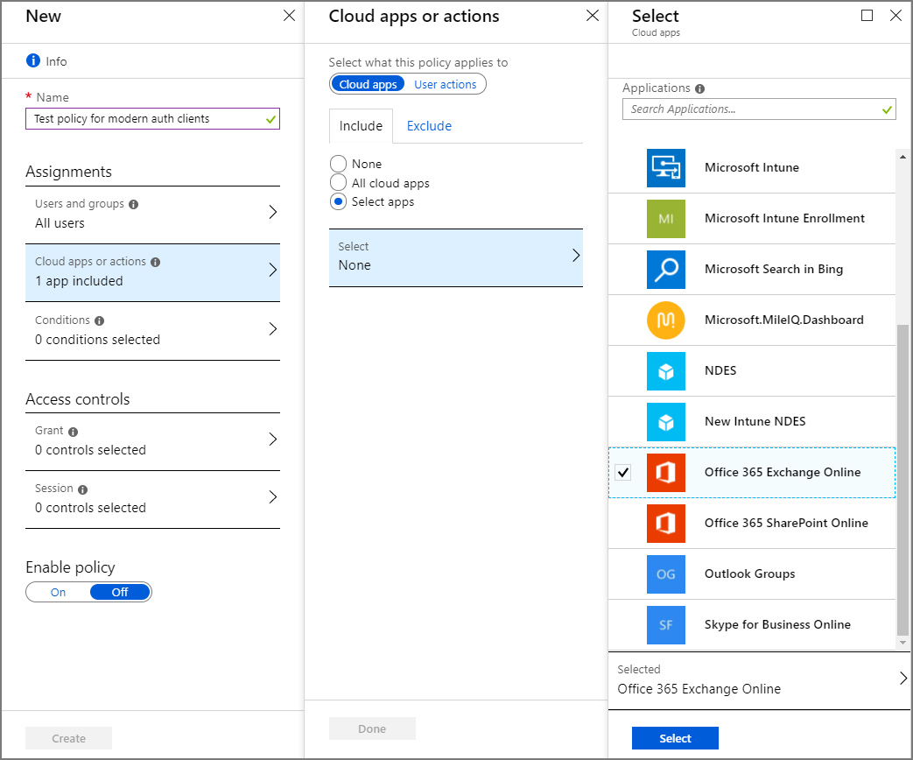
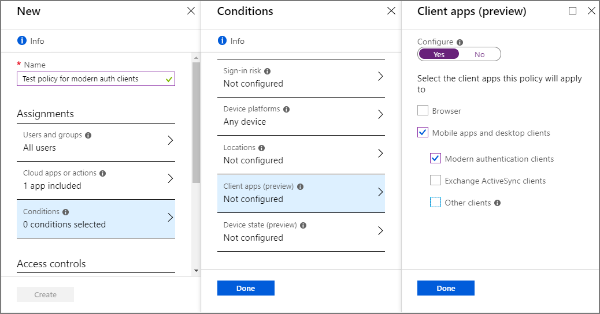
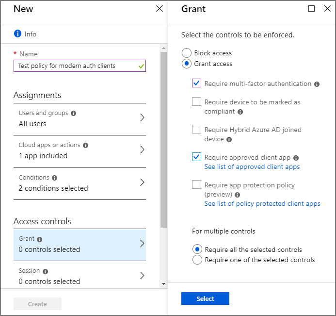
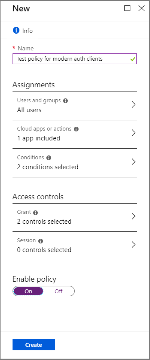
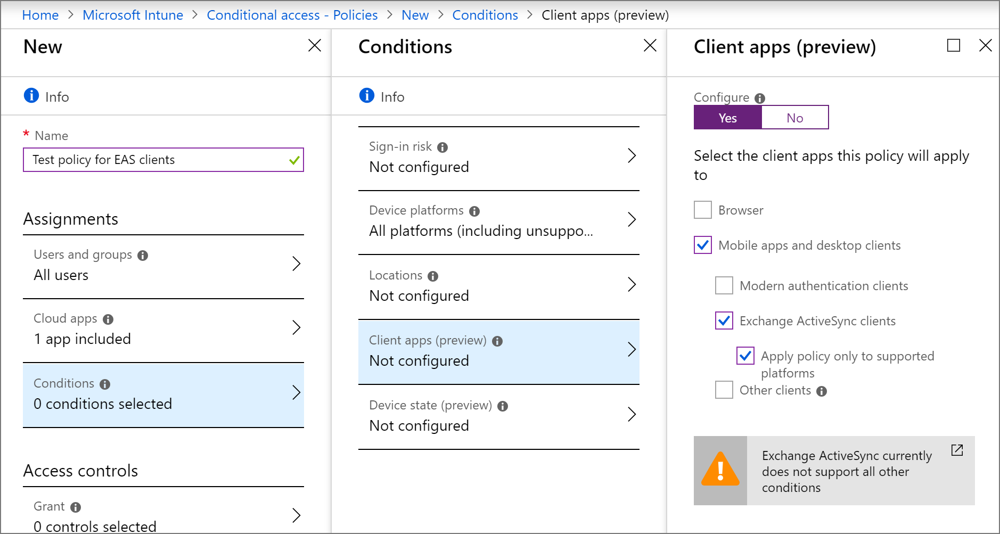
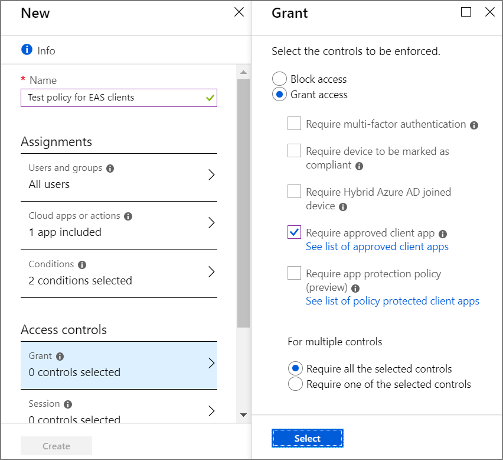

---
# required metadata

title: Tutorial - Protect Exchange Online email on unmanaged devices
titleSuffix: Microsoft Intune
description: Learn to secure Office 365 Exchange Online with Intune app protection policies and Azure AD conditional access.
keywords:
author: brenduns
ms.author: brenduns
manager: dougeby
ms.date: 03/26/2019
ms.topic: tutorial
ms.prod:
ms.service: microsoft-intune
ms.localizationpriority: high
ms.technology:
ms.assetid: 

# optional metadata

#ROBOTS:
#audience:
#ms.devlang:
ms.reviewer:
ms.suite: ems
#ms.tgt_pltfrm:
ms.custom: intune-azure
ms.collection: M365-identity-device-management
---

# Tutorial: Protect Exchange Online email on unmanaged devices

Learn about using app protection policies with conditional access to protect Exchange Online, even when devices aren't enrolled in a device management solution like Intune. In this tutorial, you'll learn how to: 

> [!div class="checklist"]
> * Create an Intune app protection policy for the Outlook app. You'll limit what the user can do with app data by preventing "Save As" and restrict cut, copy, and paste actions. 
> * Create Azure Active Directory (Azure AD) conditional access policies that allow only the Outlook app to access company email in Exchange Online. You'll also require multi-factor authentication (MFA) for Modern authentication clients, like Outlook for iOS and Android.

## Prerequisites
  - You'll need a test tenant with the following subscriptions for this tutorial:
    - Azure Active Directory Premium ([free trial](https://azure.microsoft.com/free/?WT.mc_id=A261C142F))
    - Intune subscription ([free trial](free-trial-sign-up.md))
    - Office 365 Business subscription that includes Exchange ([free trial](https://go.microsoft.com/fwlink/p/?LinkID=510938))

## Sign in to Intune

Sign in to [Intune](https://aka.ms/intuneportal) as a Global Administrator or an Intune Service Administrator. Intune is located in the Azure portal by choosing **All services** > **Intune**.

## Create the app protection policy
For this tutorial, we’ll set up an Intune app protection policy for the Outlook app to put protections in place at the app level. We'll require a PIN to open the app in a work context. We'll also limit data sharing between apps and prevent company data from being saved to a personal location.

1.	In Intune, select **Client apps** > **App protection policies** > **Add a policy**.
2.	In **Name**, enter **Outlook app policy test**.
3.	In **Description**, enter **Outlook app policy test**.
4.	Select **Apps**. In the apps list, select **Outlook**, and then choose **Select**.
5.	Select **Settings**. 
6.	Under **Data relocation**, for this tutorial select these settings:

    - For **Allow app to transfer data to other apps**, select **None**.
    - For **Allow app to receive data from other apps**, select **None**.
    - For **Prevent "Save As"**, select **Yes**.
    - For **Restrict cut, copy, and paste with other apps**, select **Blocked**.
   
     
    
7.	Under **Access Actions**, for this tutorial select these settings:

    - For **Require PIN for access**, select **Yes**.
    - For **Require corporate credentials for access**, select **Yes**.
    - Leave all other settings at their default values.
 
     

9.	Select **OK**.
10.	Select **Create**.

The app protection policy for Outlook is created. Now you can set up conditional access to require devices to use the Outlook app.

## Create conditional access policies
Now we’ll create two conditional access policies to cover all device platforms. The first policy will require Modern Authentication clients, like Outlook for iOS and Outlook for Android, to use the approved Outlook app and MFA. The second policy will require Exchange ActiveSync clients to use the approved Outlook app. (Currently, Exchange Active Sync doesn't support conditions other than device platform). You can configure conditional access policies in either the Azure AD portal or the Intune portal. Since we’re already in the Intune portal, we’ll create the policy here.
### Create an MFA policy for Modern Authentication clients
1.	In Intune, select **Conditional access** > **Policies** > **New policy**.
1.  In **Name**, enter **Test policy for modern auth clients**. 
3.	Under **Assignments**, select **Users and groups**. On the **Include** tab, select **All users**, and then select **Done**.

4.	Under **Assignments**, select **Cloud apps**. Because we want to protect Office 365 Exchange Online email, we'll select it by following these steps:
     
    1. On the **Include** tab, choose **Select apps**.
    2. Choose **Select**. 
    3. In the applications list, select **Office 365 Exchange Online**, and then choose **Select**. 
    4. Select **Done**.
  
    

5.	Under **Assignments**, select **Conditions** > **Device platforms**.
     
    1. Under **Configure**, select **Yes**.
    2. On the **Include** tab, select **Any device**.
    1. Select **Done**.
   
6.	On the **Conditions** pane, select **Client apps**.
     
    1. Under **Configure**, select **Yes**.
    2. Select **Mobile apps and desktop clients** and **Modern authentication clients**.
    3. Clear the other check boxes.
    4. Select **Done**, and then select **Done** again.
    
    

7.	Under **Access controls**, select **Grant**. 
     
    1. On the **Grant** pane, select **Grant access**.
    2. Select **Require multi-factor authentication**.
    4. Select **Require approved client app**.
    5. Under **For multiple controls**, select **Require all the selected controls**. This setting ensures that both requirements you selected are enforced when a device tries to access email.
    6. Choose **Select**.
     
    

8.	Under **Enable policy**, select **On**.
     
    

9.	Select **Create**.

The conditional access policy for Modern Authentication clients is created. Now you can create a policy for Exchange Active Sync clients.

### Create a policy for Exchange Active Sync clients
1.	In Intune, select **Conditional access** > **Policies** > **New policy**.
2.  In **Name**, enter **Test policy for EAS clients**. 
3.	Under **Assignments**, select **Users and groups**. On the **Include** tab, select **All users**, and then select **Done**.

4.	Under **Assignments**, select **Cloud apps**. Select Office 365 Exchange Online email with these steps:
     
    1. On the **Include** tab, choose **Select apps**.
    2. Choose **Select**. 
    3. In the applications list, select **Office 365 Exchange Online**, and then choose **Select**. 
    4. Select **Done**.

5.	Under **Assignments**, select **Conditions** > **Device platforms**.
     
    1. Under **Configure**, select **Yes**.
    2. On the **Include** tab, select **Any device**, and then select **Done**. 
    3. Select **Done** again.

6.	On the **Conditions** pane, select **Client apps**.
     
    1. Under **Configure**, select **Yes**.
    2. Select **Mobile apps and desktop clients**.
    3. Select **Exchange ActiveSync clients** and **Apply policy only to supported platforms**. 
    4. Clear all other check boxes.
    5. Select **Done**, and then select **Done** again.
    
    

7.	Under **Access controls**, select **Grant**. 
     
    1. On the **Grant** pane, select **Grant access**.
    4. Select **Require approved client app**. Clear all other check boxes.
    6. Choose **Select**.
     
    

8.	Under **Enable policy**, select **On**.

9.	Select **Create**.

Your app protection policies and conditional access are now in place and ready to test. 

## Try it out
With the policies you’ve created, devices will need to enroll in Intune and use the Outlook mobile app to access Office 365 email. To test this scenario on an iOS device, try signing in to Exchange Online using credentials for a user in your test tenant.
1. To test on an iPhone, go to **Settings** > **Passwords & Accounts** > **Add Account** > **Exchange**.
2. Enter the email address for a user in your test tenant, and then press **Next**.
3. Press **Sign In**.
4. Enter the test user's password, and press **Sign in**.
5. The message **More information is required** appears, which means you're being prompted to set up MFA. Go ahead and set up an additional verification method.
6. Next you'll see a message that says you're trying to open this resource with an app that hasn't been approved by your IT department. This means you're being blocked from using the native mail app. Cancel the sign-in.
7.  Open the Outlook app and select **Settings** > **Add Account** > **Add Email Account**.
8. Enter the email address for a user in your test tenant, and then press **Next**.
9. Press **Sign in with Office 365**. You'll be prompted for additional authentication and registration. Once you've signed in, you can test actions such as cut, copy, paste, and "Save As".

## Clean up resources
When the test policies are no longer needed, you can remove them.
1. Sign in to the [Intune](https://aka.ms/intuneportal) as a Global Administrator or an Intune Service Administrator.
2. Select **Device Compliance** > **Policies**.
3. In the **Policy Name** list, select the context menu (**...**) for your test policy, and then select **Delete**. Select **OK** to confirm.
4. Select **Conditional Access** > **Policies**.
5. In the **Policy Name** list, select the context menu (**...**) for each of your test policies, and then select **Delete**. Select **Yes** to confirm.

 ## Next steps 
In this tutorial, you created app protection policies to limit what the user can do with the Outlook app, and you created conditional access policies to require the Outlook app and require MFA for Modern Authentication clients. To learn about using Intune with conditional access to protect other apps and services, see [Set up conditional access](conditional-access.md).
