---
# required metadata

title: Where did my Intune feature go in Azure?
titlesuffix: "Azure portal"
description: Helps you find Intune features in the Azure portal."
keywords:
author: dagerrit
ms.author: dagerrit
manager: angrobe
ms.date: 12/29/2017
ms.topic: article
ms.prod:
ms.service: microsoft-intune
ms.technology:
ms.assetid:

# optional metadata

#ROBOTS:
#audience:
#ms.devlang:
ms.reviewer: dagerrit
ms.suite: ems
#ms.tgt_pltfrm:
ms.custom: intune-azure

---
# Where did my Intune feature go in Azure?
We took the opportunity to organize some tasks more logically as we moved Intune into the Azure portal. But every improvement comes with the cost of learning the new organization. So, we created this reference guide for those of you who are thoroughly familiar with Intune in the classic portal and are wondering how to get something done in Intune in the Azure portal. If this article doesn’t cover a feature you’re trying to find, please leave a comment at the end of the article so we can update it.
## Quick reference guide
|Feature |Path in classic portal|Path in Intune in the Azure portal|
|------------|---------------|---------------|
|Device Enrollment Program (DEP) [iOS only]|Admin > Mobile Device Management > iOS > Device Enrollment Program|[Device enrollment > Apple Enrollment > Enrollment Program Token](#where-did-apple-dep-go) |
|Device Enrollment Program (DEP) [iOS only]| Admin > Mobile Device Management > iOS and Mac OS X > Device Enrollment Program |[Device enrollment > Apple Enrollment > Enrollment Program Serial Numbers](#where-did-apple-dep-go) |
|Enrollment Rules |Admin > Mobile Device Management > Enrollment Rules|[Device enrollment > Enrollment Restrictions](#where-did-enrollment-rules-go) |
|Groups by iOS Serial Number |Groups > All Devices > Corporate Pre-enrolled devices > By iOS Serial Number|[Device enrollment > Apple Enrollment > Enrollment Program Serial Numbers](#where-did-corporate-pre-enrolled-devices-go) |
|Groups by iOS Serial Number |Groups > All Devices > Corporate Pre-enrolled devices > By iOS Serial Number| [Device enrollment > Apple Enrollment > AC Serial numbers](#where-did-corporate-pre-enrolled-devices-go)|
|Groups by IMEI (all platforms)| Groups > All Devices > Corporate Pre-enrolled devices > By IMEI (All platforms) | [Device enrollment > Corporate Device Identifiers](#by-imei-all-platforms)|
| Corporate Device Enrollment profile| Policy > Corporate Device Enrollment | [Device enrollment > Apple Enrollment > Enrollment Program Profiles](#where-did-corporate-pre-enrolled-devices-go) |
| Corporate Device Enrollment profile | Policy > Corporate Device Enrollment | [Device enrollment > Apple Enrollment > AC Profiles](#where-did-corporate-pre-enrolled-devices-go) |
| Android for Work | Admin > Mobile Device Management > Android for Work | Device enrollment > Android for Work Enrollment |
| Terms and Conditions | Policy > Terms and Conditions | Device enrollment > Terms and Conditions |

## Where do I manage groups?
Intune in the Azure portal uses [Azure Active Directory (AD)](https://docs.microsoft.com/azure/active-directory/active-directory-groups-create-azure-portal) to manage groups.

## Where did enrollment rules go?
In the classic portal, you could set rules governing the MDM enrollment of mobile and modern Windows and macOS devices:

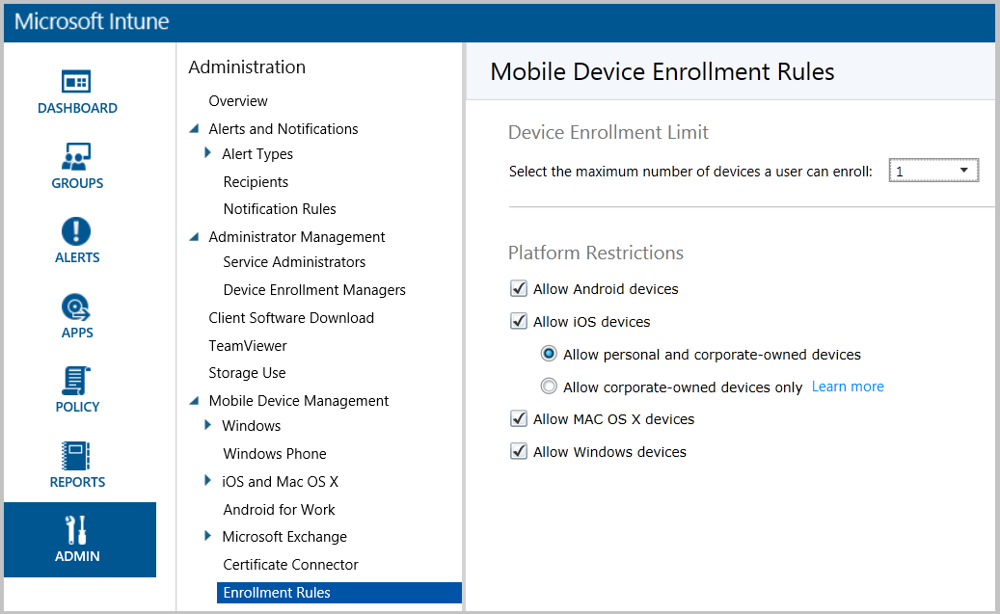

These rules applied to all users in your Intune account without exception. In the Azure portal these rules now appear in two distinct polices types: Device Type Restrictions and Device Limit Restrictions:

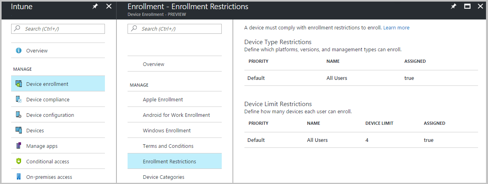

The default Device Limit Restriction corresponds to the Device Enrollment Limit in the classic portal:

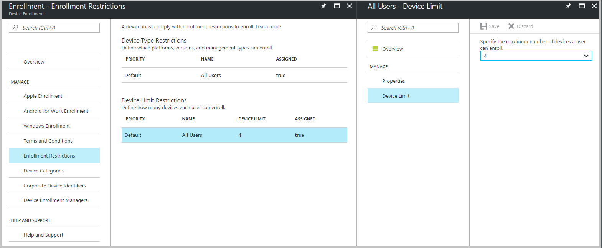

The default Device Type Restriction corresponds to the Platform Restrictions in the classic portal:

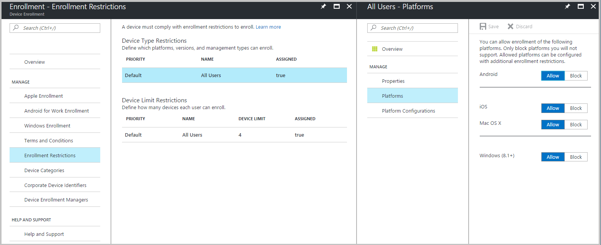

The ability to allow or block personally owned devices is now managed under the Device Type Restriction’s Platform Configurations:

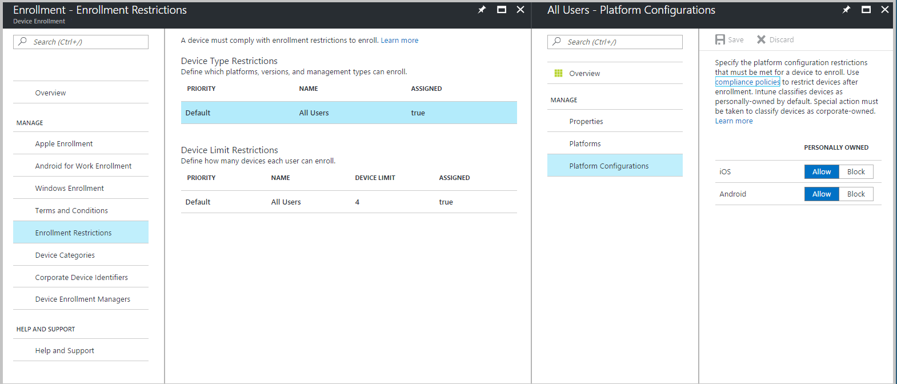

New restriction capabilities will be added to the Azure Portal only.

## Where did Apple DEP go?
In the classic portal, you could set up Intune to integrate with Apple’s Device Enrollment Program and manually request synchronization with Apple’s service:

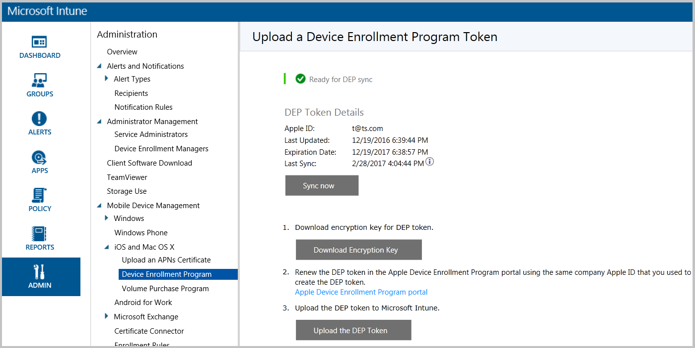

In the Azure portal, you set up Apple Device Enrollment Program with the same steps as in Intune classic:

However the **Sync** option in the classic portal has been moved to the serial number management workflow since the results of a manual sync will appear there:

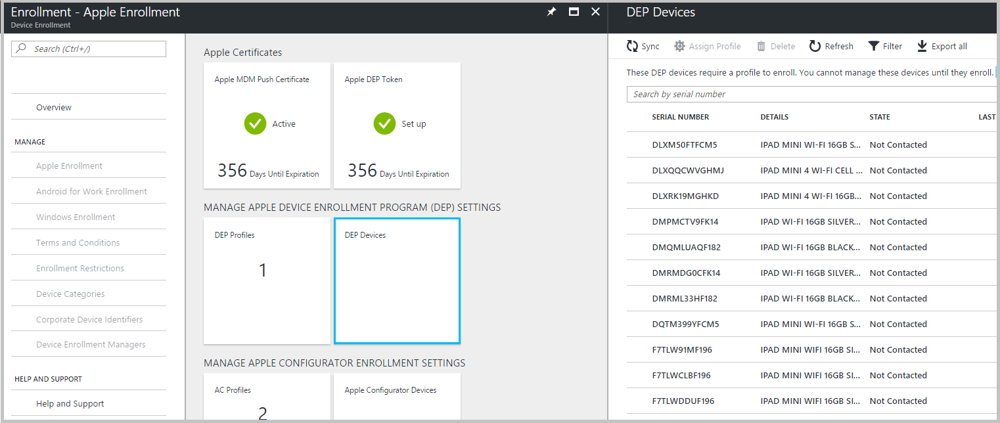

## Where did corporate pre-enrolled devices go?
### By iOS serial number
In the classic portal, you can enroll iOS devices through the Apple Device Enrollment Program (DEP) and the Apple Configurator tool. Both methods offer device pre-enrollment by serial number and involve the assignment of special Corporate Device Enrollment profiles. Prior to enrollment, the enrollment profile assignment can be managed through the **Corporate Pre-enrolled Device by iOS Serial Number** device group:

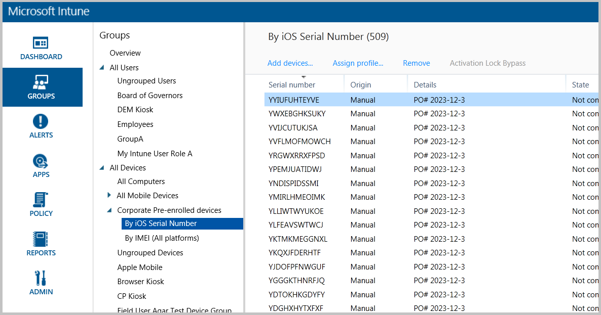

This lists serial numbers for both Apple DEP and Configurator enrollment in a single list. To reduce profile assignment mis-match (DEP profile to AC serial number and vice-versa), we have separated the serial numbers into two lists in the Azure portal:

**DEP serial numbers**
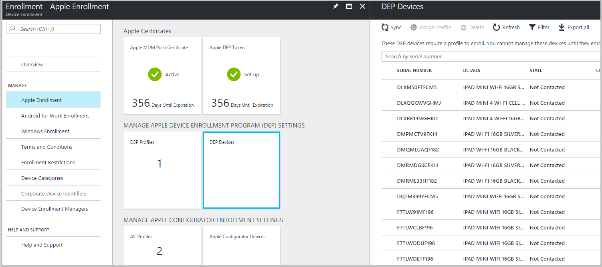

**Apple Configurator serial numbers**
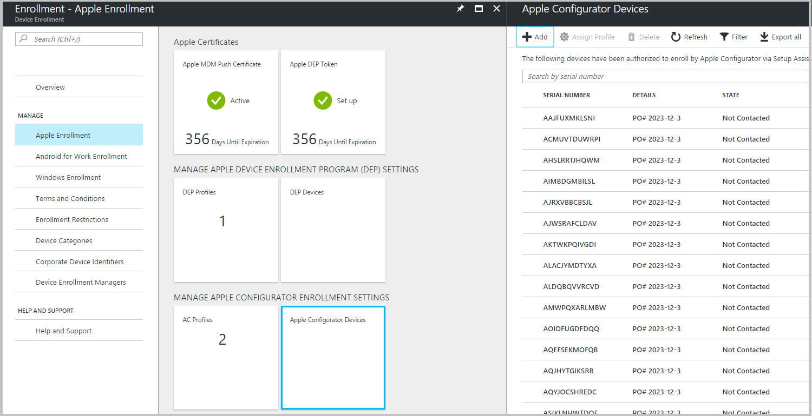

### By IMEI (all platforms)

In the classic portal, you can pre-list the IMEI numbers of devices to mark them as corporate when they enrolled to Intune:

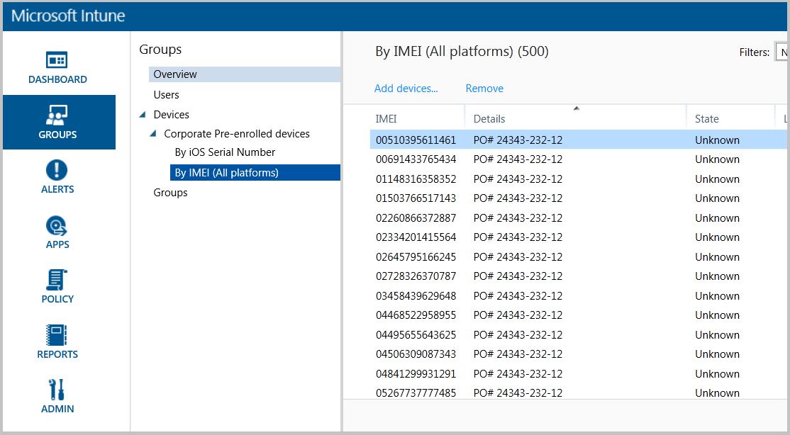

In the Azure portal, you must upload the same IMEI to the Corporate Device Identifiers list with a comma-separated-values (CSV) file. The new portal will not support manual entry of IMEI numbers:

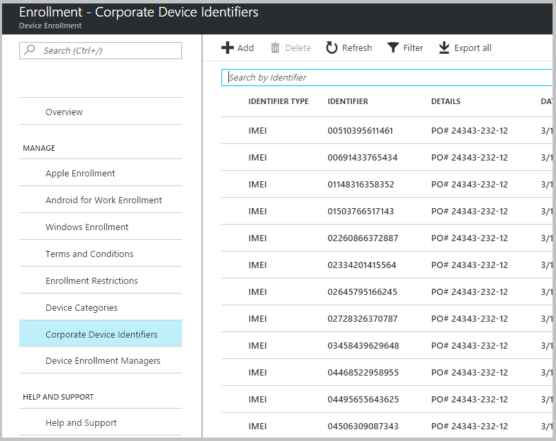

Intune in the Azure portal is future-proofed to support other types of identifiers beside IMEI, but currently only allows IMEI numbers for pre-listing.

## Where did Corporate Device Enrollment profiles go?
To enroll iOS devices through the Apple Device Enrollment Program or with the Apple Configurator tool, you must supply a Corporate Device Enrollment profile to be assigned the device. In the classic portal, the creation and management of these profiles was located in a single list:

This list shows profiles enabled for use with the Apple Device Enrollment Program (**DEP On**) and profile only enabled for use with the Apple Configurator tool (**DEP Off**).

To reduce confusion between the two profile types and potential mis-matched assignments (DEP profile to Configurator devices and vice-versa), we have separated creation and management of Enrollment Program profiles (support both Apples Device Enrollment Program and Apple School Manager) and Apple Configurator profiles:

**DEP profiles**
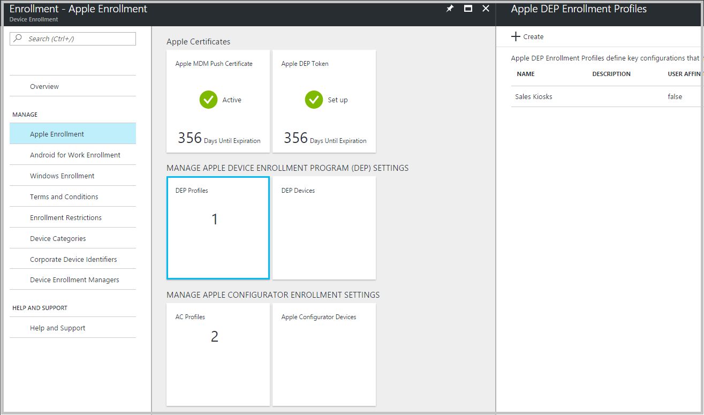

**Apple Configurator profiles**

