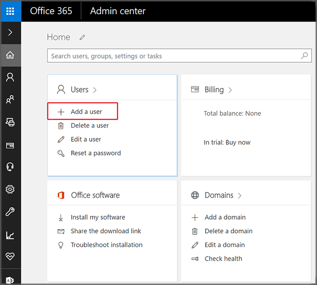
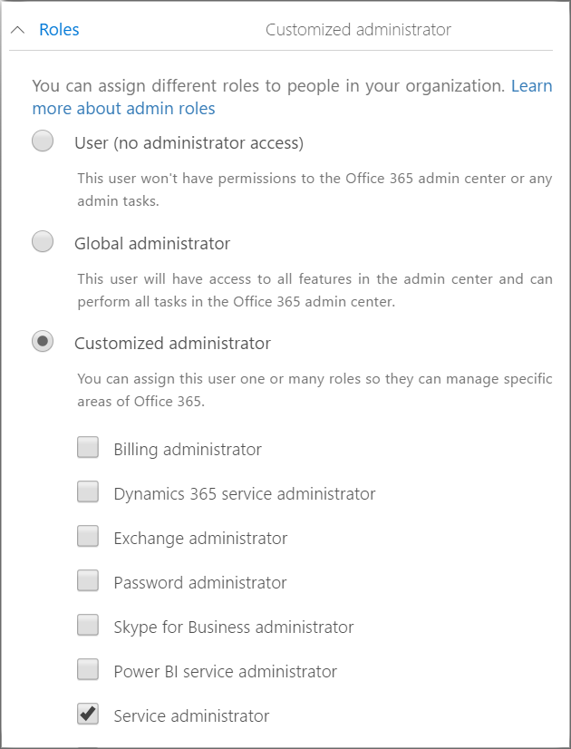

---
# required metadata

title: Add users and grant permissions
description:  Synchronize on-premises users with Azure AD and grant administrator permissions for your Intune subscription
keywords:
author: nathbarn
ms.author: nathbarn
manager: angrobe
ms.date: 06/07/2017
ms.topic: get-started-article
ms.prod:
ms.service: microsoft-intune
ms.technology:
ms.assetid: 6e9ec662-465b-4ed4-94c1-cff0fe18f126

# optional metadata

#ROBOTS:
#audience:
#ms.devlang:
ms.reviewer: angrobe
ms.suite: ems
#ms.tgt_pltfrm:
ms.custom: intune-classic

---

# Add users and give administrative permission to Intune

[!INCLUDE[both-portals](./includes/note-for-both-portals.md)]

This topic tells administrators how they can add users to Intune and what administrative permissions are available in the Intune service.

As an administrator, you can add users directly or synchronize users from your on-premises Active Directory. Once added, users can enroll devices and access company resources. You can also give users additional permissions including *tenant administrator*, *service administrator*, and *device enrollment manager permissions*.

## Add users to Intune
You can manually add users to your Intune subscription via the [Office 365 portal](https://www.office.com/signin), but they are not automatically assigned an Intune license. Instead, at a later time, an Intune tenant administrator must edit the user account to assign a license to the user from the Office 365 portal. For guidance, see [Add users individually or in bulk to the Office 365 portal](https://support.office.com/article/Add-users-individually-or-in-bulk-to-Office-365-Admin-Help-1970f7d6-03b5-442f-b385-5880b9c256ec).

  

## Grant Intune permissions

After you've added users to your Intune subscription, we recommend that you grant a few user accounts administrative permission. To administer Intune, you can give users three types of Intune permission:
-   [Tenant administrator](#tenant-administrator): Use the Office 365 portal to assign this type of administrator to manage your subscription, including billing, cloud storage, and managing the users who can use Intune.
-   [Service administrator](#service-administrator): Use the Microsoft Intune administrator console to assign this type of administrator for day-to-day tasks including device and computer management, deploying policy and apps, and running reports.
-   [Device enrollment managers](#device-enrollment-managers): Use the Microsoft Intune administrator console to assign this type of administrator for day-to-day tasks including device and computer management, deploying policy and apps, and running reports.

### Tenant administrator

Tenant administrators are assigned one administrator role, which defines the administrative scope for that user and the tasks they can manage. Administrator roles are common between the different Microsoft cloud services, although some services might not support some roles. Intune uses the following roles:

- **Global administrator** - Accesses all administrative features in Intune. By default the person who signs up for Intune becomes a Global admin. Global admins are the only admins who can assign other admin roles. You can have more than one global admin in your organization. As a best practice we recommend that only a few people in your company have this role to reduce the risk to your business.
- **Billing administrator** - Makes purchases, manages subscriptions, manages support tickets, and monitors service health.
- **Password administrator** - Resets passwords, manages service requests, and monitors service health. Password admins are limited to resetting passwords for users.
- **Service support administrator** - Opens support requests with Microsoft, and views the service dashboard and message center. They have “view only” permissions except for opening support tickets and reading them.
- **User management administrator** - Resets passwords, monitors service health, adds and deletes user accounts, and manages service requests. The user management admin can’t delete a global admin, create other admin roles, or reset passwords for billing, global, and service admins.

By default, the account you use to create your Microsoft Intune subscription is a tenant administrator with the global administrator role. As a tenant administrator, you use the Intune administrator console to manage your subscription for Intune and assign tenant administrators from the [Office 365 portal](http://go.microsoft.com/fwlink/p/?LinkId=698854). Use a tenant administrator with the global administration role to access the portal and assign your first service administrator. As a best practice, do not use a tenant administrator for day-to-day management tasks. A tenant administrator does not require a license to Intune to access the Intune administrator console. The tenant administrator is a common concept between Microsoft cloud services. When you subscribe to Intune, your service is a tenant of Azure AD. See the Azure AD tenant section in [What is an Azure AD directory?](http://technet.microsoft.com/library/jj573650.aspx) for more information.

As a tenant administrator, use the [Office 365 portal](http://go.microsoft.com/fwlink/p/?LinkId=698854) to manage your subscription, including the following tasks, when permitted by your administrator role:

- Manage user accounts and configure directory synchronization from your on-premises Active Directory
- Manage groups of users, called security groups
- Assign users licenses for Intune
- Configure the domain name for your subscription used when users sign in (i.e. contoso.com)
- Manage billing and purchases including licenses and cloud storage space
- Find links to view the health of the Intune service

To access the Office 365 portal, your account must have a sign-in status of **Allowed**. This status is different from having a license to the subscription. By default, all user accounts are **Allowed**. Users without administrator permissions can use the Office 365 portal to reset Intune passwords.

### Service administrator

By default, Intune does not assign a service administrator. Instead, you must use a tenant administrator with the global administrator role to assign the first service administrator for your subscription. As a service administrator, you use the Intune portal to manage day-to-day tasks for Intune. You assign service administrators from the administrator console. A service administrator requires a license to Intune to access the administration console.

Service administrators are assigned one of the following permissions:
- **Full access**: Unrestricted access to all areas of the Intune administrator console, add and manage other service administrators
- **Read-only access**: Read permission to all areas of the Intune administrator console, cannot modify data, but can run reports
- **Helpdesk - Groups Node**: Lets the service administrator perform only tasks associated with helpdesk scenarios, see [Help desk operators](help-desk-operators.md) ([Classic console](/intune-classic/deploy-use/control-what-admins-can-see-in-the-microsoft-intune-admin-console))

As a service administrator, use this portal to manage day-to-day operations including:

- Create and manage policies for computers and mobile devices
- Upload and deploy software updates and apps
- Manage Endpoint Protection on computers
- View device status and run reports

### Device enrollment managers

Device enrollment managers are standard user accounts with additional permission to enroll more many userless devices. By default, each Intune user can enroll up to fifteen devices. As an administrator, you can give a user account the device enrollment manager permission. That account can enroll large numbers of corporate-owned devices. This is useful when the devices might be assigned to users on a temporary basis, or might serve in a kiosk mode where a user-to-device association is not required. For more information, see [Device enrollment manager](device-enrollment-manager-enroll.md) ([Classic console](/intune-classic/deploy-use/enroll-corporate-owned-devices-with-the-device-enrollment-manager-in-microsoft-intune)).

## Sync Active Directory and add users to Intune
You can configure directory synchronization to import user accounts from your on-premises Active Directory to Microsoft Azure Active Directory (Azure AD) which includes Intune users. Having your on-premises Active Directory service connected with all of your Azure Active Directory-based services makes managing user identity much simpler. You can also configure single sign-on features to make the authentication experience for your users familiar and easy. By linking the same [Azure AD tenant](https://azure.microsoft.com/documentation/articles/active-directory-aadconnect/) with multiple services, the user accounts that you have previously synchronized are available to all cloud-based services.

### How to sync on-premises users with Azure AD
The only tool that you need to synchronize your user accounts with Azure AD is the [Azure AD Connect wizard](https://www.microsoft.com/download/details.aspx?id=47594). The Azure AD Connect wizard provides a simplified and guided experience for connecting your on-premises identity infrastructure to the cloud.  Choose your topology and needs (single or multiple directories, password sync or federation), and the wizard will deploy and configure all components required to get your connection up and running. Including: sync services, Active Directory Federation Services (AD FS), and the Azure AD PowerShell module.

> [!TIP]
> Azure AD Connect encompasses functionality that was previously released as Dirsync and Azure AD Sync. Learn more about [directory integration](http://technet.microsoft.com/library/jj573653.aspx). To learn about the benefits of synchronizing user accounts from your local directory to Azure AD, see [Similarities between Active Directory and Azure AD](http://technet.microsoft.com/library/dn518177.aspx).
