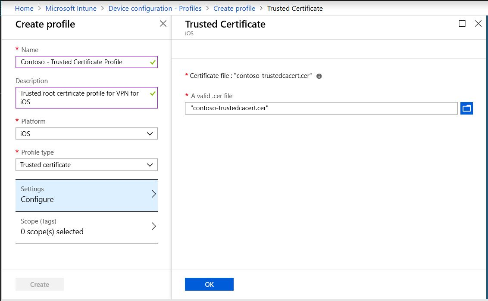
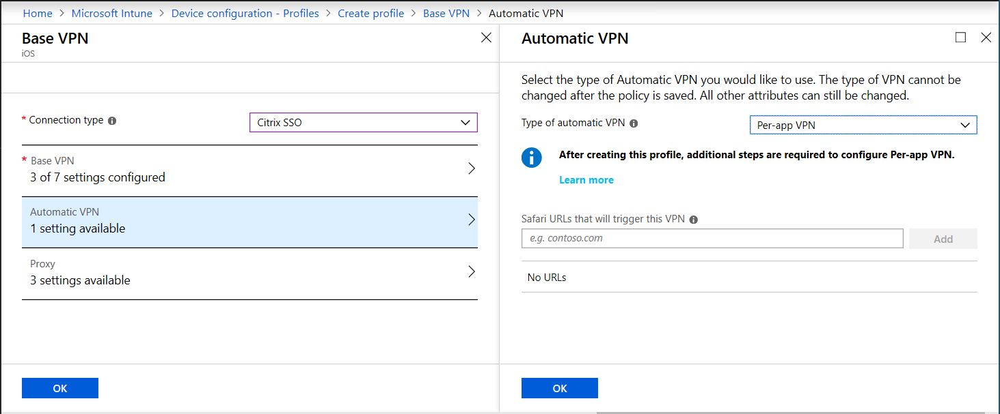

---
# required metadata

title: Set up per-app VPN for iOS devices in Microsoft Intune - Azure | Microsoft Docs
description: See the prerequisites, create a group for the virtual private network (VPN) users, add a SCEP certificate profile, configure a per-app VPN profile, and assign some apps to the VPN profile in Microsoft Intune on iOS devices. Also lists the steps to verify the VPN connection on the device.
keywords:
author: MandiOhlinger
ms.author: mandia
manager: dougeby
ms.date: 02/04/2019
ms.topic: article
ms.prod:
ms.service: microsoft-intune
ms.technology:
ms.assetid: D9958CBF-34BF-41C2-A86C-28F832F87C94

# optional metadata

#ROBOTS:
#audience:
#ms.devlang:
ms.reviewer: tycast
ms.suite: ems
search.appverid: MET150
#ms.tgt_pltfrm:
ms.custom: intune-azure
ms.collection: M365-identity-device-management
---

# Set up per-app Virtual Private Network (VPN) for iOS devices in Intune

In Microsoft Intune, you can create and use Virtual Private Networks (VPNs) assigned to an app. This feature is called "per-app VPN". You choose the managed apps that can use your VPN on devices managed by Intune. When using a per-app VPNs, end users automatically connect through the VPN, and get access to organizational resources, such as documents.

This feature applies to:

- iOS 9 and later

Check your VPN provider's documentation to see if your VPN supports per-app VPN.

This article shows you how to create a per-app VPN profile, and assign this profile to your apps. Use these steps to create a seamless per-app VPN experience for your end users. For most VPNs that support per-app VPN, the user opens an app, and automatically connects to the VPN.

Some VPNs allow username and password authentication with per-app VPN. Meaning, users need to enter a username and password to connect to the VPN.

## Per-app VPN with Zscaler

Zscaler Private Access (ZPA) integrates with Azure Active Directory (Azure AD) for authentication. When using ZPA, you don't need the [trusted certificate](#create-a-trusted-certificate-profile) or [SCEP or PKCS certificate](#create-a-scep-or-pkcs-certificate-profile) profiles (described in this article). If you have a per-app VPN profile set up for Zscaler, opening one of the associated apps doesn't automatically connect to ZPA. Instead, the user needs to sign into the Zscaler app first. Then, remote access is limited to the associated apps.

## Prerequisites for per-app VPN

> [!IMPORTANT]
> Your VPN vendor may have other requirements for per-app VPN, such as specific hardware or licensing. Be sure to check with their documentation, and meet those prerequisites before setting up per-app VPN in Intune.

To prove its identity, the VPN server presents the certificate that must be accepted without a prompt by the device. To confirm the automatic approval of the certificate, create a trusted certificate profile that contains the VPN server's root certificate issued by the Certification Authority (CA). 

#### Export the certificate and add the CA

1. On your VPN server, open the administration console.
2. Confirm that your VPN server uses certificate-based authentication. 
3. Export the trusted root certificate file. It has a .cer extension, and you add it when creating a trusted certificate profile.
4. Add the name of the CA that issued the certificate for authentication to the VPN server.

    If the CA presented by the device matches a CA in the Trusted CA list on the VPN server, then the VPN server successfully authenticates the device.

## Create a group for your VPN users

Create or choose an existing group in Azure Active Directory (Azure AD) for the users or devices that use per-app VPN. To create a new group, see [Add groups to organize users and devices](groups-add.md).

## Create a trusted certificate profile

Import the VPN server's root certificate issued by the CA into a profile created in Intune. The trusted certificate profile instructs the iOS device to automatically trust the CA that the VPN server presents.

1. In the [Azure portal](https://portal.azure.com), select **All services** > filter on **Intune** > select **Intune**.
2. Select **Device configuration** > **Profiles** > **Create profile**.
3. Enter the following properties:
    - **Name**
    - **Description**
    - **Platform**: Select **iOS**.
    - **Profile type**: Select **Trusted certificate**.
4. Select the folder icon, and browse to your VPN certificate (.cer file) that you exported from your VPN administration console. 
5. Select **OK** > **Create**.

    

## Create a SCEP or PKCS certificate profile

The trusted root certificate profile allows the device to automatically trust the VPN Server. The SCEP or PKCS certificate provides credentials from the iOS VPN client to the VPN server. The certificate allows the device to silently authenticate without prompting for a username and password. 

To configure and assign the client authentication certificate, see one of the following articles:

- [Configure and manage SCEP certificates with Intune](certificates-scep-configure.md)
- [Configure and manage PKCS certificates with Intune](certficates-pfx-configure.md)

Be sure to configure the certificate for client authentication. You can set this directly in SCEP certificate profiles (**Extended key usage** list > **Client authentication**). For PKCS, set client authentication in the certificate template in the certificate authority (CA).

## Create a per-app VPN profile

The VPN profile contains the SCEP or PKCS certificate with the client credentials, the connection information to the VPN, and the per-app VPN flag to enable the per-app VPN feature uses by the iOS application.

1. In **Intune**, select **Device configuration** > **Profiles** > **Create profile**. 
2. Enter the following properties: 
    - **Name**
    - **Description**
    - **Platform**: Select **iOS**.
    - **Profile type**: Select **VPN**.
3. In **Connection type**, select your VPN client app.
4. Select **Base VPN**. [iOS VPN settings](vpn-settings-ios.md) lists and describes all the settings. When using per-app VPN, be sure you set the following properties as listed: 
    
    - **Authentication method**: Select **Certificates**. 
    - **Authentication certificate**: Select an existing SCEP or PKCS certificate > **OK**.      
    - **Split tunneling**: Select **Disable** to force all traffic to use the VPN tunnel when the VPN connection is active. 

      

    For information on the other settings, see [iOS VPN settings](vpn-settings-ios.md).

5. Select **Automatic VPN** > **Type of automatic VPN** > **Per-app VPN**

    

6. Select **OK** > **OK** > **Create**.

## Associate an app with the VPN profile

After adding your VPN profile, associate the app and Azure AD group to the profile.

1. In **Intune**, select **Client apps** > **Apps**.
2. Select an app from the list > **Assignments** > **Add group**.
3. In **Assignment type**, select **Required** or **Available for enrolled devices**.
4. Select **Included groups** > **Select groups to include** > Select the group [you created](#create-a-group-for-your-vpn-users) (in this article) > **Select**.
5. In **VPNs**, select the per-app VPN profile [you created](#create-a-per-app-vpn-profile) (in this article).

    

6. Select **OK** > **Save**.

An association between an app and a profile is removed during the next device check-in, when all of the following conditions exist:

- The app was targeted with required install intent.
- Both the profile and the app are targeted to the same group.
- You remove the per-app VPN configuration from the app assignment.

An association between an app and a profile persists until the user requests a reinstall from Company Portal, when all of the following conditions exist:

- The app was targeted with available install intent.
- Both the profile and the app are targeted to the same group.
- The end user requested app install from Company Portal, which results in app and profile being installed on the device.
- You remove or change the per-app VPN configuration from the app assignment.

## Verify the connection on the iOS device

With your per-app VPN set-up and associated with your app, verify the connection works from a device.

### Before you attempt to connect

 - Make sure you deploy all of the above mentioned policies to the same group. Otherwise, the per-app VPN experience won't work.
 - If you're using the Pulse Secure VPN app or a custom VPN client app, you can choose to use app-layer or packet-layer tunneling. Set the **ProviderType** value to **app-proxy** for app-layer tunneling, or **packet-tunnel** for packet-layer tunneling. Check your VPN provider's documentation to make sure you're using the right value.

### Connect using the per-app VPN

Verify the zero-touch experience by connecting without having to select the VPN or type your credentials. The zero-touch experience means:

 - The device doesn't ask you to trust the VPN server. That is, the user doesn't see the **Dynamic Trust** dialog box.
 - The user doesn't have to type credentials.
 - The user's device is connected to the VPN when the user opens one of the associated apps.

<!-- ## Troubleshooting the per-app VPN

The user experiences the feature by silently connecting to the VPN. This experience, however, can provide little information for troubleshooting. You can review the event logs crated by the iOS device.

`Note -- use the Apple Configurator as the supported tool. Only runs on a mac.'

To review event logs:

1. Connect your iOS device to a PC
2. Open the **iPhone Configuration Utility** (IPCU). If you do not have a copy, you can install it from [CompatCenter](http://www.microsoft.com/en-us/windows/compatibility/CompatCenter/ProductDetailsViewer?Name=iPhone%20Configuration%20Utility&vendor=Apple&Locale=1033%2C2057%2C3081%2C4105%2C16393&ModelOrVersion=3&BreadCrumbPath=iphone%20configuration%20utility&LastSearchTerm=iphone%2Bconfiguration%2Butility&Type=Software&tempOsid=Windows%208.1)
3. Review the logs. -->

## Next steps

- To review iOS settings, see [VPN settings for iOS devices in Microsoft Intune](vpn-settings-ios.md).
- To learn more about VPN setting and Intune, see [configure VPN settings in Microsoft Intune](vpn-settings-configure.md).
