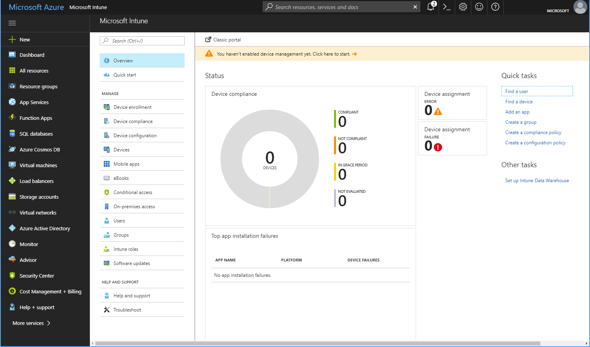

---
# required metadata

title: Introduction to Intune in the Azure portal preview
titleSuffix: "Intune Azure preview"
description: "Intune Azure preview: Get the basics about Intune in the Azure portal preview, and how it can help you manage your devices."
keywords:
author: robstackmsft
ms.author: robstack
nmanager: angrobe
ms.date: 04/24/2017
ms.topic: get-started-article
ms.prod:
ms.service: microsoft-intune
ms.technology:
ms.assetid: 4a085264-232a-4af0-97f1-747496c44517

# optional metadata

#ROBOTS:
#audience:
#ms.devlang:
#ms.reviewer:
ms.suite: ems
#ms.tgt_pltfrm:
ms.custom: intune-azure

---

# Introduction to Microsoft Intune in the Azure portal preview

[!INCLUDE[azure_preview](./includes/azure_preview.md)]

Microsoft Intune is moving to the Azure portal and this means that the workflows and functionality you are used to will change.
The new portal offers you a preview of new and updated functionality in the Azure portal where you can manage your organization's mobile devices, PCs, and apps.
All Intune functionality will eventually move to Azure, but you can perform many Intune tasks in the Azure portal today. Because this new experience is in preview, some functionality might not yet be present in the portal. Review the [What’s new](#whats-new) section for details.

> [!IMPORTANT]
> **Don’t see the new portal yet?** 
> We’ve already begun to roll out the preview to select tenants. Existing tenants will be migrated to the new experience starting in early calendar year 2017. You will receive a notification in the Office Message Center prior to your tenant’s migration.
>
> Intune accounts created before January 2017 will require a one-time migration before Apple Enrollment workflows are available in Azure. The schedule for migration has not been announced yet, but details will be made available as soon as possible. We strongly recommend creating a trial account to test out the new experience if your existing account cannot access the preview.

You'll find new product documentation in this library, and it will be continually updated during the preview. If you have suggestions you'd like to see, please leave feedback in the topic comments. We'd love to hear from you.

<!--- You can view the new Intune technical preview console in Azure at [portal.azure.com]. --->

Highlights of the new experience include:

- An integrated console for all your Enterprise Mobility + Security (EMS) components
- An HTML-based console built on web standards
- Microsoft Graph API support to automate many actions
- Azure Active Directory (AD) groups to provide compatibility across all your Azure applications
- Support for most modern web browsers

If you are looking for documentation for the classic Intune console, see [the Intune documentation library](https://docs.microsoft.com/intune-classic/).

## Before you start

To use Intune in the Azure portal, you must have an Intune admin and tenant account. [Sign up for an account](https://portal.office.com/Signup/Signup.aspx?OfferId=40BE278A-DFD1-470a-9EF7-9F2596EA7FF9&dl=INTUNE_A&ali=1#0%20) if you don't already have one.

## Supported web browsers for the Azure portal

The Azure portal runs on most modern PCs, Macs, and tablets. Mobile phones are not supported.
Currently, the following browsers are supported:

- Microsoft Edge (latest version)
- Microsoft Internet Explorer 11
- Safari (latest version, Mac only)
- Chrome (latest version)
- Firefox (latest version)

Check the [Azure portal](https://docs.microsoft.com/azure/azure-preview-portal-supported-browsers-devices) for the latest information about supported browsers.

## What's in this library?

The documentation reflects the layout of the Intune portal to make it easier to find the information you need.

### Introduction and get started
This section contains information about [what's new](whats-new.md), [known issues](known-issues.md), [how to get support](get-support.md) and how to [get started with a free trial](free-trial-sign-up.md) of Intune.
### Plan and design
Information to help you [plan and design](/intune-classic/plan-and-design/introduction) your Intune environment.
### Device enrollment
[How to get your devices managed by Intune](device-enrollment.md).
### Device compliance
[Define a compliance level for your devices, then report about any devices which are not compliant](device-compliance.md).
### Device configuration
[Understand the profiles you can use to configure settings and features on devices you manage](device-profiles.md).
### Devices
[Get to know the devices you manage with inventory and reports](device-management.md).
### Mobile apps
[How to publish, manage, configure, and protect apps](app-management.md).
### Conditional access
[Restrict access to Exchange services depending on conditions you specify](conditional-access.md).
### On-premises access
[Configure access to Exchange ActiveSync, and Exchange on-premises](/intune-classic/deploy-use/mobile-device-management-with-exchange-activesync-and-microsoft-intune)
### Users
[Learn about the users of devices you manage and sort resources into groups](user-management.md).
### Groups
[Learn about how you can use Azure Active Directory groups with Intune](groups-get-started.md)
### Intune roles
[Control who can perform various Intune actions, and who those actions apply to](role-based-access-control.md). You can either use the built-in roles that cover some common Intune scenarios, or you can create your own roles.
### Software updates
[Learn about how to configure software updates for Windows 10 devices](windows-update-for-business-configure.md).

## What's new?

[Find out what's new in the preview release](whats-new.md).
