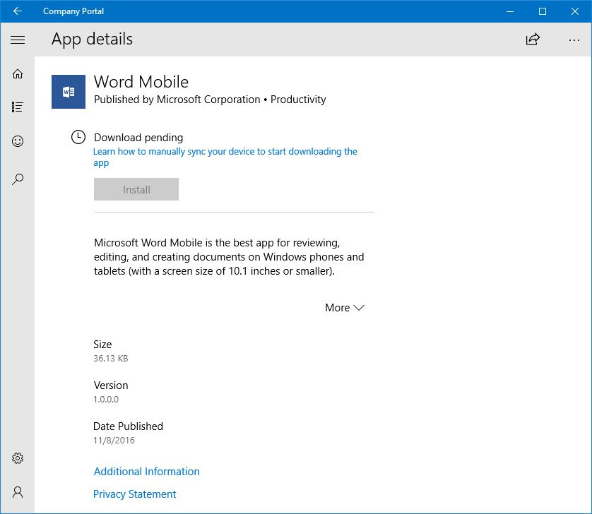
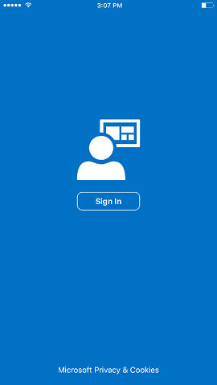
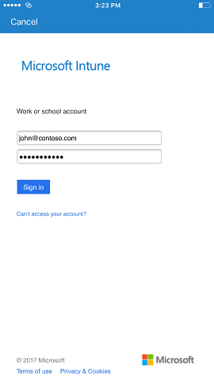
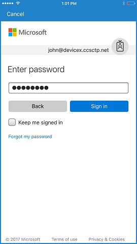
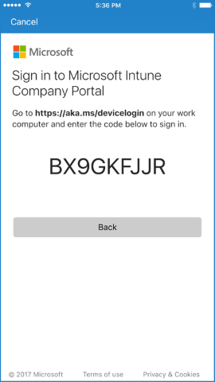
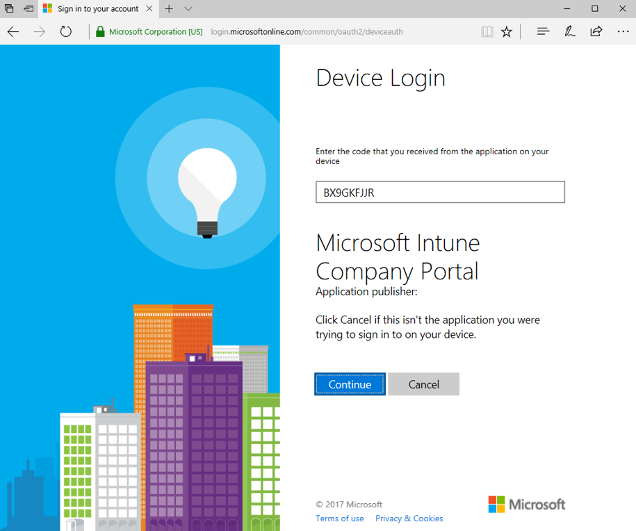
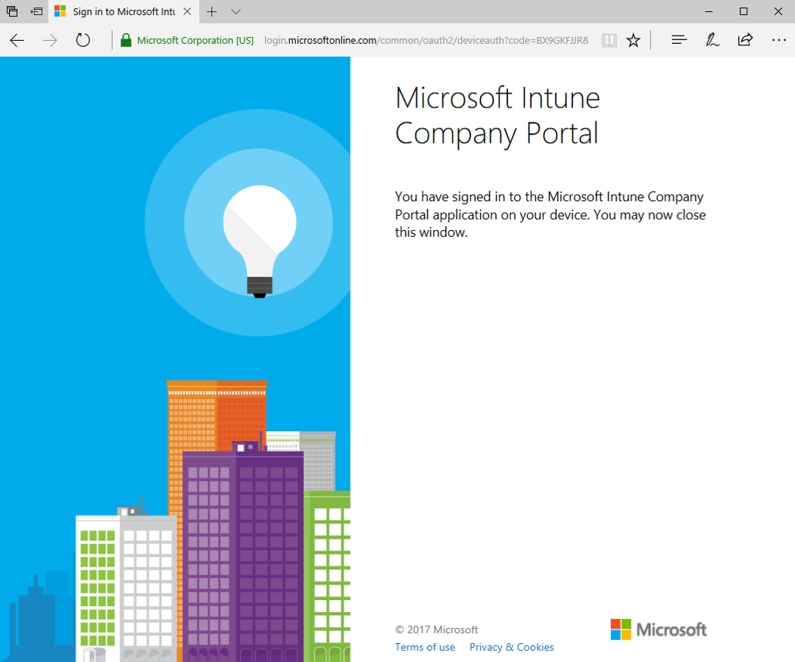

---
# required metadata

title: UI updates for Intune end user apps
description: "Find out what has changed in UI for apps that work on end user devices with Intune."
keywords:
author: barlanmsft
ms.author: barlan
manager: angrobe
ms.date: 06/21/2017
ms.topic: article
ms.prod:
ms.service: microsoft-intune
ms.technology:
ms.assetid: b782e382-8deb-48a7-a437-d7c5a17163f1

# optional metadata

#ROBOTS:
#audience:
#ms.devlang:
ms.reviewer: priyar
ms.suite: ems
#ms.tgt_pltfrm:
ms.custom: intune-classic

---
# UI updates for Intune end user apps
Learn what updates we've made to the UI for apps that your end users will see in this release of Microsoft Intune. This can help you with user communications and any updating custom documentation that you've created to support your deployment. It can also help you understand how to better troubleshoot any issues they're facing should they call helpdesk for support using the Company Portal.

## Week of June 12, 2017

### Improvements to app syncing with Windows 10 Creators Update <!--676505-->

The Company Portal app for Windows 10 will now automatically initiate a sync for app install requests for devices with Windows 10 Creators Update (version 1703). This will reduce the issue of app installs stalling during the "Pending Sync" state. In addition, users will be able to manually initiate a sync from within the app.

### New menu action to easily remove Company Portal <!--1164569-->
Based on user feedback, the Company Portal app for Android has added a new menu action to initiate the removal of Company Portal from your device. This action removes the device from Intune management so that the app can be removed from the device by the user.

## Week of June 5, 2017

### Improvements to the app tiles in the Company Portal app for iOS
We updated the design of the app tiles on the homepage to reflect the branding color you set for the Company Portal.

**Before**

**After**

### Account picker now available for the Company Portal app for iOS
If users have used their work or school account to sign in to other Microsoft apps on their iOS device, then they may see our new account picker when signing into the Company Portal for the first time.

## April 2017

### New icons for the Managed Browser and the Company Portal <!--918433, 918431-->

The Managed Browser is receiving updated icons for both the Android and iOS versions of the app. The new icon will contain the updated Intune badge to make it more consistent with other apps in Enterprise Mobility + Security (EM+S).

<html>
<body>
   <table id="wrapper">
      <tr>
         <td>
            
          </td>
          <td>
             
           </td>
      </tr>
   </table>
</body>
</html>

The Company Portal is also receiving updated icons for the Android, iOS, and Windows versions of the app to improve consistency with other apps in EM+S. These icons will be gradually released across platforms from April to late May.

### Sign-in progress indicator in Android Company Portal <!--953374-->

An update to the Android Company Portal app shows a sign-in progress indicator when the user launches or resumes the app. The indicator progresses through new statuses, beginning with "Connecting...", then "Signing in...", then "Checking for security requirements..." before allowing the user to access the app.

<html>
<body>
   <table id="wrapper">
      <tr>
         <td>
            
          </td>
          <td>
             
           </td>
           <td>
              
           </td>
      </tr>
   </table>
</body>
</html>

### Improved app install status for the Windows 10 Company Portal app <!--676495-->
The Windows 10 Company Portal app now provides an install progress bar on the app details page. This is supported for modern apps on devices running the Windows 10 Anniversary Update and up..

__Before__
  

__After__
  

## February 2017

### New user experience for the Company Portal app for Android <!--621622, announced 1702-->
Beginning in March, the Company Portal app for Android will follow [material design guidelines](https://material.io/guidelines/material-design/introduction.html) to create a more modern look and feel. This improved user experience includes:

* __Colors__: tab headers can be colored according to your custom color palette.

* __Interface__: __Featured Apps__ and __All Apps__ buttons have been updated in the __Apps__ tab. The __Search__ button is now a floating action button.

* __Navigation__: All Apps shows a tabbed view of __Featured__, __All__ and __Categories__ for easier navigation. __Contact IT__ has been streamlined for improved readability.

<html>
<body>
   <table id="wrapper">
      <tr>
         <td>
            
          </td>
      </tr>
   </table>
</body>
</html>

## January 2017

### Modernizing the Company Portal website <!--753980, announced 1701-->
Beginning in February, the Company Portal website will support apps that are targeted to users who do not have managed devices. The website will align with other Microsoft products and services by using a new contrasting color scheme, dynamic illustrations, and a "hamburger menu,"  which will contain helpdesk contact details and information on existing managed devices. The landing page will be rearranged to emphasize apps that are available to users, with carousels for Featured and Recently Updated apps.

## Coming soon in the UI
These are the plans for ways we will be improving the user experience by updating our user interface.

> [!Note]
> Please note that the images below may be previews, and the announced product may differ from the presented versions.

### Improved sign in experience across Company Portal apps for all platforms <!--User Story 1132123-->

We are announcing a change that is coming in the next few months that will improve the sign in experience for the Intune Company Portal apps for Android, iOS, and Windows. The new user experience will automatically appear across all platforms for the Company Portal app when Azure AD makes this change. In addition, users can now sign in to the Company Portal from another device with a generated, single-use code. This is especially useful in cases when users need to sign in without credentials.  

Below you can see the previous sign in experience, the new sign in experience with credentials, and the new sign in experience from another device.

__Previous sign in experience__

__New sign in experience__

__New sign in experience when signing in from another device__

Tap the __Sign in from another device__ link.

Launch a browser and go to [https://aka.ms/devicelogin](https://aka.ms/devicelogin).

Enter the code you saw in the Company Portal app. When you select __Continue__, you will be able to authenticate in the using any method that is supported by your company, such as a smartcard.

The Company Portal app will begin signing in.

### See also
* [Microsoft Intune Blog](http://go.microsoft.com/fwlink/?LinkID=273882)
* [Cloud Platform roadmap](https://www.microsoft.com/server-cloud/roadmap/Indevelopment.aspx?TabIndex=0&dropValue=Intune)
* [What's new in Intune](https://docs.microsoft.com/intune/whats-new)
