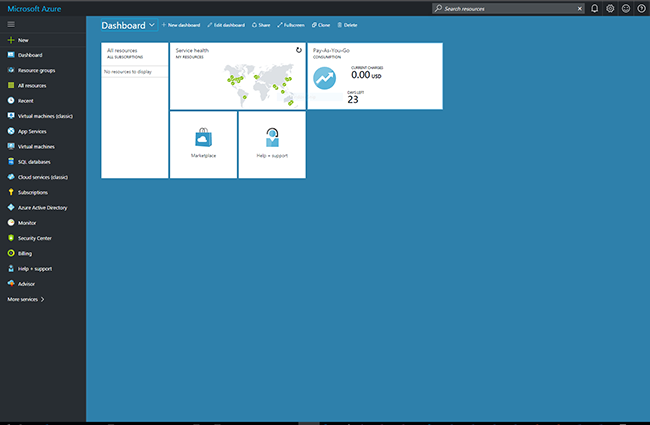
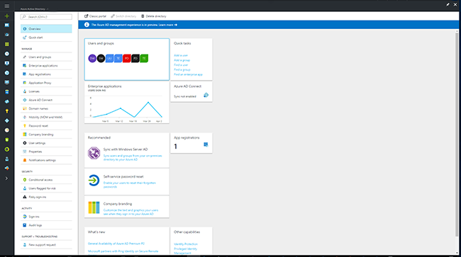
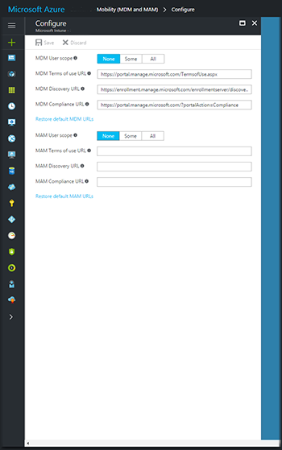
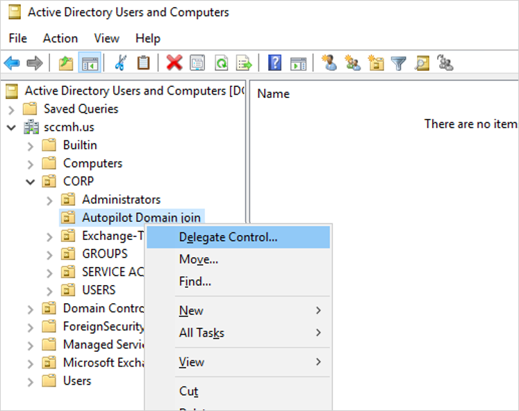
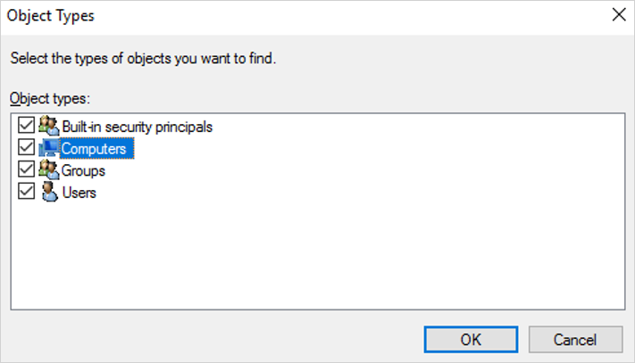

---
# required metadata

title: Enrollment for hybrid Active Directory joined devices - Windows Autopilot
titleSuffix: 
description: Use Windows Autopilot to enroll hybrid Active Directory joined devices in Microsoft Intune.
keywords:
author: ErikjeMS
ms.author: erikje
manager: dougeby
ms.date: 12/06/2018
ms.topic: article
ms.prod:
ms.service: microsoft-intune
ms.technology:
ms.assetid: 8518d8fa-a0de-449d-89b6-8a33fad7b3eb
 
# optional metadata
 
#ROBOTS:
#audience:
#ms.devlang:
ms.reviewer: damionw
ms.suite: ems
search.appverid: MET150
#ms.tgt_pltfrm:
ms.custom: seodec18
 
---
 

# Deploy hybrid Azure AD joined devices using Intune and Windows Autopilot (Preview)
You can use Intune and Windows Autopilot to set up hybrid Azure Active Directory joined devices. To do so, follow the steps below.

> [!NOTE]
> This feature is rolling out across the user base over the next few days. Therefore, you might not be able to follow these steps until it rolls out to your account.

## Prerequisites

- Successfully configure [hybrid Azure Active Directory join devices](https://docs.microsoft.com/azure/active-directory/devices/hybrid-azuread-join-plan).
    - Make sure to [verify the registration by using the Get-MsolDevice cmdlet]( https://docs.microsoft.com/azure/active-directory/devices/hybrid-azuread-join-managed-domains#verify-the-registration).

The devices to be enrolled must also:
- Be running Windows 10 with the [October 2018 update](https://blogs.windows.com/windowsexperience/2018/10/02/how-to-get-the-windows-10-october-2018-update/).
- Have access to the internet.
- Have access to your Active Directory (VPN connection not supported).
- Go through the Out-of-Box Experience (OOBE).

## Set up Windows 10 automatic enrollment

1. Sign in to the [Azure portal](https://portal.azure.com), and select **Azure Active Directory**.

   

2. Select **Mobility (MDM and MAM)**.

   

3. Select **Microsoft Intune**.

   

4. Make sure that the users deploying Azure Active Directory joined devices using Intune and Windows are members of a group included in your **MDM User scope**.

   

5. Use the default values for the following URLs:
    - **MDM Terms of use URL**
    - **MDM Discovery URL**
    - **MDM Compliance URL**
6. Choose **Save**.

## Increase the computer account limit in the Organizational Unit

The Intune Connector for Active Directory creates Autopilot enrolled computers in the On-Premises Active directory domain. The computer hosting the Intune Connector must have the rights to create the computer objects within the domain. 

On some domains, computers are not granted the rights to create computers. Additionally, domains have a built in limit (default of 10) that applies to all users and computers that aren't delegated rights to create Computer Objects. Therefore, the rights need to be delegated to computers hosting the Intune connector on the organizational unit where Hybrid Azure AD joined devices are created.

The organizational unit granted the right to create computers must match:
- the organizational unit entered in the Domain Join profile
- or, if no profile is selected, the computer's domain name for your domain.

1. Open **Active Directory Users and Computers** (DSA.msc).

2. Right-click the organizational unit you'll use to create Hybrid Azure AD joined computers > **Delegate Control**.

    

3. In the **Delegation of Control** wizard, choose **Next** > **Add...** > **Object Types**.

4. In the **Object Types** dialog box, check **Computers**, and then choose **OK**.

    

5. In the **Select Users, Computers, or Groups** dialog box, in the **Enter the object names to select** box, enter the name of the computer where the Connector is installed.

    

6. Choose **Check Names** to validate your entry, then choose **OK** > **Next**.

7. Choose **Create a custom task to delegate** > **Next**.

8. Choose **Only the following objects in the folder** and then check the following options:
    - **Computer objects**
    - **Create selected objects in this folder**
    - **Delete selected objects in this folder**

    
    
9. Choose **Next**.

10. Under **Permissions**, check **Full Control** (this will check all other options) > **Next** > **Finish**.

    

## Install the Intune Connector

The Intune Connector for Active Directory needs to be installed on a computer running Windows Server 2016 that has access to the Internet and your Active Directory. To increase scale and availability or to support multiple Active Directory domains, you can install multiple connectors in your environment. We recommend installing the connector on a server that is not running any other Intune connectors.

1. Make sure that you have a language pack installed and configured as described in [Intune Connector (Preview) language requirements](https://docs.microsoft.com/windows/deployment/windows-autopilot/intune-connector).
2. In [Intune](https://aka.ms/intuneportal), choose **Device enrollment** > **Windows enrollment** > **Intune Connector for Active Directory (Preview)** > **Add connector**. 
3. Follow the instructions to download the connector.
4. Open the downloaded connector setup file to install the connector (ODJConnectorBootstrapper.exe).
5. At the end of setup, choose **Configure**.
6. Choose **Sign In**.
7. Enter user Global Administrator or Intune Administrator role credentials.
8. Go to **Device enrollment** > **Windows enrollment** > **Intune Connector for Active Directory (Preview)** and confirm the connection status is **Active**.

### Configure web proxy settings

If you have a web proxy in your networking environment, follow the instructions here so that the Intune Connector for Active Directory works properly: [Work with existing on-premises proxy servers](https://docs.microsoft.com/azure/active-directory/manage-apps/application-proxy-configure-connectors-with-proxy-servers).

## Create a device group
1. In [Intune](https://aka.ms/intuneportal), choose **Groups** > **New group**.
2. In the **Group** blade:
    1. For **Group type**, choose **Security**.
    2. Type a **Group name** and **Group description**.
    3. Choose a **Membership type**.
3. If you chose **Dynamic Devices** for **Membership type** above, then in the **Group** blade, choose **Dynamic device members** and type any of the following code in the **Advanced rule** box.
    - If you want to create a group that includes all of your Autopilot devices, type `(device.devicePhysicalIDs -any _ -contains "[ZTDId]")`
    - If you want to create a group that includes all of your Autopilot devices with a specific order ID, type: `(device.devicePhysicalIds -any _ -eq "[OrderID]:179887111881") `
    - If you want to create a group that includes all of your Autopilot devices with a specific Purchase Order ID, type: `(device.devicePhysicalIds -any _ -eq "[PurchaseOrderId]:76222342342")`
    
    After adding the **Advanced rule** code, choose **Save**.
5. Choose **Create**.  

## Register your Autopilot devices

Choose one of the following ways to enroll your Autopilot  devices:

### Register Autopilot devices that are already enrolled

1. Create an Autopilot deployment profile with **Convert all targeted devices to Autopilot** set to **Yes**. 
2. Assign the profile to a group containing the members that you want to automatically register with Autopilot.

For more information, see [Create an Autopilot deployment profile](enrollment-autopilot.md#create-an-autopilot-deployment-profile).

### Register Autopilot devices that aren't enrolled

If your devices aren't yet enrolled, you can register them yourself. For more information, see [Add devices](enrollment-autopilot.md#add-devices).

### Register devices from an OEM

If you're buying new devices, some OEMs can register the devices for you. For more information, see the [Windows Autopilot page](http://aka.ms/WindowsAutopilot).

When Autopilot devices are registered (and before they are enrolled into Intune), you'll see them in three places (with names set to their serial numbers):
- Autopilot Devices blade in the Intune in the Azure portal (**Device enrollment** > **Windows enrollment** > **Devices**).
- Azure AD devices blade in the Intune in the Azure portal (**Devices** > **Azure AD Devices**).
- AAD All Devices blade in Azure Active Directory in the Azure portal (**Devices** > **All Devices**).

After Autopilot devices are enrolled, you'll see them in four places:
- Autopilot Devices Blade in the Intune in the Azure portal (**Device enrollment** > **Windows enrollment** > **Devices**).
- Azure AD devices blade in the Intune in the Azure portal (**Devices** > **Azure AD Devices**).
- AAD All Devices blade in Azure Active Directory in the Azure portal (**Devices** > **All Devices**).
- All Devices blade in the Intune in the Azure portal (**Devices** > **All Devices**).

After Autopilot devices are enrolled, their device names change to the hostname of the device. By default, it begins with "DESKTOP-".

## Create and assign an Autopilot deployment profile
Autopilot deployment profiles are used to configure the Autopilot devices.

1. In [Intune](https://aka.ms/intuneportal), choose **Device enrollment** > **Windows enrollment** > **Deployment Profiles** > **Create Profile**.
2. Type a **Name** and optional **Description**.
3. For **Deployment mode**, choose **User-driven**.
4. In the **Join to Azure AD as** box, choose **Hybrid Azure AD joined (Preview)**.
5. Choose **Out-of-box experience (OOBE)**, configure the options as needed, and then choose **Save**.
6. Choose **Create** to create the profile. 
7. In the profile blade, choose **Assignments**.
8. Choose **Select groups** > in the **Select groups** blade, choose the device group > **Select**.

It will take around 15 minutes for the device profile status to change from **Not assigned** to **Assigning** and finally to **Assigned**.

## Turn on the enrollment status page (optional)

1. In [Intune](https://aka.ms/intuneportal), choose **Device enrollment** > **Windows enrollment** > **Enrollment Status Page (Preview)**.
2. In the **Enrollment Status Page** blade, choose **Default** > **Settings**.
3. For **Show app and profile installation progress**, choose **Yes**.
4. Configure the other options as needed.
5. Choose **Save**.

## Create and assign a Domain Join profile

1. In [Intune](https://aka.ms/intuneportal), choose **Device configuration** > **Profiles** > **Create Profile**.
2. Enter the following properties:
   - **Name**: Enter a descriptive name for the new profile.
   - **Description**: Enter a description for the profile.
   - **Platform**: Choose **Windows 10 and later**.
   - **Profile type**: Choose **Domain Join (Preview)**.
3. Choose **Settings** and provide a **Computer name prefix**, **Domain name**, and **Organizational unit** (optional). 
4. Choose **OK** > **Create**. The profile is created, and appears in the list.
5. To assign the profile, follow the steps under [Assign a device profile](device-profile-assign.md#assign-a-device-profile). 

## Next steps

After you configure Windows Autopilot, learn how to manage those devices. For more information, see [What is Microsoft Intune device management?](device-management.md)
