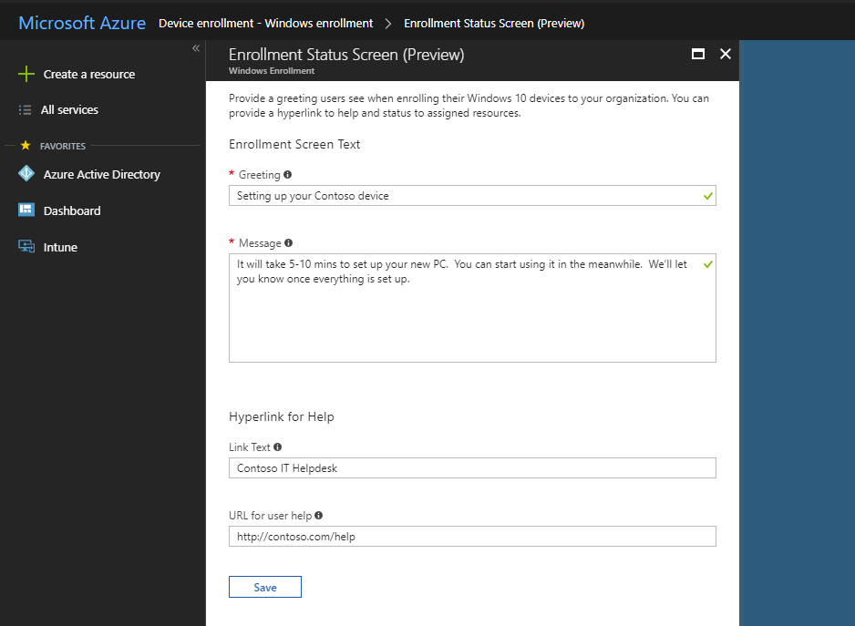

---
# required metadata

title: Adding Enrollment Status Screens
titlesuffix: "Azure portal"
description: Greet your users who are enrolling Windows 10 devices.
keywords:
author: barlan
manager: barlanmsft
ms.date: 11/08/2017
ms.topic: article
ms.prod:
ms.service: microsoft-intune
ms.technology:
ms.assetid: 8518d8fa-a0de-449d-89b6-8a33fad7b3eb

# optional metadata

#ROBOTS:
#audience:
#ms.devlang:
ms.reviewer: damionw
ms.suite: ems
#ms.tgt_pltfrm:
ms.custom: intune-azure

---

# Set up an Enrollment Status Screen

[!INCLUDE[azure_portal](./includes/azure_portal.md)]

When an end user enrolls a Windows device, they expect to be able to access everything they need to be productive immediately after enrollment. What end users don't recognize is that content, apps, policies, and settings are still being delivered to their devices after enrollment completes.

You can set up an Enrollment Status Screen to provide additional information to your end users to keep them informed as to what is actually happening after the enrollment process. This is located in **Device enrollment** > **Windows enrollment** > **Enrollment Status Screen**.

There are four fields that you can define: the **Greeting**, the **Message**, and the **Hyperlink for Help**, where you can set the **Link Text** and the **URL for user help**.

Your end users will also see the progress of the security profile that is installing. 
